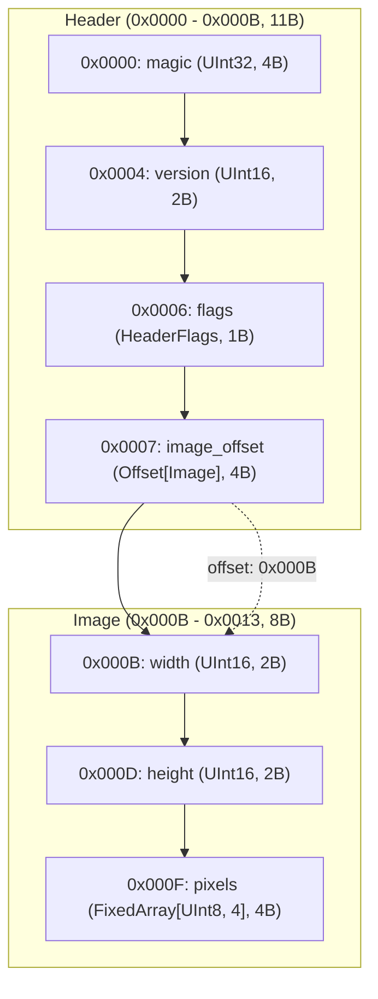
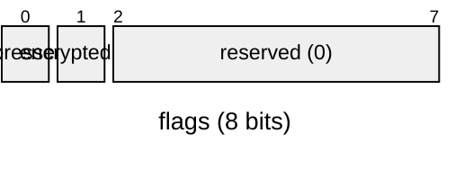

# Binary Master (`binary-master`)

[](https://www.python.org/)
[](LICENSE)
[]()

**Binary Master** は、Python 3.14+ 向けの高機能な構造化バイナリ生成・読み込み（シリアライズ／デシリアライズ）＆仕様書自動生成ライブラリです。

Python 標準の `struct` モジュールで生じがちなフォーマット文字列のミス、手作業でのオフセット計算、エンディアンの混在、バイト列の煩雑な結合・切り出し処理を排除し、**型安全・宣言的・直感的**にバイナリデータを読み書きできます。  
さらに、書き込んだバイナリ構造から **Mermaid ダイアグラム（フローチャート／パケット図）付きの仕様書（Markdown）** をワンライナーで自動生成する機能を備えています。

> 📖 **まずは動かしてみたい方へ**: ステップバイステップで基本から応用までを学べる **[実践チュートリアル (TUTORIAL.md)](TUTORIAL.md)** をご覧ください。  
> 🤖 **AI・LLM にライブラリ仕様を読み込ませたい方へ**: トークン効率と情報密度を最大化し、全機能・型システム・制約事項を凝縮した **[AI向け完全リファレンス (FOR_AI.md)](FOR_AI.md)** をコンテキストとしてご活用ください。

---

## 主な特徴

- 🚀 **宣言的バイナリ構造体 (`@binary_struct`)**  
  - Python の型ヒントとデータクラス記法を用いて、バイナリヘッダーやパケットフォーマットを直感的に定義可能。
  - **双方向シリアライズ**: `instance.to_bytes()` による書き込みと `Cls.from_bytes(data)` による自動デシリアライズの両方に対応。
  - **バイナリサイズ取得 (`Cls.binary_size`, `sizeof(Cls)`, `len(instance)`)**: クラス定義からの静的計算や、インスタンスからの動的バイト数取得に対応。
  - **Docstring の仕様書自動反映**: クラスの docstring（`"""..."""`）が仕様書の概要やビットフィールド詳細にそのまま自動反映。
  - **コメントの自動抽出**: コード上のインラインコメント（`# ...`）や `Annotated[Type, "説明"]` を自動抽出し、仕様書の `Description` 列に反映。
  - **自動アライメント & パディング (`auto_align=True`, `align=N`)**: C言語の構造体アライメント規則に基づき、メンバ境界や構造体サイズのアライメントパディングを自動挿入。
- 🧩 **高度な型サポート**  
  - 符号付き / 符号なし整数（8, 16, 32, 64-bit）
  - 浮動小数点数（Float32, Float64）
  - **論理値 (`Bool` / `bool`)**: サイズ設定可能（`Bool[1]`, `Bool[2]`, `Bool[4]` 等、デフォルト1バイト）
  - **ビットフィールド (`Bits[N]`)**: 1ビット単位のフラグ定義と自動パッキング・アンパッキング
  - **オフセット自動計算 & 解決 (`Offset[T, Size, BaseOffset]`)**: ヘッダーのオフセット値の自動バックパッチ（1, 2, 4, 8バイト指定可、`Base.SELF + 0x20` などの構造体先頭相対指定対応）および読み込み時の参照先自動インスタンス化
  - **オフセットテーブル (`OffsetTable[Count, Type, BaseOffset]`)**: 複数エントリのオフセット配列の予約・自動バックパッチ（`Base.SELF` などの相対指定対応）
  - **多態チャンク & タグ付き共用体 (`Variant[TagField, Mapping]`)**: 種別IDに応じて切り替わる多態構造体の自動ディスパッチ
  - 固定長配列 (`FixedArray[T, N]`) および可変長配列 (`Array[T]`)
  - 構造体のネスト
- ✍️ **柔軟な手続き的ライター & リーダー (`BinaryWriter` / `BinaryReader`)**  
  - **ワンストップ仕様書・多言語出力**: Builder 不要で `writer.to_markdown()` や `writer.to_c_header()`, `writer.to_rust()`, `writer.to_cpp()`, `writer.to_csharp()`, `writer.to_go()` を直接出力可能
  - **チャンクの繰り返し (`repeat`, `writer.repeat()`, `writer.write_repeated()`)**: 変数名（`repeat="chunk_count"`）、固定回数（`repeat=5`）、不定回数（`repeat=-1`）を指定可能。仕様書上では重複テーブルを出さず1要素のテンプレート（相対オフセット `+0x00`）として美しく自動集約
  - **多態バリアントの書き込み (`write_variant`, `writer.write_variant`)**: 候補構造体リスト（`candidates`）に対する厳格な型バリデーションおよび先行タグの一致チェック
  - インメモリ（`BytesIO` / `bytes`）またはファイル/ストリームへの直接読み書き
  - 厳格な境界・EOFチェック（オーバーフローや切り捨ての即時エラー検知）
  - 各種文字列形式（C言語スタイルの Null 終端、Pascal スタイルの長さプレフィックス、固定長パディング）
  - バイト境界アライメント（`align`）およびパディング（`pad`）
  - メソッドチェーン対応ライター、カーソル操作（`seek`, `tell`, `skip`, `remaining`）
  - **仕様書メタデータ統合管理 (`set_caption` / `subcaption`)**: セクションタイトル、詳細説明文（`desc`）、繰り返し回数・変数名（`spec_count="num_chunk"`）、多態バリアント候補（`variants`）を統合指定。`with` ブロックによるスコープ管理にも対応
- 📐 **事前設計型プロトコルビルダー & 自動リーダー (`Builder` / `BinaryBuilder`)**  
  - バイナリデータを実際に書き出すことなく、構造体クラス（`@binary_struct`）、説明文（`add_document`）、条件分岐（`condition`）、多態バリアント（`add_choice`）を事前定義して仕様書を生成（`builder.write("spec.md")`）。
  - 事前に定義したスキーマ情報をもとに、バイナリバイト列から各構造体・バリアントを自動判別して復元する **スキーマ駆動自動リーダー (`builder.read(data)`)** を提供。
- 📊 **仕様書 & Mermaid 図の自動生成 (`writer.to_markdown` / `builder.write`)**  
  - シリアライズされた全フィールドのオフセット（16進/10進）、サイズ、エンディアン、参照先ターゲット（`-> 0xXXXX`）を記録した Markdown ドキュメントを出力
  - **Mermaid Flowchart**: 条件分岐ひし形ノード、バリアント選択ノード、サブグラフとオフセット参照矢印の描画（繰り返し領域は `🔁 xCount` で集約）
  - **Mermaid packet-beta**: ネットワークパケット形式のビット/バイト配置図およびビットフィールド詳細図の生成
  - **多態チャンク・バリアント仕様の自動展開**: 条件に応じて格納される候補構造体のレイアウト表と相対パケット図の自動生成
- 🔍 **専用デバッグダンプ & バイナリ検証・差分比較 (`verify` / `hexdump` / `dump` / `diff`)**  
  - **バイナリ検証・アサーション (`writer.verify` / `verify`)**: 期待するバイト列との完全一致検証。不一致時は該当バイト位置とフィールド注釈付き diff を自動出力（テスト自動化に最適）
  - **注釈付き Hexdump (`hexdump`)**: 16バイト標準ヘックスダンプ＋ASCII文字表示＋出力されたフィールド名・型・値の注釈表示
  - **ターミナル色分け表示 (`color=True`)**: ANSI カラーによるフィールド境界ごとの色分け、カーソル位置のハイライト
  - **リーダー状態検査 (`reader.hexdump()`)**: 現在のカーソル位置（`--> CURSOR @ 0xXXXX`）、消費済み／残りバイト数の即時把握
  - **表形式トレース (`dump("table")`)**: Offset, Size, Field Name, Type, Hex Bytes, Value, Caption を整然と表示するモノスペース表
  - **構造化ダンプ (`dump("json")` / `dump("dict")`)**: ロギングやテスト検証のための辞書／JSON 配列エクスポート
  - **バイナリ差分比較 (`diff_dump` / `writer.diff`)**: 2つのバッファ間のバイト単位・フィールド単位の差異を可視化


---

## 動作要件・インストール

- **Python**: 3.14 以上

```bash
# uv を使用する場合
uv add binary-master

# pip を使用する場合
pip install .
```

### パッケージ（Wheel / `.whl`）のビルド

本ライブラリは `pyproject.toml` に準拠した最新のパッケージ仕様に対応しており、**uv** または標準の **build** ツール（PEP 517）を使用して Wheel（`.whl`）およびソース配布物（`.tar.gz`）を作成・配布できます。

#### 1. uv によるビルド（推奨・高速）

```bash
# dist/ ディレクトリに .whl および .tar.gz が自動生成されます
uv build
```

#### 2. 標準 build ツール（PEP 517）によるビルド

```bash
# build ツールのインストール（未導入の場合）
pip install build

# パッケージのビルド実行
python -m build
```

#### 3. ビルド成果物の確認とインストール

ビルドが完了すると、プロジェクト直下の `dist/` ディレクトリに以下の成果物が生成されます：
- `dist/binary_master-<version>-py3-none-any.whl` （Wheel パッケージ）
- `dist/binary_master-<version>.tar.gz` （ソースアーカイブ）

生成された `.whl` ファイルは、別の環境やオフライン環境、自社リポジトリ等へ配布し、`pip` で直接インストールできます：

```bash
pip install dist/binary_master-0.2.0-py3-none-any.whl
```


---

## クイックスタート

### 1. 宣言的構造体の定義とバイナリ化

`@binary_struct` を使うことで、画像フォーマットやネットワークパケットなどの複雑なバイナリ構造を数行で定義できます。

```python
from binary_master import (
    BinaryWriter,
    Bits,
    FixedArray,
    Offset,
    UInt8,
    UInt16,
    UInt32,
    binary_struct,
)

# 1バイト（8ビット）のビットフィールド
@binary_struct(bits=8)
class HeaderFlags:
    compressed: Bits[1]
    encrypted: Bits[1]
    reserved: Bits[6]

# 画像データ本体
@binary_struct
class Image:
    width: UInt16
    height: UInt16
    pixels: FixedArray[UInt8, 4]

# メインヘッダー（Image へのオフセットを保持）
@binary_struct
class Header:
    magic: UInt32
    version: UInt16
    flags: HeaderFlags
    image_offset: Offset[Image]  # オフセット位置は自動計算されます

# データの構築
header = Header(
    magic=0x474E5089,
    version=1,
    flags=HeaderFlags(compressed=1, encrypted=0, reserved=0),
    image_offset=Image(width=1920, height=1080, pixels=[255, 0, 0, 255]),
)

# バイト列に変換
data: bytes = header.to_bytes()
print(f"Serialized {len(data)} bytes: {data.hex()}")

# バイナリサイズの取得 (sizeof / binary_size / len)
print(Header.binary_size)   # クラス定義から静的サイズを取得 -> 11 バイト
print(sizeof(Header))       # sizeof() 関数でも取得可能 -> 11 バイト
print(header.binary_size)   # インスタンスから取得（参照先含む） -> 19 バイト
print(len(header))          # len(instance) でも取得可能 -> 19 バイト
```

### 2. 仕様書（Markdown & Mermaid）の自動生成

書き込み実行後の `BinaryWriter`、または事前定義用 `Builder` から、フォーマット仕様書（マニュアル）をワンライナーで自動生成できます。

```python
# 方法1: BinaryWriter から直接出力（推奨・データ駆動）
from binary_master import BinaryWriter

writer = BinaryWriter()
writer.write_struct(header)
writer.write_struct(image)

# 仕様書を Markdown ファイルに出力
writer.write_markdown("image_spec.md")

# C言語ヘッダーや Rust コードも同様に出力可能
# writer.write_c_header("image_spec.h")
# writer.write_rust("image_spec.rs")

# 方法2: Builder による静的スキーマ設計（実バイナリデータがない場合）
# from binary_master import Builder
# builder = Builder(title="Sample Image File Specification")
# builder.add_struct(Header)
# builder.add_struct(Image)
# builder.write("image_spec.md")
```

#### 生成される仕様書のイメージ

生成された Markdown には、概要、Mermaid 図、メモリレイアウト表、ビットフィールド詳細が含まれます。

````markdown
# Sample Image File Specification

## Overview
- **Total Size**: 19 bytes (`0x0013`)
- **Default Endianness**: Little
- **Total Fields**: 7

## Structure Diagram


## Memory Layout Table
| Offset (Hex) | Offset (Dec) | Size (B) | Field Name | Type | Endian | Value / Preview | Description |
|---|---|---|---|---|---|---|---|
| `0x0000` | 0 | 4 | `magic` | `UInt32` | Little | `1196314761 (0x474E5089)` | - |
| `0x0004` | 4 | 2 | `version` | `UInt16` | Little | `1 (0x1)` | - |
| `0x0006` | 6 | 1 | `flags` | `HeaderFlags` | Little | `1 (0x1)` | - |
| `0x0007` | 7 | 4 | `image_offset` | `Offset[Image]` | Little | `11 (0xB)` | - |
| `0x000B` | 11 | 2 | `width` | `UInt16` | Little | `1920 (0x780)` | - |
| `0x000D` | 13 | 2 | `height` | `UInt16` | Little | `1080 (0x438)` | - |
| `0x000F` | 15 | 4 | `pixels` | `FixedArray[UInt8, 4]` | Little | `[255, 0, 0, 255]` | - |

## Bitfield Details
### `flags` (Offset: `0x0006`, Size: 1B)

````

---

## 詳細ガイド

### 1. `BinaryWriter` の逐次書き込み

低レベルな制御や動的なプロトコル書き込みには `BinaryWriter` を直接利用します。メソッドチェーンにも対応しています。

```python
from binary_master import BinaryWriter, Endian

writer = BinaryWriter(default_endian=Endian.LITTLE)

# 仕様書セクション（キャプション）の設定
# 直接呼び出し、または 'with writer.set_caption(...):' によるスコープ管理が可能
writer.set_caption("File Header", desc="コンテナヘッダ情報")
writer.write_uint32(0xDEADBEEF, name="magic", desc="マジックナンバー")
writer.write_uint16(1, name="version")

# 新しいキャプションを設定すると、以降のフィールドは新しいグループに属します
writer.set_caption("Payload Data", desc="ペイロードデータ領域")
writer.write_cstring("Hello", name="c_str")                         # Null終端 (b"Hello\x00")
writer.write_prefixed_string("World", prefix_bytes=2, name="p_str")  # 2バイト長さプレフィックス
writer.write_fixed_string("Fixed", length=10, pad_byte=b"\x00")    # 10バイト固定長パディング

# アライメントとパディング
writer.pad(4, pad_byte=b"\xFF", name="padding")   # 4バイトのパディング
writer.align(16, name="alignment")                # 16バイト境界へアライメント

# 結果の取得
binary_data: bytes = writer.to_bytes()
```

### 2. `@binary_struct` の詳細機能

#### ビットフィールド (`Bits[N]`)
`bits` 引数を指定することで、ビット単位のフラグを効率よく 1/2/4/8 バイト等の整数にパッキングします。

```python
@binary_struct(bits=16)
class ControlFlags:
    enable: Bits[1]      # 0ビット目
    mode: Bits[3]        # 1-3ビット目
    priority: Bits[4]    # 4-7ビット目
    reserved: Bits[8]    # 8-15ビット目
```

#### オフセット自動計算 (`Offset[T, Size, BaseOffset]`)
ファイルフォーマットなどで頻出する「ヘッダー内に後続ブロックの開始オフセットを格納する」構造を自動処理します。オフセットサイズ（1, 2, 4, 8バイト）のカスタマイズや、自身が含まれる構造体の先頭アドレス相対（`Base.SELF + delta`）も柔軟に指定できます。

```python
from binary_master import Base, Offset, UInt16, UInt32, binary_struct

@binary_struct
class FileHeader:
    magic: UInt32
    # 1. 構造体先頭からの相対オフセット (Base.SELF)
    body_offset: Offset[FileBody, UInt32, Base.SELF]
    # 2. 構造体先頭 + 0x20 を基準とする相対オフセット（加減算対応）
    data_offset: Offset[FileBody, UInt32, Base.SELF + 0x20]
    # 3. 型を省略した短縮記法 (4バイトUInt32デフォルト)
    short_offset: Offset[FileBody, Base.SELF + 0x20]
    # 4. 2バイトオフセット (UInt16)
    small_offset: Offset[FileBody, UInt16, Base.SELF]

@binary_struct
class FileBody:
    data_length: UInt32
    raw_data: FixedArray[UInt8, 128]

header = FileHeader(
    magic=0x12345678,
    body_offset=FileBody(data_length=128, raw_data=b"\xAA" * 128),
    data_offset=FileBody(data_length=64, raw_data=b"\xBB" * 64),
    short_offset=FileBody(data_length=32, raw_data=b"\xCC" * 32),
    small_offset=FileBody(data_length=16, raw_data=b"\xDD" * 16),
)
```

#### 配列 (`FixedArray` & `Array`)
- `FixedArray[Type, Size]`: 固定長配列（サイズ不足時は自動パディング、サイズ超過時はエラー検知）。
- `Array[Type]`: 可変長配列。

#### 自動アライメント & パディング (`auto_align`, `align`)
C言語の構造体のように、各メンバ型のサイズに合わせた自然境界アライメント（または指定バイト境界アライメント）に自動でパディングを挟むことができます。

- デフォルト (`auto_align=False`, `align=None`): `#pragma pack(1)` 相当で、パディングなしで詰めて配置されます。
- `auto_align=True`: 各フィールドの自然境界（UInt16=2B, UInt32=4B, UInt64=8Bなど）に合わせて手前にパディング（`padding`）を自動挿入し、末尾も最大メンバサイズ境界に合わせてパディングします。
- `align=N`: フィールド境界および構造体末尾を N バイト境界（例: 4 や 8）にアライメントします。

```python
@binary_struct(auto_align=True)
class AlignedHeader:
    flag: UInt8        # 1バイト
    # -> ここに3バイトの自動パディングが挿入される
    data_length: UInt32 # 4バイト（0x0004から開始）
```

#### オフセットテーブル (`OffsetTable`) & `write_offset_table`
複数のブロックやセクションへのオフセットをテーブル（配列）形式で保持し、後からそのオフセットを書き込む（またはターゲットオブジェクトを直接シリアライズする）ことができます。

**1. `@binary_struct` での利用 (`OffsetTable[Count, Type]`)**
要素数には固定値（例: `2`）のほか、先行するフィールド名（例: `"num_chunk"`）を文字列で指定できます。動的指定時は仕様書・C言語ヘッダ（`uint32_t offsets[num_chunk];`）に反映され、デシリアライズ時も該当フィールドの値をもとに自動復元されます。

```python
from binary_master import OffsetTable, binary_struct, UInt32, UInt16

@binary_struct
class ChunkHeader:
    chunk_id: UInt32

@binary_struct
class Container:
    magic: UInt32
    num_chunk: UInt16
    # 先行フィールド 'num_chunk' の個数分だけオフセット配列を展開
    chunk_offsets: OffsetTable["num_chunk", UInt32]

c1 = ChunkHeader(chunk_id=10)
c2 = ChunkHeader(chunk_id=20)
# 対象構造体を渡すと、自動的にオフセットが計算されてテーブルに書き込まれます
container = Container(magic=0x12345678, num_chunk=2, chunk_offsets=[c1, c2])
```

**2. `BinaryWriter` 手続き的利用 (`write_offset_table`)**
オフセットサイズ（1, 2, 4, 8バイト）とテーブル数を指定して領域を予約し、返り値の `OffsetTableHandle` を使ってオフセット値をセットできます。
また、`spec_count="num_chunk"` を渡すことで、仕様書（Markdown / Mermaid）生成時に個別のスロットを1つのテンプレート行（`offsets[i]`）と繰り返し情報（`🔁 xnum_chunk`）に自動集約してスマートに出力できます。

```python
writer = BinaryWriter()

# 3エントリ・各4バイト(32bit)のオフセットテーブル枠を予約
table = writer.write_offset_table(count=3, offset_size=4, name="section_offsets")

# 方法A: 戻り値の write_offset() で現在位置をセット
table.write_offset(0)
writer.write_cstring("Section 0 Data")

# 方法B: 戻り値の set_offset(index, offset) で明示的にセット
pos1 = writer.tell()
table.set_offset(1, pos1)
writer.write_cstring("Section 1 Data")

# 方法C: インデックス代入 table[index] = offset
table[2] = writer.tell()
writer.write_cstring("Section 2 Data")

# 方法D: write_target(index, object) で現在オフセット記録＋対象の書き込みを一括実行
# table.write_target(0, my_struct)
```
※ マニュアル出力時、オフセットテーブルの各スロットには参照先オフセットを示す `-> 0xXXXX` マーカーや Mermaid の矢印（`-.->|offset: 0xXXXX|`）が自動的に付与されます。

**3. オフセットの起点（`base_offset`）の設定と構造体先頭相対（`Base.SELF`）**
デフォルトではファイル先頭（`0`）からの絶対オフセットが書き込まれますが、**自身が含まれる構造体の先頭アドレス相対**にしたい場合は、`Base.SELF`（または `Base.SELF + 0x20`、`Base.SELF - 0x10`）を指定できます。

```python
from binary_master import Base, Offset, OffsetTable, UInt32, binary_struct

@binary_struct
class ChunkContainer:
    magic: UInt32
    # 構造体先頭を起点とした相対オフセット
    data_offset: Offset[DataChunk, UInt32, Base.SELF]
    # 構造体先頭 + 0x20 を起点とした相対オフセット
    body_offset: Offset[DataChunk, UInt32, Base.SELF + 0x20]
    # オフセットテーブルも同様に指定可能
    chunk_offsets: OffsetTable[2, UInt32, Base.SELF + 0x20]
```
構造体がバイナリストリームの任意の位置（例: `0x0100`〜）や入れ子構造の中に配置されても、その構造体の開始位置を動的な基準として自動計算されます。
また、オフセットフィールド自身の位置を基準とする `Base.FIELD` や、手続き的ライターでの固定位置指定（`write_offset_table(..., base_offset=pos)`）も可能です。
※ 仕様書（Markdown）出力時は、Value列に計算後の相対オフセット値（`target - base`）が表示され、参照先マーカー（`-> 0xXXXX`）や Mermaid 矢印は実際の格納先（絶対アドレス）を正確に指し示します。

#### 多態チャンク（タグ付き共用体 / バリアント）とサブキャプション
チャンク形式のバイナリなど、**「同じオフセット位置に、種別タグやフラグに応じて異なる種類の構造体が格納される」** ケースを強力にサポートしています。

**1. 宣言的タグ付き共用体 (`Variant[tag_field, mapping]`)**
先行するタグフィールド（例: `chunk_type`）の値に基づいて、デシリアライズ先を自動分岐させます。

```python
from binary_master import Variant, UInt16, UInt32, binary_struct

@binary_struct
class HeaderChunk:
    """設定ヘッダ情報"""
    version: UInt16
    flags: UInt16

@binary_struct
class TextChunk:
    """文字列データ情報"""
    length: UInt32

@binary_struct
class Chunk:
    """多態チャンクコンテナ"""
    chunk_type: UInt16
    # chunk_type が 1 なら HeaderChunk、2 なら TextChunk に自動ディスパッチ
    payload: Variant["chunk_type", {1: HeaderChunk, 2: TextChunk}]

# 書き込み
c = Chunk(chunk_type=1, payload=HeaderChunk(version=1, flags=0))
raw = c.to_bytes()

# 読み込み（タグ値に応じて自動的に HeaderChunk インスタンスとして復元されます）
parsed = Chunk.from_bytes(raw)
assert isinstance(parsed.payload, HeaderChunk)
```

**2. キャプションでの候補バリアント登録 & マニュアル自動展開 (`variants`)**
同一領域に入る候補構造体を `caption(..., variants=[...])` に指定しておくと、マニュアル上に各候補構造体の説明、相対オフセット（`+0x00`）のパケット図およびレイアウト表が展開されます。

```python
writer = BinaryWriter()
writer.caption(
    "ペイロード領域",
    desc="チャンク種別に応じていずれかの構造体が格納されます",
    variants=[
        (1, HeaderChunk, "種別1: ヘッダ"),
        (2, TextChunk, "種別2: テキスト"),
    ],
)
writer.write_struct(header_chunk)
```

**3. 階層的サブキャプション (`subcaption`)**
共通セクションの中で種類ごとに手続き的に書き分けたい場合、`subcaption()` を使うと大見出しの下に小見出しが生成されます。

```python
writer = BinaryWriter()
writer.caption("チャンクボディ", "多態データ領域")

writer.subcaption("ヘッダ種別 (Type=1)", "Type 1 の設定パラメータ")
writer.write_uint16(0x0100, name="version")

writer.subcaption("テキスト種別 (Type=2)", "Type 2 の文字列パラメータ")
writer.write_uint32(42, name="length")
```

**4. 多態バリアントの書き込みと候補型バリデーション (`write_variant`)**  
多態構造体をストリームに書き出す際、許可された候補構造体リスト（`candidates`）を指定することで、実行時の型安全性を担保しながら、仕様書や C/Rust 等のヘッダーファイルへ候補構造体を自動登録できます。

```python
candidates = {0x01: HeaderChunk, 0x02: TextChunk}

# tag_field を指定すると、先行して書かれたタグフィールド値とインスタンスの型の一致も自動検証
writer.write_uint16(0x01, name="type")
writer.write_variant(
    HeaderChunk(version=1, flags=0),
    candidates=candidates,
    tag_field="type",
    name="payload",
    desc="動的ペイロード",
)
```

#### 仕様書メタデータの統合設定と繰り返し集約 (`set_caption` / `spec_count`)
セクションタイトル、説明文（`desc`）、繰り返し回数や変数名（`spec_count="chunk_count"`）、多態バリアント（`variants`）など、**仕様書生成に必要なすべての説明メタデータを `set_caption` に統合** して指定できます。

コンテキストマネージャ（`with writer.set_caption(...)`）を使うことで、ブロック内の一連の書き込み（構造体ループやオフセットテーブル）に対してメタデータが自動適用され、ブロックを抜けると自動的にリセットされます。

```python
@binary_struct
class Chunk:
    chunk_id: UInt32
    data_size: UInt32

writer = BinaryWriter()

# パターン1: with writer.set_caption(...) によるスコープ化（推奨）
# セクションタイトル、説明文、繰り返し回数・変数名を1箇所でスッキリ定義！
with writer.set_caption("Chunks", desc="データチャンク群（不定回数）", spec_count=-1):
    for chunk in chunks:
        writer.write_struct(chunk)

# パターン2: オフセットテーブルでの活用
# テーブル定義が 'offsets[i]' として仕様書に自動集約されます
with writer.set_caption("offsets", desc="各チャンクへのオフセット配列", spec_count="num_chunk"):
    table = writer.write_offset_table(count=len(chunks))

# パターン3: write_struct で直接指定
for chunk in chunks:
    writer.write_struct(chunk, spec_count="chunk_count")

# パターン4: リストを一括繰り返し書き込み
writer.write_repeated(chunks, spec_count="num_chunks")
```

- **仕様書上の表示例**:
  - `🔁 **繰り返し**: chunk_count 回` または `不定回数 (0回以上 / 可変)`
  - `**1要素サイズ**: 8 bytes (0x8)`
  - `**サンプルデータ**: 3 件 (合計 24 bytes)`
- **Mermaid ダイアグラム**:
  重複ノードが排除され、`subgraph SG_Chunk ["Chunk 🔁 xchunk_count (...)"]` として1つのサブグラフに集約可視化されます。

#### Docstring の仕様書反映
構造体やビットフィールドに記述した Python 標準の docstring（`"""..."""`）は、自動的に仕様書（マニュアル）の見出し下や概要欄にドキュメントとして反映されます。

```python
@binary_struct
class NetworkPacket:
    """イーサネットフレームおよびペイロードをカプセル化するパケット仕様。"""
    magic: UInt32  # プロトコル識別子 (0x4E504B54)
    length: UInt16 # ペイロード長
```
マニュアル出力時、`## Overview` に上記クラスの docstring がそのまま出力され、フィールドのインラインコメントは `Description` 列に出力されます。

### 3. 仕様書（マニュアル）生成オプション

`Builder` では、出力形式やダイアグラムの表示スタイルを柔軟にカスタマイズできます。

```python
from binary_master import Builder

builder = Builder(title="Network Protocol Spec")
builder.add_struct(Header)

# 仕様書出力オプション
builder.write(
    "spec.md",
    diagram_type="both",      # 'flowchart', 'packet', 'both'
    diagram_direction="TD",   # フローチャートの向き ('TD', 'LR')
    bits_per_row=32,          # パケット図の1行あたりのビット数 (8, 16, 32)
    bit_width=40,             # パケット図の1ビットあたりの横幅 (px)。横に大きく広げたい場合に指定
    include_bitfield_diagram=True,  # ビットフィールドの詳細パケット図を含めるか
)
```

- **`diagram_type="flowchart"`**: 構造体の入れ子構造やオフセット参照（矢印）を可視化するフローチャート。
- **`diagram_type="packet"`**: RFC風のパケットレイアウト図（`packet-beta` 記法）を生成。
- **`diagram_type="both"`**: フローチャートとパケット図の両方を並記。

### 4. バイナリの読み込みとデシリアライズ (`BinaryReader` / `from_bytes`)

書き込んだバイナリデータは、[`BinaryReader`](file:///home/ishii/PycharmProjects/binary_master/src/binary_master/reader.py) または構造体の `from_bytes()` メソッドで完全に対称復元（ラウンドトリップ）できます。

#### ① `@binary_struct.from_bytes()` による宣言的復元
```python
# バイト列から直接復元
header = Header.from_bytes(binary_data)
print(header.magic)
print(header.flags.compressed)
print(header.image_offset.width) # Offset[Image] の参照先も自動的にデシリアライズ
```

#### ② `BinaryReader` による逐次読み込み
```python
from binary_master import BinaryReader, Endian

reader = BinaryReader(binary_data, default_endian=Endian.LITTLE)

# プリミティブ値の読み込み
magic = reader.read_uint32()
version = reader.read_uint16()
name = reader.read_cstring()

# カーソル操作
pos = reader.tell()
reader.seek(0)
reader.skip(4)
reader.align(8)

# 構造体の読み込み
header = reader.read_struct(Header)
```

### 5. デバッグダンプ & ストリーム検査 (`hexdump` / `dump` / `diff`)

シリアライズ時の実メモリ配置の確認、デシリアライズ時のカーソル追跡、バイナリ差分比較を行うための専門デバッグ機能が用意されています。

#### ① 注釈付き Hexdump (`hexdump` / `writer.hexdump()`)
バイト列とともに、どのオフセットがどのフィールド（型・値）に該当するかを同時に確認できます。

```python
from binary_master import BinaryWriter, hexdump

writer = BinaryWriter()
writer.write_uint32(0x46494C45, name="magic")
writer.write_uint16(2, name="version")

# ターミナルへ注釈付きで出力 (color=True で ANSI カラー色分け)
print(writer.hexdump(color=True))
```

```text
Offset    00 01 02 03 04 05 06 07  08 09 0A 0B 0C 0D 0E 0F  |     ASCII      |  Field Annotations
-------------------------------------------------------------------------------------------------
00000000  45 4c 49 46 02 00                                 |ELIF..          |  magic=0x46494C45 (UInt32); version=2 (UInt16)
  [Total: 6 bytes (`0x0006`) | Cursor: 0x0006 (6/6) | Remaining: 0 bytes]
```

#### ② リーダーのカーソル位置・未読込バイト検査 (`reader.hexdump()`)
デシリアライズ中にどこまで読み進めたか、残り何バイトあるかを可視化します。

```python
reader = BinaryReader(binary_data)
reader.read_uint32()

# 現在のカーソル位置と残りバイト数が表示されます
print(reader.hexdump())
```

#### ③ 表形式トレース・JSON エクスポート (`writer.dump()`)
```python
# モノスペース表形式で出力
print(writer.dump("table"))

# ログ出力・テスト自動検証用の JSON / 辞書リストとして取得
records = writer.dump("dict")
json_str = writer.dump("json")
```

#### ④ バイナリ検証・ベリファイ (`writer.verify()` / `verify()`)
テストコード（`pytest` など）や実行時チェックで、生成されたバイナリが期待するバイト列（ゴールデンマスター等）と完全一致するかを 1 行で検証できます。  
不一致がある場合は、**どのバイト位置のどのフィールドが異なるか** を分かりやすく示した `AssertionError` を送出します。

```python
from binary_master import BinaryWriter, verify

writer = BinaryWriter()
writer.write_uint32(0x12345678, name="magic")
writer.write_uint16(42, name="id")

expected_bytes = b"\x78\x56\x34\x12\x2a\x00"

# 方法A: writer.verify() で直接検証（不一致なら詳細な diff 付きで例外発生）
writer.verify(expected_bytes)

# 方法B: トップレベル関数 verify(actual, expected)
verify(writer, expected_bytes)

# 方法C: 例外を出さずに True / False の真偽値だけを取得
is_valid = writer.verify(expected_bytes, raise_error=False)
```

不一致時のエラー出力例:
```text
AssertionError: Binary verification failed:
--- Binary Diff: Expected vs Actual ---
  Size Expected:  6 bytes (`0x0006`)
  Size Actual:    6 bytes (`0x0006`)
  Differing byte count: 1 bytes in 1 range(s)

Offset      Expected Hex            Actual Hex              Field / Context
---------------------------------------------------------------------------
0x0004..0005   2a                      99                      id (UInt16)
```

#### ⑤ バイナリ差分比較 (`diff_dump` / `writer.diff()`)
例外を投げずに差分の詳細テキスト（またはコンソールカラー付き差分）を取得したい場合は、`diff()` または `diff_dump()` を使用します。

```python
from binary_master import diff_dump

# 2つの Writer やバイト列の差分レポート文字列を取得
diff_report = writer_expected.diff(writer_actual, color=True)
print(diff_report)
```

### 6. プロトコル全体の事前スキーマ定義・仕様書・多言語・リーダー統合 (`Builder` / `BinaryBuilder`)

#### 💡 なぜ `Builder` が必要なのか？（`Writer` との使い分け・存在理由）

`BinaryWriter` でも仕様書（Markdown）や C/Rust ヘッダーの直接出力、多態バリアント、繰り返しチャンクの集約ができるようになりました。それでもライブラリにおいて **`Builder` が不可欠な3つの理由** があります：

1. **実データ不要の「事前仕様策定・ドキュメント作成」**:
   バイナリを出力するプログラムやダミーデータがまだ存在しない企画・設計フェーズで、構造体クラスの定義と `add_document`（章立てテキスト）から **先行して仕様書（Mermaid図付き）や C/Rust ヘッダーを作成** できます。データを作らずにスキーマだけを純粋に宣言できる唯一の手段です。
2. **スキーマ駆動の「自動デシリアライズ」(`builder.read`)**:
   `Writer` は書き込み専用であり、バイナリを復元することはできません。`builder.read(data)` を使うと、事前定義したスキーマ情報に基づいて **受信した生のバイト列からヘッダのタグ値や条件フラグを自動評価し、対応する構造体インスタンスとして一括復元** できます（手動で `Reader` による `if/elif` パーサーを書く必要がありません）。
3. **システム全体の「内部中間表現 (IR: Intermediate Representation)」**:
   実は `writer.to_c_header()` や `writer.to_rust()` などの多言語コード生成機能も、内部では `writer.to_builder()` を介して Builder 構造に変換されて動作しています。Builder はシステム全体のスキーマ共通モデル（IR）として不可欠な土台です。

| 観点 | `BinaryWriter` (コード駆動 / データ駆動) | `Builder` (スキーマ駆動 / 仕様・パーサー駆動) |
|---|---|---|
| **主な用途** | バイナリの生成・出力、書き込み実行ログからの仕様書/ヘッダー自動生成 | プロトコル仕様の先行策定、受信バイナリの自動デシリアライズ |
| **動的な条件分岐** | Python の自然な `if/elif` や `for` ループで柔軟に処理可能 | メタ定義（`add_choice`, `condition`）による静的スキーマ宣言 |
| **実データの要否** | 必要（実際に書き込まれたバイト列から仕様を抽出） | **不要**（クラス定義と章立てドキュメントのみで仕様書/コード出力可） |
| **読み込み (パース)** | 読み込み不可（別途 `BinaryReader` で手動実装） | **自動パース可能** (`builder.read(data)` で一括復元) |

> [!TIP]
> **推奨される使い分け**:
> - **バイナリを書き出す処理がある場合（日常使いの 8〜9 割）**: `BinaryWriter` を使うのが最も直感的でコード量も少なくなります。
> - **仕様策定が先行する場合 / 受信パケットの自動パースを行う場合**: `Builder` が威力を発揮します。

```python
from binary_master import Builder, binary_struct, UInt8, UInt16, UInt32, Float32, FixedArray

@binary_struct
class Header:
    magic: UInt32
    msg_type: UInt16
    flags: UInt16

@binary_struct
class TextPayload:
    length: UInt16
    content: FixedArray[UInt8, 16]

@binary_struct
class SensorPayload:
    sensor_id: UInt32
    temperature: Float32

@binary_struct
class Footer:
    crc32: UInt32

# 1. スキーマの事前定義
builder = Builder(title="Telemetry Protocol", version="1.0.0")

# 説明文・ドキュメントの章を追加
builder.add_document("プロトコル概要", "このプロトコルはネットワークテレメトリを送信します。")

# 順次構造体の登録
builder.add_struct(Header, name="header", desc="メッセージヘッダー")

# タグフィールドに基づく多態バリアント分岐（フローチャートにひし形分岐ノードを自動生成）
builder.add_choice(
    name="payload",
    tag_field="msg_type",
    variants={
        1: (TextPayload, "テキストメッセージ"),
        2: (SensorPayload, "センサーデータ"),
    },
)

# 条件付き構造体（flags & 1 の場合のみフッターが存在）
builder.add_struct(Footer, name="footer", condition="flags & 0x01 != 0")

# 2. 仕様書を Markdown ファイルに出力
builder.write("protocol_spec.md")

# 3. 多言語ヘッダー・型定義ファイルの出力
# C言語ヘッダー (#pragma pack(1), typedef struct, enum, union)
builder.write_c_header("protocol.h")

# Rust (#[repr(C, packed)], #[derive(...)], タグ付き enum)
builder.write_rust("protocol.rs")

# Modern C++17/20 (#pragma pack(1), std::array, enum class, std::variant)
builder.write_cpp("protocol.hpp")

# C# / Unity ([StructLayout(Pack=1)], [MarshalAs], [FieldOffset(0)] 共用体)
builder.write_csharp("protocol.cs", namespace="MyProtocol")

# Go (package protocol, type struct, [N]T, typed const)
builder.write_go("protocol.go", package_name="protocol")

# 拡張子から自動判別して出力することも可能
builder.write_code("export/packet.rs")   # -> Rust
builder.write_code("export/packet.cs")   # -> C#
builder.write_code("export/packet.hpp")  # -> C++
builder.write_code("export/packet.go")   # -> Go
builder.write_code("export/packet.h")    # -> C

# 4. 定義したスキーマに基づく自動デシリアライズ
# （タグ値に応じたバリアント選択や条件判定を自動実行）
result = builder.read(binary_bytes)
print(result.header.magic)
print(result.payload)       # TextPayload または SensorPayload インスタンス
if "footer" in result:
    print(result.footer.crc32)
```

### 6. 多言語ヘッダー・構造体定義のエクスポート (C, Rust, C#, Modern C++, Go)

`Builder` / `BinaryBuilder` および `@binary_struct` は、Python 側で定義したバイナリレイアウト（1バイトパッキング整合）を保ったまま、主要なネイティブ・システムプログラミング言語向けのコードを自動生成できます。

| 言語 | `Builder` メソッド | `@binary_struct` メソッド | 生成特徴 |
|---|---|---|---|
| **C** | `to_c_header()` / `write_c_header()` | `Cls.to_c()` / `Cls.to_c_struct()` | `typedef struct`, `#pragma pack(push, 1)`, `union`, `enum` |
| **Rust** | `to_rust()` / `write_rust()` | `Cls.to_rust()` / `Cls.to_rust_struct()` | `#[repr(C, packed)]`, `[T; N]`, タグ付共用体 `enum` |
| **Modern C++** | `to_cpp()` / `write_cpp()` | `Cls.to_cpp()` / `Cls.to_cpp_struct()` | `#pragma once`, `std::array<T, N>`, `std::variant`, `enum class` |
| **C# (.NET / Unity)** | `to_csharp()` / `write_csharp()` | `Cls.to_csharp()` / `Cls.to_csharp_struct()` | `[StructLayout(Pack = 1)]`, `[MarshalAs]`, `[FieldOffset(0)]` |
| **Go** | `to_go()` / `write_go()` | `Cls.to_go()` / `Cls.to_go_struct()` | `type Struct struct`, `[N]T`, `const` タグ, `interface` |
| **統一 API** | `to_code(lang)` / `write_code(path)` | - | 拡張子 (`.rs`, `.cs`, `.hpp`, `.go`, `.h`) からの言語自動判別 |


---

## API リファレンス

### プリミティブ型 (`binary_struct`)
| 型 | サイズ | 説明 |
|---|---|---|
| `UInt8` / `Int8` | 1 バイト | 8ビット 符号なし / 符号付き整数 |
| `UInt16` / `Int16` | 2 バイト | 16ビット 符号なし / 符号付き整数 |
| `UInt32` / `Int32` | 4 バイト | 32ビット 符号なし / 符号付き整数 |
| `UInt64` / `Int64` | 8 バイト | 64ビット 符号なし / 符号付き整数 |
| `Float32` | 4 バイト | IEEE 754 単精度浮動小数点数 |
| `Float64` | 8 バイト | IEEE 754 倍精度浮動小数点数 |
| `Bits[N]` | N ビット | ビットフィールドのフィールド幅 |
| `Offset[T, Size, BaseOffset]` | 指定サイズ（デフォルト: 4B） | 構造体 `T` へのバイトオフセット（自動解決。`UInt16` 等のサイズ指定や `Base.SELF + 0x20` 等の構造体先頭相対指定に対応） |
| `OffsetTable[Count, Type, BaseOffset]` | `sizeof(Type) * Count` | オフセットテーブル配列（自動解決。`Base.SELF` 等の相対指定に対応） |
| `Base.SELF` / `Base.FIELD` | - | 相対オフセット起点シンボル（`+`, `-` 演算子オーバーロードによる加減算に対応） |
| `FixedArray[T, N]` | `sizeof(T) * N` | 固定長要素配列 |
| `Array[T]` | 可変 | 可変長要素配列 |
| `Variant[TagField, Mapping]` | 可変 | タグ値に応じた多態構造体（自動ディスパッチ） |

### 構造体操作 & ユーティリティ (`@binary_struct`)
- **バイナリサイズ取得**: `Cls.binary_size` / `sizeof(Cls)`（クラスから静的サイズを取得）、`instance.binary_size` / `sizeof(instance)` / `len(instance)`（インスタンスのシリアライズサイズを取得）
- **シリアライズ**: `instance.to_bytes(endian=None)` または `write_struct(instance)`
- **デシリアライズ**: `Cls.from_bytes(data, endian=None)` または `read_struct(Cls, reader)`
- **他言語コード生成**: `Cls.to_c()` / `Cls.to_c_struct()`, `Cls.to_rust()`, `Cls.to_cpp()`, `Cls.to_csharp()`, `Cls.to_go()`

### `Builder` / `BinaryBuilder` 主要メソッド
- **章・説明文の追加**: `add_document(title, content)`（Markdown 形式の説明文・章を追加）
- **構造体の登録**: `add_struct(cls, name=None, desc="", condition=None, condition_func=None, count=None)`（`@binary_struct` クラスを登録。条件分岐やリピート件数に対応）
- **多態バリアント分岐の登録**: `add_choice(name, tag_field, variants, desc="", condition=None, condition_func=None)`（タグフィールドに基づくバリアント選択点を登録）
- **セクション・仕様書メタデータ統合設定**: `set_caption(title, desc="", spec_count=None)` / `section(...)` / `caption(...)`（`with` 構文による論理グループ化に対応。Mermaid に `subgraph` を自動生成）、`add_section` / `add_caption`
- **アドホックフィールド**: `add_field(name, type_name, size, desc="", endian=None, condition=None)`
- **仕様書テキスト生成**: `build(...)` / `to_markdown(...)`（Markdown 文字列を返却）
- **仕様書ファイル書き出し**: `write(path_or_file, ...)`（ファイルまたはストリームへ出力して Markdown 文字列を返却）
- **C言語ヘッダー出力**: `to_c_header(guard=None, pack=True)`, `write_c_header(path_or_file, ...)`
- **Rustコード出力**: `to_rust()`, `write_rust(path_or_file)`
- **C++ヘッダー出力**: `to_cpp()`, `write_cpp(path_or_file)`
- **C#コード出力**: `to_csharp(namespace="BinaryProtocol")`, `write_csharp(path_or_file, ...)`
- **Goコード出力**: `to_go(package_name="protocol")`, `write_go(path_or_file, ...)`
- **統一コード出力**: `to_code(lang)`, `write_code(path_or_file, lang=None)`（拡張子自動判別）
- **スキーマ駆動自動読み込み**: `read(reader_or_bytes, endian=None, trace=False)`（バイナリデータをスキーマに基づいて自動パースし `BuilderReadResult` を返却）
- **スキーマ駆動デバッグ検査**: `hexdump(data, ...)`（スキーマのフィールド・セクション名と突き合わせた注釈付き Hexdump）、`dump(data, format="table", ...)`（セクション名付きのモノスペース表や JSON を出力）
- **Writer からのスキーマ逆生成 & インポート**: `Builder.from_writer(writer, title=...)`（`BinaryWriter` の書き込み履歴からセクションとフィールドをインポートして `Builder` を自動構築）、`import_writer(writer)`、`import_captions(writer)`（キャプションのみ抽出）


### `BinaryWriter` / `Writer` 主要メソッド
- **整数書き込み**: `write_uint8`, `write_int8`, `write_uint16`, `write_int16`, `write_uint32`, `write_int32`, `write_uint64`, `write_int64`
- **浮動小数点数**: `write_float32`, `write_float64`
- **論理値 / バイト**: `write_bool`, `write_bytes`
- **文字列**: `write_cstring`, `write_prefixed_string`, `write_fixed_string`, `write_string`
- **オフセットテーブル**: `write_offset_table(count, offset_size=4, endian=None, name="offsets", desc="Offset Table", base_offset=0, spec_count=None)`（戻り値 `OffsetTableHandle` で `set_offset`, `write_offset`, `write_target`, `base_offset`, `get_target_offset`, `get_stored_offset` 等が可能。`spec_count` で仕様書の集約表示が可能）
- **構造体**: `write_struct(instance, endian=None, section="", spec_count=None)`（`spec_count` で繰り返し回数、変数名、または `-1` 不定回数を指定可能）
- **多態バリアント**: `write_variant(instance, candidates, tag_field=None, ...)`（候補型辞書・リストによる型バリデーションおよび先行タグ整合性検証付き書き込み）
- **仕様書メタデータ統合管理**: `set_caption(title=None, desc="", spec_count=None, variants=None)`（セクションタイトル、説明文、繰り返し回数・変数名、候補バリアントを統合指定。`with writer.set_caption(...):` によるスコープ化に対応。`caption` もエイリアスとして完全対応）
- **サブセクションタイトル**: `subcaption(title=None, desc="")`（大見出し内の階層的サブグループを設定）
- **チャンク繰り返し**: `repeat(name, count=..., desc=...)`（コンテキストマネージャ）、`write_repeated(items, count=..., section=...)`
- **仕様書直接出力**: `to_markdown(...)`（Markdown 文字列生成）、`write_markdown(path_or_file, ...)`（Markdown ファイル出力）
- **多言語ヘッダー直接出力**: `to_c_header()`, `write_c_header(path)`, `to_rust()`, `write_rust(path)`, `to_cpp()`, `write_cpp(path)`, `to_csharp()`, `write_csharp(path)`, `to_go()`, `write_go(path)`, `write_code(path)`
- **Builder 変換**: `to_builder(title=...)`（書き込み履歴から静的 `Builder` インスタンスを自動生成）
- **位置制御**: `tell()`, `seek(offset, whence)`
- **パディング & アライメント**: `pad(count, pad_byte)`, `align(boundary, pad_byte)`
- **デバッグ・検証**: `verify(expected, raise_error=True)`（期待値との完全一致検証・不一致時 diff 表示）、`diff(other, color=False)`（他バッファとの差分比較）、`hexdump(width=16, color=False, annotate=True)`（注釈付き Hexdump）、`dump(format="hexdump"|"table"|"json"|"dict")`
- **データ取り出し**: `to_bytes()`, `to_bytearray()`

### `BinaryReader` / `Reader` 主要メソッド
- **整数読み込み**: `read_uint8`, `read_int8`, `read_uint16`, `read_int16`, `read_uint32`, `read_int32`, `read_uint64`, `read_int64`
- **浮動小数点数**: `read_float32`, `read_float64`
- **論理値 / バイト**: `read_bool`, `read_bytes(count=None)`
- **文字列**: `read_cstring`, `read_prefixed_string`, `read_fixed_string`, `read_string`
- **構造体**: `read_struct(cls, endian=None)`
- **位置制御**: `tell()`, `seek(offset, whence)`, `skip(count)`, `remaining()`, `align(boundary)`
- **デバッグダンプ**: `hexdump(width=16, color=False)`（カーソル位置・未読込バイト表示付き Hexdump）、`dump(format="hexdump")`
- **初期化**: `BinaryReader(source)`, `BinaryReader.from_bytes(data)`, `BinaryReader.from_file(path)`

### デバッグ & 検査・検証ユーティリティ (`debug`)
- **バイナリ検証**: `verify(actual, expected, raise_error=True, color=False)`（期待値との完全一致検証。不一致時は詳細 diff 付きで例外送出）
- **バイナリ差分比較**: `diff_dump(left, right, name_left="Expected", name_right="Actual", color=False)`
- **注釈付き Hexdump**: `hexdump(target, width=16, color=False, annotate=True)`（`bytes`, `BinaryWriter`, `BinaryReader`, `@binary_struct` に対応）
- **統一デバッグダンプ**: `debug_dump(target, format="hexdump"|"table"|"json"|"dict")`
- **表形式トレース**: `dump_table(target, color=False)`
- **構造化エクスポート**: `dump_json(target, indent=2)`, `dump_dict(target)`

---

## サンプルコード一覧

`sample/` ディレクトリには、基本機能から高度な応用まで系統立てて学べるサンプルスクリプトが用意されています：

| ファイル | テーマ | 主な内容 |
|---|---|---|
| [`sample/01_basic_struct.py`](sample/01_basic_struct.py) | 基本的な宣言的構造体 | `@binary_struct` の定義、数値型・固定長配列、`to_bytes()`、`read_struct()`、`sizeof()`、エンディアン制御 |
| [`sample/02_bitfields_and_alignment.py`](sample/02_bitfields_and_alignment.py) | ビットフィールドとアライメント | `Bits[N]` によるビットパッキング、`align=4` によるパディング、`auto_align=True` 自然アライメント |
| [`sample/03_offsets_and_tables.py`](sample/03_offsets_and_tables.py) | 相対ポインタ & オフセットテーブル | `Offset[T, Base.SELF]`、オフセット演算（`Base.SELF + 0x20`）、`OffsetTable`、自動デリファレンス |
| [`sample/04_procedural_writer.py`](sample/04_procedural_writer.py) | 手続き的ライター & リーダー | `BinaryWriter` / `BinaryReader` によるストリーム操作、各種文字列、境界パディング、デバッグダンプ（`hexdump`, `dump`） |
| [`sample/05_builder_and_reader.py`](sample/05_builder_and_reader.py) | Builder と自動リーダー | 事前スキーマ定義、`add_document`、多態 `add_choice`、多言語出力（C/Rust/C++/C#/Go）、`builder.write()`、`builder.read()` |
| [`sample/main.py`](sample/main.py) | 一括実行ランナー | 全 5 本のサンプルを順番に自動実行・検証するオーケストレーター |

```bash
# 全サンプルの実行
python sample/main.py
```

---

## テストの実行

テストスイートは `pytest` を使用して実行できます。

```bash
pytest
```

---

## ライセンス

MIT License

