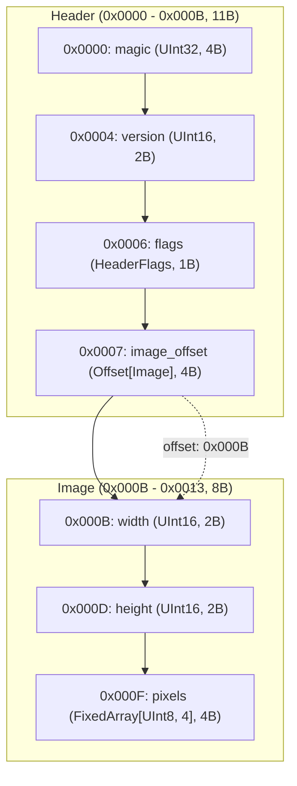
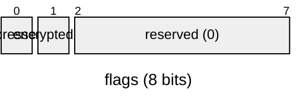

# Binary Master (`binary-master`)

[](https://www.python.org/)
[](LICENSE)
[]()

**Binary Master** は、Python 3.14+ 向けの高機能な構造化バイナリ生成＆仕様書自動生成ライブラリです。

Python 標準の `struct` モジュールで生じがちなフォーマット文字列のミス、手作業でのオフセット計算、エンディアンの混在、バイト列の煩雑な結合処理を排除し、**型安全・宣言的・直感的**にバイナリデータを構築できます。  
さらに、書き込んだバイナリ構造から **Mermaid ダイアグラム（フローチャート／パケット図）付きの仕様書（Markdown）** をワンライナーで自動生成する機能を備えています。

---

## 主な特徴

- 🚀 **宣言的バイナリ構造体 (`@binary_struct`)**  
  Python の型ヒントとデータクラス記法を用いて、バイナリヘッダーやパケットフォーマットを直感的に定義可能。
- 🧩 **高度な型サポート**  
  - 符号付き / 符号なし整数（8, 16, 32, 64-bit）
  - 浮動小数点数（Float32, Float64）
  - **ビットフィールド (`Bits[N]`)**: 1ビット単位のフラグ定義と自動パッキング
  - **オフセット自動計算 (`Offset[T]`)**: ヘッダーのオフセット値の自動バックパッチと参照先構造体の追跡
  - 固定長配列 (`FixedArray[T, N]`) および可変長配列 (`Array[T]`)
  - 構造体のネスト
- ✍️ **柔軟な手続き的ライター (`BinaryWriter`)**  
  - インメモリ（`BytesIO`）またはファイル/ストリームへの直接出力
  - メソッドチェーン対応
  - 各種文字列形式（C言語スタイルの Null 終端、Pascal スタイルの長さプレフィックス、固定長パディング）
  - バイト境界アライメント（`align`）およびパディング（`pad`）
  - 厳格な境界チェック（オーバーフロー/アンダーフローの即時エラー検知）
- 📊 **仕様書 & Mermaid 図の自動生成 (`write_manual`)**  
  - シリアライズされた全フィールドのオフセット（16進/10進）、サイズ、値、エンディアンを記録した Markdown ドキュメントを出力
  - **Mermaid Flowchart**: 構造体ごとのサブグラフとオフセット参照関係の矢印表示
  - **Mermaid packet-beta**: ネットワークパケット形式のビット/バイト配置図およびビットフィールド詳細図の生成

---

## 動作要件・インストール

- **Python**: 3.14 以上

```bash
# uv を使用する場合
uv add binary-master

# pip を使用する場合
pip install .
```

---

## クイックスタート

### 1. 宣言的構造体の定義とバイナリ化

`@binary_struct` を使うことで、画像フォーマットやネットワークパケットなどの複雑なバイナリ構造を数行で定義できます。

```python
from binary_master import (
    BinaryWriter,
    Bits,
    FixedArray,
    Offset,
    UInt8,
    UInt16,
    UInt32,
    binary_struct,
)

# 1バイト（8ビット）のビットフィールド
@binary_struct(bits=8)
class HeaderFlags:
    compressed: Bits[1]
    encrypted: Bits[1]
    reserved: Bits[6]

# 画像データ本体
@binary_struct
class Image:
    width: UInt16
    height: UInt16
    pixels: FixedArray[UInt8, 4]

# メインヘッダー（Image へのオフセットを保持）
@binary_struct
class Header:
    magic: UInt32
    version: UInt16
    flags: HeaderFlags
    image_offset: Offset[Image]  # オフセット位置は自動計算されます

# データの構築
header = Header(
    magic=0x474E5089,
    version=1,
    flags=HeaderFlags(compressed=1, encrypted=0, reserved=0),
    image_offset=Image(width=1920, height=1080, pixels=[255, 0, 0, 255]),
)

# バイト列に変換
data: bytes = header.to_bytes()
print(f"Serialized {len(data)} bytes: {data.hex()}")
```

### 2. 仕様書（Markdown & Mermaid）の自動生成

バイナリを書き込むだけで、フォーマット仕様書（マニュアル）が自動生成されます。

```python
writer = BinaryWriter()
writer.write_struct(header)

# 仕様書を Markdown ファイルに出力
writer.write_manual("image_spec.md", title="Sample Image File Specification")
```

#### 生成される仕様書のイメージ

生成された Markdown には、概要、Mermaid 図、メモリレイアウト表、ビットフィールド詳細が含まれます。

````markdown
# Sample Image File Specification

## Overview
- **Total Size**: 19 bytes (`0x0013`)
- **Default Endianness**: Little
- **Total Fields**: 7

## Structure Diagram


## Memory Layout Table
| Offset (Hex) | Offset (Dec) | Size (B) | Field Name | Type | Endian | Value / Preview | Description |
|---|---|---|---|---|---|---|---|
| `0x0000` | 0 | 4 | `magic` | `UInt32` | Little | `1196314761 (0x474E5089)` | - |
| `0x0004` | 4 | 2 | `version` | `UInt16` | Little | `1 (0x1)` | - |
| `0x0006` | 6 | 1 | `flags` | `HeaderFlags` | Little | `1 (0x1)` | - |
| `0x0007` | 7 | 4 | `image_offset` | `Offset[Image]` | Little | `11 (0xB)` | - |
| `0x000B` | 11 | 2 | `width` | `UInt16` | Little | `1920 (0x780)` | - |
| `0x000D` | 13 | 2 | `height` | `UInt16` | Little | `1080 (0x438)` | - |
| `0x000F` | 15 | 4 | `pixels` | `FixedArray[UInt8, 4]` | Little | `[255, 0, 0, 255]` | - |

## Bitfield Details
### `flags` (Offset: `0x0006`, Size: 1B)

````

---

## 詳細ガイド

### 1. `BinaryWriter` の逐次書き込み

低レベルな制御や動的なプロトコル書き込みには `BinaryWriter` を直接利用します。メソッドチェーンにも対応しています。

```python
from binary_master import BinaryWriter, Endian

writer = BinaryWriter(default_endian=Endian.LITTLE)

# 整数・浮動小数点数
writer.write_uint32(0xDEADBEEF, name="magic", desc="マジックナンバー")
writer.write_uint16(1, name="version")
writer.write_float32(3.14, endian=Endian.BIG, name="ratio") # 個別のエンディアン指定

# 文字列の書き込み戦略
writer.write_cstring("Hello", name="c_str")                         # Null終端 (b"Hello\x00")
writer.write_prefixed_string("World", prefix_bytes=2, name="p_str")  # 2バイト長さプレフィックス
writer.write_fixed_string("Fixed", length=10, pad_byte=b"\x00")    # 10バイト固定長パディング

# アライメントとパディング
writer.pad(4, pad_byte=b"\xFF", name="padding")   # 4バイトのパディング
writer.align(16, name="alignment")                # 16バイト境界へアライメント

# 結果の取得
binary_data: bytes = writer.to_bytes()

# ファイルへの直接出力
with BinaryWriter.to_file("output.bin", default_endian=Endian.BIG) as f_writer:
    f_writer.write_uint32(100)
```

### 2. `@binary_struct` の詳細機能

#### ビットフィールド (`Bits[N]`)
`bits` 引数を指定することで、ビット単位のフラグを効率よく 1/2/4/8 バイト等の整数にパッキングします。

```python
@binary_struct(bits=16)
class ControlFlags:
    enable: Bits[1]      # 0ビット目
    mode: Bits[3]        # 1-3ビット目
    priority: Bits[4]    # 4-7ビット目
    reserved: Bits[8]    # 8-15ビット目
```

#### オフセット自動計算 (`Offset[T]`)
ファイルフォーマットなどで頻出する「ヘッダー内に後続ブロックの開始オフセットを格納する」構造を自動処理します。

```python
@binary_struct
class FileHeader:
    magic: UInt32
    body_offset: Offset[FileBody]  # 自動的に FileBody の開始バイト位置が書き込まれます

@binary_struct
class FileBody:
    data_length: UInt32
    raw_data: FixedArray[UInt8, 128]

header = FileHeader(
    magic=0x12345678,
    body_offset=FileBody(data_length=128, raw_data=b"\xAA" * 128)
)
```

#### 配列 (`FixedArray` & `Array`)
- `FixedArray[Type, Size]`: 固定長配列（サイズ不足時は自動パディング、サイズ超過時はエラー検知）。
- `Array[Type]`: 可変長配列。

### 3. 仕様書（マニュアル）生成オプション

`write_manual` では、出力形式やダイアグラムの表示スタイルを柔軟にカスタマイズできます。

```python
from binary_master import write_manual

# 構造体インスタンスまたは BinaryWriter から直接出力可能
write_manual(
    header,
    path_or_file="spec.md",
    title="Network Protocol Spec",
    diagram_type="both",      # 'flowchart', 'packet', 'both'
    diagram_direction="TD",   # フローチャートの向き ('TD', 'LR')
    bits_per_row=32,          # パケット図の1行あたりのビット数 (8, 16, 32)
    include_bitfield_diagram=True,  # ビットフィールドの詳細パケット図を含めるか
)
```

- **`diagram_type="flowchart"`**: 構造体の入れ子構造やオフセット参照（矢印）を可視化するフローチャート。
- **`diagram_type="packet"`**: RFC風のパケットレイアウト図（`packet-beta` 記法）を生成。
- **`diagram_type="both"`**: フローチャートとパケット図の両方を並記。

---

## API リファレンス

### プリミティブ型 (`binary_struct`)
| 型 | サイズ | 説明 |
|---|---|---|
| `UInt8` / `Int8` | 1 バイト | 8ビット 符号なし / 符号付き整数 |
| `UInt16` / `Int16` | 2 バイト | 16ビット 符号なし / 符号付き整数 |
| `UInt32` / `Int32` | 4 バイト | 32ビット 符号なし / 符号付き整数 |
| `UInt64` / `Int64` | 8 バイト | 64ビット 符号なし / 符号付き整数 |
| `Float32` | 4 バイト | IEEE 754 単精度浮動小数点数 |
| `Float64` | 8 バイト | IEEE 754 倍精度浮動小数点数 |
| `Bits[N]` | N ビット | ビットフィールドのフィールド幅 |
| `Offset[T]` | 4 バイト | 構造体 `T` へのバイトオフセット（自動解決） |
| `FixedArray[T, N]` | `sizeof(T) * N` | 固定長要素配列 |
| `Array[T]` | 可変 | 可変長要素配列 |

### `BinaryWriter` 主要メソッド
- **整数書き込み**: `write_uint8`, `write_int8`, `write_uint16`, `write_int16`, `write_uint32`, `write_int32`, `write_uint64`, `write_int64`
- **浮動小数点数**: `write_float32`, `write_float64`
- **論理値 / バイト**: `write_bool`, `write_bytes`
- **文字列**: `write_cstring`, `write_prefixed_string`, `write_fixed_string`, `write_string`
- **構造体**: `write_struct(instance, endian=None)`
- **位置制御**: `tell()`, `seek(offset, whence)`
- **パディング & アライメント**: `pad(count, pad_byte)`, `align(boundary, pad_byte)`
- **仕様書生成**: `write_manual(path_or_file, title=..., diagram_type=...)`
- **データ取り出し**: `to_bytes()`, `to_bytearray()`

---

## テストの実行

テストスイートは `pytest` を使用して実行できます。

```bash
pytest
```

---

## ライセンス

MIT License
