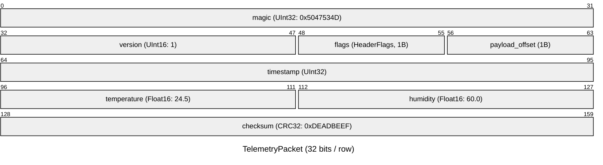
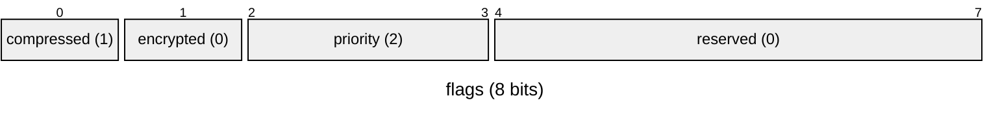
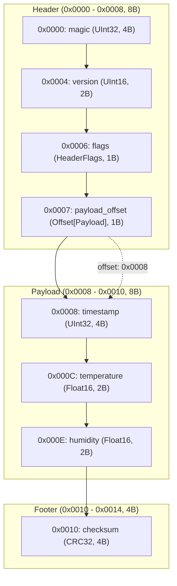

# Binary Master (`binary-master`)

[](https://www.python.org/)
[](LICENSE)
[]()

**Binary Master** は、Python 3.14+ 向けの宣言的バイナリ構造化＆仕様書自動生成ライブラリです。

### 🌟 特徴
- **🛡️ 安全**: ポインタ操作を気にせず、境界チェックや型検証が自動で行われる安全な純 Python 設計。
- **📊 仕様書の自動吐き出し**: 定義した構造体から Mermaid パケット図付き Markdown や、ブラウザで開ける HTML 仕様書をワンライナーで生成。
- **✨ IDE で強力に補完**: 型アノテーションによる dataclass 感覚の記法で、フィールド名や型が IDE でスムーズに補完。

```python
from binary_master import binary_struct, Magic, UInt16, Float32, CString, CRC32

# 1. 宣言的にパケット構造を定義（データクラス感覚）
@binary_struct
class SensorPacket:
    magic: Magic[b"PKT\x01"]               # ヘッダーシグネチャ（自動補完 & 検証）
    sensor_id: UInt16                      # 2バイト符号なし整数
    temperature: Float32                   # 4バイト浮動小数点数
    device_name: CString                   # Null終端文字列
    checksum: CRC32                        # CRC32（自動計算 & 検証）

# 2. シリアライズ（書き込み）: マジックや CRC は完全自動計算！
packet = SensorPacket(sensor_id=101, temperature=24.5, device_name="Sensor-A")
data = packet.to_bytes()                   # -> bytes 列 (b'PKT\x01e\x00\x00\x00\xc4A...')

# 3. デシリアライズ（読み込み）: データ整合性・破損も自動検証！
restored = SensorPacket.from_bytes(data)
print(restored.sensor_id, restored.temperature, restored.device_name)
# 出力: 101 24.5 Sensor-A

# 4. ブラウザで開けるインタラクティブ HTML 仕様書（Hex Inspector付き）を即時生成！
packet.write_html("sensor_spec.html", title="センサー通信パケット仕様書")
```

> 📖 **まずは動かしてみたい方へ**: ステップバイステップで基本から応用までを学べる **[実践チュートリアル (TUTORIAL.md)](TUTORIAL.md)** をご覧ください。  
> 🤖 **AI・LLM にライブラリ仕様を読み込ませたい方へ**: トークン効率と情報密度を最大化し、全機能・型システム・制約事項を凝縮した **[AI向け完全リファレンス (FOR_AI.md)](FOR_AI.md)** をコンテキストとしてご活用ください。

---

## 動作要件・インストール

- **Python**: 3.14 以上

```bash
# uv を使用する場合
uv add binary-master

# pip を使用する場合
pip install .
```

### パッケージ（Wheel / `.whl`）のビルド

本ライブラリは `pyproject.toml` に準拠した最新のパッケージ仕様に対応しており、**uv** または標準の **build** ツール（PEP 517）を使用して Wheel（`.whl`）およびソース配布物（`.tar.gz`）を作成・配布できます。

#### 1. uv によるビルド（推奨・高速）

```bash
# dist/ ディレクトリに .whl および .tar.gz が自動生成されます
uv build
```

#### 2. 標準 build ツール（PEP 517）によるビルド

```bash
# build ツールのインストール（未導入の場合）
pip install build

# パッケージのビルド実行
python -m build
```

#### 3. ビルド成果物の確認とインストール

ビルドが完了すると、プロジェクト直下の `dist/` ディレクトリに以下の成果物が生成されます：
- `dist/binary_master-<version>-py3-none-any.whl` （Wheel パッケージ）
- `dist/binary_master-<version>.tar.gz` （ソースアーカイブ）

生成された `.whl` ファイルは、別の環境やオフライン環境、自社リポジトリ等へ配布し、`pip` で直接インストールできます：

```bash
pip install dist/binary_master-0.2.0-py3-none-any.whl
```


---

## クイックスタート

### 1. 宣言的構造体の定義とバイナリ化

`@binary_struct` を使うことで、画像フォーマットやネットワークパケットなどの複雑なバイナリ構造を数行で定義できます。

```python
from binary_master import (
    BinaryWriter,
    Bits,
    FixedArray,
    L,
    Offset,
    UInt8,
    UInt16,
    UInt32,
    binary_struct,
    sizeof,
)

# 1バイト（8ビット）のビットフィールド
@binary_struct(bits=8)
class HeaderFlags:
    compressed: Bits[1]
    encrypted: Bits[1]
    reserved: Bits[6]

# 画像データ本体
@binary_struct
class Image:
    width: UInt16
    height: UInt16
    pixels: FixedArray[UInt8, L[4]]  # 静的型チェッカー準拠の L[4]（または Literal[4]）

# メインヘッダー（Image へのオフセットを保持）
@binary_struct
class Header:
    magic: UInt32
    version: UInt16
    flags: HeaderFlags
    image_offset: Offset[Image] = None  # オフセット位置は自動計算されます

# データの構築（ヘッダーを先に宣言し、後から実体データをセット）
header = Header(
    magic=0x474E5089,
    version=1,
    flags=HeaderFlags(compressed=1, encrypted=0, reserved=0),
)
header.image_offset = Image(width=1920, height=1080, pixels=[255, 0, 0, 255])

# バイト列に変換
data: bytes = header.to_bytes()
print(f"Serialized {len(data)} bytes: {data.hex()}")

# デシリアライズ（復元された restored.image_offset は IDE でメンバが自動補完されます）
restored = Header.from_bytes(data)
assert restored.image_offset is not None
print(f"Restored width: {restored.image_offset.width}")  # .width や .height が自動補完される！

# バイナリサイズの取得 (sizeof / binary_size / len)
print(Header.binary_size)   # クラス定義から静的サイズを取得 -> 11 バイト
print(sizeof(Header))       # sizeof() 関数でも取得可能 -> 11 バイト
print(header.binary_size)   # インスタンスから取得（参照先含む） -> 19 バイト
print(len(header))          # len(instance) でも取得可能 -> 19 バイト
```

### 2. 仕様書（Markdown & Mermaid & HTML）の自動生成

`binary_master` の最大の強みのひとつは、バイナリ構造の定義や書き込み結果から、**人間が読みやすく美しい仕様書（Markdown / インタラクティブ HTML）を完全自動生成**できる点です。

Excel や Word、Wiki で二重管理することなく、**Python コードを「唯一の信頼できる情報源（Single Source of Truth）」** として常に最新の仕様書を即時出力できます。

#### 🚀 仕様書の出力方法（ワンライナー）

```python
# 1. 構造体クラス・インスタンスから直接出力（一番手軽！）
pkt = TelemetryPacket(...)
pkt.write_markdown("spec.md", diagram_type="both")       # Markdown 仕様書（Mermaid 図付き）
pkt.write_html("spec.html", title="センサー通信仕様書")    # 双方向 Hex Inspector 付き HTML

# 2. BinaryWriter から直接出力（実際に書き込んだバイナリログから生成）
writer = BinaryWriter()
writer.write_struct(header)
writer.write_struct(payload)
writer.write_markdown("spec.md")
writer.write_html("spec.html")

# 3. Builder による事前スキーマ設計（実データ不要で仕様書を先行生成）
builder = Builder(title="IoT Protocol Specification")
builder.add_struct(Header)
builder.add_struct(Payload)
builder.write("spec.md", diagram_type="both")
```

#### 📊 実際に自動生成される仕様書のサンプル

以下は、`binary_master` が自動生成する仕様書の実物サンプルです。GitHub 上でそのまま美しいグラフィカルな図表としてレンダリングされます：

---

### サンプル仕様書: IoT Telemetry Packet Specification

#### Overview
IoTセンサーテレメトリ通信パケット仕様。ヘッダーシグネチャ、制御フラグ、半精度浮動小数点センサー値、CRC32整合性検証コードを含みます。

- **Total Size**: 20 bytes (`0x0014`)
- **Default Endianness**: Little
- **Total Fields**: 8

#### 1. 全体パケット配置図（RFC 形式 32-bit `packet-beta`）
各フィールドがパケット内のどのビット／バイト位置を占有しているかを、RFC 標準の 32 ビット幅で直感的に可視化します：



#### 2. ビットフィールド詳細図（8-bit / 16-bit `packet-beta`）
サブバイト（ビット単位）のフラグや予約ビットの配置を独立したビットマップとして展開します：



| Bit Range | Field Name | Width | Value | Description |
|---|---|---|---|---|
| `[0:1]` | `compressed` | 1 bit | 1 | 圧縮有効フラグ |
| `[1:2]` | `encrypted` | 1 bit | 0 | 暗号化フラグ |
| `[2:4]` | `priority` | 2 bits | 2 | 配信優先度 (0: Low, 1: Normal, 2: High, 3: Critical) |
| `[4:8]` | `reserved` | 4 bits | 0 | 将来拡張用リザーブ領域 |

#### 3. 構造体フローチャート図（`flowchart TD`）
パケット内の論理セクション（Header / Payload / Footer）の境界や、オフセットポインタ（`Offset[T]`）の参照先リンクを矢印で明示します：



#### 4. メモリレイアウト詳細表
全フィールドの 16進/10進 オフセット、占有サイズ、型、エンディアン、値プレビュー、制約条件（Range / Constant / Magic）を一覧化します：

| Offset (Hex) | Offset (Dec) | Size (B) | Field Name | Type | Endian | Value / Preview | Description |
|---|---|---|---|---|---|---|---|
| `0x0000` | 0 | 4 | `magic` | `UInt32` | Little | `0x5047534D` | プロトコル識別子 (`Magic`) |
| `0x0004` | 4 | 2 | `version` | `UInt16` | Little | `1` | プロトコルバージョン |
| `0x0006` | 6 | 1 | `flags` | `HeaderFlags` | Little | `0x09` | 制御フラグ（ビットフィールド） |
| `0x0007` | 7 | 1 | `payload_offset` | `Offset[Payload]` | Little | `0x08` | ペイロード先頭へのオフセット (`-> 0x0008`) |
| `0x0008` | 8 | 4 | `timestamp` | `UInt32` | Little | `1710000000` | UNIXエポック秒 |
| `0x000C` | 12 | 2 | `temperature` | `Float16` | Little | `24.5` | 温度計測値 (℃) |
| `0x000E` | 14 | 2 | `humidity` | `Float16` | Little | `60.0` | 湿度計測値 (%) |
| `0x0010` | 16 | 4 | `checksum` | `CRC32` | Little | `0xDEADBEEF` | パケット末尾 CRC32 自動整合性検証 |

---

#### 🌐 インタラクティブ HTML 仕様書（Hex Inspector 内蔵） & 多言語対応

`pkt.write_html("spec.html")` または `writer.write_html("spec.html")`、`builder.write_html("spec.html")` を実行すると、**外部依存ライブラリなし（スタンドアロン）でブラウザですぐ開ける HTML 仕様書** が生成されます。

- **双方向 Hex Inspector**:
  - メモリレイアウト表の行にマウスカーソルを合わせると、Hexdump 上の**該当バイト列が即座にハイライト**されます。
  - 逆に Hexdump のバイト列にカーソルを合わせると、**対応する構造体フィールド名・型・オフセットがフローティングバーに表示**され、表の該当行が強調表示されます。
- **ダーク / ライトテーマ対応**: 閲覧環境に応じた快適な視認性。
- **Mermaid 図のネイティブ描画**: ブラウザ側でフローチャートやパケット図が美しく描画されます。
- **マルチ言語ローカライズ (`lang="auto"`, `"ja"`, `"en"`)**:
  - デフォルト（`lang="auto"`）で OS / システムロケールを自動判別し、日本語環境では見出し（`概要`、`メモリレイアウト表`、`ビットフィールド詳細` など）や表ヘッダー、ツールチップが完全日本語化されます。
  - 明示的に `lang="ja"` や `lang="en"` を指定することも可能です（IDE 入力補完対応）。

```python
# 日本語ロケール環境では自動的に日本語マニュアル / HTML が出力されます
pkt.write_markdown("manual.md")               # Markdown 仕様書
pkt.write_html("spec.html")                   # HTML 仕様書 (Hex Inspector 付)

# 言語を明示指定する場合
pkt.write_markdown("manual_en.md", lang="en") # 英語出力
pkt.write_html("spec_ja.html", lang="ja")     # 日本語出力
```

#### 💡 スマートな仕様書要約とレイアウト最適化
`binary_master` は、仕様書が長大化・肥大化して視認性が損なわれないよう、様々な自動要約・最適化機能を備えています：

- **OffsetTable の中間省略**: 要素数が多いオフセットテーブルは最初と最後の要素のみを詳細表示し、中間を `...` で自動省略（表およびパケット図）。
- **繰り返し要素の省略**: ループ書き込みされた同一構造体や配列の連続要素は、構造図（フローチャート／パケット図）上で最初と最後を残して `...` で省略。
- **巨大生データブロックの自動要約 (`large_data_threshold`)**:
  `Bytes[10000]` などの大容量生データや大きな固定配列は、パケット図内で `payload (10000B)` や `data (FixedArray[UInt8, 1024], 1024B)` のようにバイトサイズ併記で簡潔に要約描画（デフォルトしきい値: 64B）。
- **セクション見出しのアドレス非表示化 (`include_section_offsets=False`)**:
  セクション見出し（`### Payload` 等）はデフォルトで絶対アドレスを省き、動的パケットでも汎用的な仕様書として利用可能。必要に応じて `include_section_offsets=True` でアドレス範囲を付加できます。

```python
# 例: 巨大データ要約のしきい値調整や、セクション見出しのオフセット表示
writer.write_markdown(
    "protocol_spec.md",
    large_data_threshold=128,      # 128B以上を要約（0で無効化）
    include_section_offsets=True,  # 見出しにアドレス範囲 (0x0000 - 0x0010, 16B) を付加
)
```


---

## 詳細ガイド

### 1. `BinaryWriter` の逐次書き込み

低レベルな制御や動的なプロトコル書き込みには `BinaryWriter` を直接利用します。メソッドチェーンにも対応しています。

```python
from binary_master import BinaryWriter, Endian

writer = BinaryWriter(default_endian=Endian.LITTLE)

# 仕様書セクション（キャプション）の設定
# 直接呼び出し、または 'with writer.set_caption(...):' によるスコープ管理が可能
writer.set_caption("File Header", desc="コンテナヘッダ情報")
writer.write_uint32(0xDEADBEEF, name="magic", desc="マジックナンバー")
writer.write_uint16(1, name="version")

# 新しいキャプションを設定すると、以降のフィールドは新しいグループに属します
writer.set_caption("Payload Data", desc="ペイロードデータ領域")
writer.write_cstring("Hello", name="c_str")                         # Null終端 (b"Hello\x00")
writer.write_prefixed_string("World", prefix_bytes=2, name="p_str")  # 2バイト長さプレフィックス
writer.write_fixed_string("Fixed", length=10, pad_byte=b"\x00")    # 10バイト固定長パディング

# アライメントとパディング
writer.pad(4, pad_byte=b"\xFF", name="padding")   # 4バイトのパディング
writer.align(16, name="alignment")                # 16バイト境界へアライメント

# 位置の退避と特定オフセットへの一時書き込み (at_offset / preserve_position)
# 例: ペイロード長ヘッダーの後から書き戻し（バックパッチ）
len_pos = 4
with writer.at_offset(len_pos):
    writer.write_uint32(1024, name="payload_length")  # 指定位置に書き込み、終了時に末尾へ自動復帰

with writer.preserve_position():
    writer.seek(0)
    # カーソル位置を保存したまま一時シーク操作...

# 結果の取得
binary_data: bytes = writer.to_bytes()
```

### 2. `@binary_struct` の詳細機能

#### フィールド定義時の初期値（デフォルト値）の自由配置
`@binary_struct` では、通常の Python クラスのようにフィールド定義時に初期値（デフォルト値）を指定できます。

Python 標準の `@dataclass` の制限（「デフォルト値を持つフィールドの後に、デフォルト値を持たないフィールドを置けない」）を排除しているため、**ヘッダーの先頭や途中のフィールドにも自由に初期値（`magic: UInt32 = 0x504B5401`）を配置可能** です。

```python
from binary_master import binary_struct, UInt32, UInt16, UInt8
from dataclasses import field

@binary_struct
class PacketHeader:
    magic: UInt32 = 0x504B5401        # 先頭フィールドに初期値を指定可能
    version: UInt16 = 1               # 初期値
    payload_len: UInt16               # 必須フィールド（初期値なし）
    flags: UInt8 = 0                  # 初期値
    checksum: UInt32 = field(default=0) # dataclasses.field も利用可能

# 1. 必要なフィールドのみ指定してインスタンス化可能（初期値未指定のフィールドは自動的に0クリア）
pkt = PacketHeader(payload_len=256)
assert pkt.magic == 0x504B5401
assert pkt.version == 1
assert pkt.payload_len == 256
assert pkt.flags == 0

# 2. 初期値の上書きも自由
custom_pkt = PacketHeader(magic=0xDEADBEEF, payload_len=512)
assert custom_pkt.magic == 0xDEADBEEF

# 3. 引数をすべて省略することも可能（未指定フィールドは自動的にゼロ値で初期化）
zero_pkt = PacketHeader()
assert zero_pkt.payload_len == 0

# 4. 任意フィールドのみの位置引数指定にも対応
pos_pkt = PacketHeader(128)
assert pos_pkt.payload_len == 128
```

#### 静的型チェッカー（ty / Pyright / mypy）対応と基底クラス (`BinaryStruct` / `Struct`)
`@binary_struct` は実行時に動的に `to_bytes()`, `from_bytes()`, `to_dict()` などのメソッドを付与します。
Astral の `ty` や Pyright、mypy などの静的型チェッカーにおいて、動的属性の警告（`unresolved-attribute`）を回避し、IDE のコード補完（IntelliSense）を有効化するには、基底クラス `BinaryStruct`（または別名 `Struct`）を継承します：

```python
from binary_master import binary_struct, BinaryStruct, UInt16

@binary_struct
class Data(BinaryStruct):
    data: UInt16

data = Data()
# ty や Pyright、mypy で警告が出ず、IDE の補完も完全に機能します
raw = data.to_bytes()
restored = Data.from_bytes(raw)
```

また、クラス定義を変更せずにトップレベル関数 `to_bytes(data)` / `from_bytes(Data, raw)` を使用することでも型チェッカーの警告を回避できます：

```python
from binary_master import binary_struct, UInt16, to_bytes

@binary_struct
class Data:
    data: UInt16

data = Data()
raw = to_bytes(data)  # トップレベル関数呼び出し
```

#### 文字列・バイト列型 (`Bytes[N]`, `FixedString[N]`, `CString`, `PrefixedString[N]`)
構造体メンバとして、固定長バイト配列や各種文字列フォーマットを直接宣言できます。

- `Bytes[N]`: Nバイトの生バイト列（Python `bytes`）。`FixedArray[UInt8, N]` の直感的な短縮形。
- `FixedString[N]`: Nバイトの固定長文字列（Python `str`）。指定長に満たない場合は Null バイトでパディングされ、読み込み時は自動でデコードされます。
- `CString`: Null 終端文字列（Python `str`）。末尾に `\0` が自動付与されます。
- `PrefixedString[N]`: Nバイト（1, 2, 4, 8バイト）の長さプレフィックス付き文字列（Python `str`）。

```python
from binary_master import Bytes, FixedString, CString, PrefixedString, binary_struct, UInt32

@binary_struct
class NetworkMessage:
    magic: Bytes[4]              # 4バイト生バイト列 (b"MSGP")
    tag: FixedString[8]          # 8バイト固定長文字列 ("CLIENT01")
    username: CString            # Null終端文字列 ("Alice")
    payload: PrefixedString[2]   # 2バイト符号なし整数で長さを示す文字列 ("Hello World")

msg = NetworkMessage(
    magic=b"MSGP",
    tag="CLIENT01",
    username="Alice",
    payload="Hello World",
)
data = msg.to_bytes()
restored = NetworkMessage.from_bytes(data)
assert restored.username == "Alice"
assert isinstance(restored.tag, str)
assert isinstance(restored.magic, bytes)
```

#### ビットフィールド (`Bits[N]`)
`bits` 引数を指定することで、ビット単位のフラグを効率よく 1/2/4/8 バイト等の整数にパッキングします。

```python
@binary_struct(bits=16)
class ControlFlags:
    enable: Bits[1]      # 0ビット目
    mode: Bits[3]        # 1-3ビット目
    priority: Bits[4]    # 4-7ビット目
    reserved: Bits[8]    # 8-15ビット目
```

#### オフセット自動計算 (`Offset[T, Size, BaseOffset]`)

バイナリフォーマットで頻出する「ヘッダー内に後続ブロックの開始オフセット（ポインタ）を格納する」構造を完全自動化します。

##### 💡 「Offset で渡した構造体はどこに書かれるのか？」
`Offset[Target]` を含む構造体を `to_bytes()` または `write_struct()` で書き出すとき、以下の **3段階のライフサイクル** でシリアライズされます：

```text
【メモリレイアウト / バイト列の配置順序】

0x0000 ┌───────────────────────────────────────────────┐
       │ FileHeader (主構造体)                         │
       │   magic: UInt32 (4B)                          │
0x0004 │   body_offset: Offset[FileBody] (4B) ───┐     │ ← 1. まず仮値 0x00000000 を書き込み位置を記憶
       │   other_field: ...                      │     │
0x0010 ├─────────────────────────────────────────┼─────┤ ← 主構造体の末尾
       │ FileBody (Offsetで渡した実体データ)       │     │
       │   data_length: UInt32 (4B)              │     │ ← 2. 主構造体の直後(末尾)に自動追記！
0x0014 │   raw_data: Bytes[128]                  │     │
       └─────────────────────────────────────────┴─────┘
                                                 │
                                                 └─── 3. 実際の開始位置 (0x0010) との相対オフセットを
                                                         ヘッダー内の body_offset に自動バックパッチ！
```

1. **フェーズ 1 (主構造体の書き込み)**: ヘッダーの各フィールドを順にストリームへ出力します。`Offset` フィールドの位置には仮値 `0x00000000` を書き込み、そのファイル位置（プレースホルダー）を記録します。
2. **フェーズ 2 (実体データの末尾追記)**: 主構造体の全フィールドの書き込みが完了した直後、`body_offset=FileBody(...)` で渡された子構造体の実体が **ストリームの末尾に順番に追加（追記）書き込み** されます。
3. **フェーズ 3 (オフセットの自動バックパッチ)**: 子構造体が配置された実アドレスを取得し、基準位置（`Base.SELF` = 自身の位置、または `Base.STRUCT` = 構造体先頭など）との差分を計算して、フェーズ 1 のプレースホルダーへ戻って正しいオフセット値を上書きします。

```python
from binary_master import Base, Offset, UInt16, UInt32, FixedArray, UInt8, binary_struct

@binary_struct
class FileBody:
    data_length: UInt32
    raw_data: FixedArray[UInt8, 128]

@binary_struct
class FileHeader:
    magic: UInt32
    # 1. 自身のフィールド位置からの相対オフセット (Base.SELF)
    body_offset: Offset[FileBody, UInt32, Base.SELF]
    # 2. 構造体先頭 + 0x20 を基準とする相対オフセット（加減算対応）
    data_offset: Offset[FileBody, UInt32, Base.SELF + 0x20]
    # 3. 型を省略した短縮記法 (4バイト UInt32 がデフォルト)
    short_offset: Offset[FileBody, Base.SELF + 0x20]
    # 4. 2バイトオフセット (UInt16)
    small_offset: Offset[FileBody, UInt16, Base.SELF]

# パターン 1: ヘッダーを先に宣言して後から実体をセット（直感的でおすすめ）
# Offset フィールドは省略可能（0初期化）なため、ヘッダーを先に定義できます
header = FileHeader(magic=0x12345678)
header.body_offset  = FileBody(data_length=128, raw_data=b"\xAA" * 128)
header.data_offset  = FileBody(data_length=64, raw_data=b"\xBB" * 64)
header.short_offset = FileBody(data_length=32, raw_data=b"\xCC" * 32)
header.small_offset = FileBody(data_length=16, raw_data=b"\xDD" * 16)

# パターン 2: コンストラクタ引数で一括初期化
# header = FileHeader(
#     magic=0x12345678,
#     body_offset=FileBody(data_length=128, raw_data=b"\xAA" * 128),
#     data_offset=FileBody(data_length=64, raw_data=b"\xBB" * 64),
#     short_offset=FileBody(data_length=32, raw_data=b"\xCC" * 32),
#     small_offset=FileBody(data_length=16, raw_data=b"\xDD" * 16),
# )

# シリアライズ時に各 FileBody がヘッダー直後に順次書き出され、各オフセットが自動バックパッチされます
data = header.to_bytes()
```

##### 🌟 中間構造体不要！`Offset[OffsetTable[...]]` によるポインタテーブル直接配置
ヘッダーからポインタテーブル（オフセット配列）を指し、そのテーブル内の各ポインタが実体アイテムを指す「2段階の間接参照」も、中間ラッパー構造体を作ることなく 1 行で宣言できます。
リストを直接渡すだけで、要素数カウント（`num_items`）の自動導出、テーブルの配置、各アイテムの配置、全ポインタの自動バックパッチがすべて自動で行われます。

```text
【Offset[OffsetTable] の配置順序】

┌──────────────────────────────────────┐
│ DirectTableContainer (ヘッダー)      │
│   magic: UInt32                      │
│   num_items: UInt16 (=2 自動反映)     │
│   table_offset: Offset ──────────┐   │
├──────────────────────────────────┼───┤
│ OffsetTable (ポインタ配列テーブル)  │<──┘
│   table[0] ──────────────────┐   │
│   table[1] ──────────────┐   │   │
├──────────────────────────┼───┼───┤
│ LeafItem #0 (id=1, val=100)│<──┘   │
├──────────────────────────┼───────┤
│ LeafItem #1 (id=2, val=200)│<──────┘
└──────────────────────────┴───────┘
```

```python
from binary_master import binary_struct, UInt16, UInt32, Offset, OffsetTable, Base

@binary_struct
class LeafItem:
    item_id: UInt16
    val: UInt32

@binary_struct
class DirectTableContainer:
    magic: UInt32
    num_items: UInt16
    # 中間構造体なしで OffsetTable へのオフセットを直接指定！
    table_offset: Offset[OffsetTable["num_items", UInt32, Base.SELF], Base.SELF]

# 1. ヘッダーを先に宣言（num_items や table_offset は省略可能）
container = DirectTableContainer(magic=0x524F4F54)

# 2. 後からペイロードのリストを代入
# （num_items はリストの長さから自動計算・補完されます）
container.table_offset = [
    LeafItem(item_id=1, val=100),
    LeafItem(item_id=2, val=200),
]

# 3. シリアライズ
raw = container.to_bytes()
restored = DirectTableContainer.from_bytes(raw)
print(restored.num_items)     # => 2 (自動補完)
print(restored.table_offset)  # => [8, 14] (各 LeafItem への相対オフセット)
```

##### 🎯 自由配置・ヘッダー先行書き込み (`NamedOffset["key"]`)
`Offset[...]` は「親構造体の直後に自動追記」されますが、**「ヘッダーを先に書いて、その後に任意の文字列や可変長データを挟み、任意のタイミングでオフセット位置を確定させたい」** 場合には、`NamedOffset["key"]` を使用します。

```python
from binary_master import binary_struct, UInt16, BinaryWriter, NamedOffset, read_struct

@binary_struct
class Header:
    magic: UInt16
    offset: NamedOffset["payload_pos"]  # "payload_pos" というキー名でオフセット枠を宣言

writer = BinaryWriter()
h = Header(magic=0x1234)

writer.write_struct(h)                    # 1. まずヘッダーを出力
writer.write_string("任意の可変長データ...") # 2. 途中に自由なデータを書き込む
writer.write_named_offset("payload_pos")  # 3. ここで "payload_pos" のオフセットを現在位置に確定・上書き！

raw = writer.to_bytes()
restored = read_struct(Header, raw)
print(restored.offset)  # => 2 + 4 + len("任意の可変長データ...")
```

- **同一キーの多重登録と例外安全性**:
  - 同じキー名の `NamedOffset` を複数のフィールドや構造体で宣言した場合、同一キーの多重登録が許可されます。`writer.write_named_offset("key")` を呼び出すと、そのキーに紐づくすべてのオフセットスロットが同じターゲット位置へと一括でバックパッチされます（複数のポインタが同一ペイロードを指す構造に対応）。
  - すでに解決済みのキーに対して誤って再度 `write_named_offset("key")` を呼び出した場合は、意図しない二重確定を防ぐため [`DuplicateNamedOffsetError`](file:///home/ishii/PycharmProjects/binary_master/src/binary_master/exceptions.py#L101-L103) が発生します（明示的に上書き・再更新する場合は [`rewrite_named_offset("key")`](file:///home/ishii/PycharmProjects/binary_master/src/binary_master/writer.py) を使用します）。
  - `write_named_offset("key")` や `rewrite_named_offset("key")` で存在しないキーを指定した場合は、安全のため [`NamedOffsetNotFoundError`](file:///home/ishii/PycharmProjects/binary_master/src/binary_master/exceptions.py#L106-L108) が発生します。
- **名前空間スコープ (`with writer.namespace(...)`)**:
  同じ構造体クラスをループや複数チャンクで使い回す場合、`with writer.namespace(...)` で囲むことで同一キー名（例: `"payload"`）の衝突を完全に防止できます。
  ```python
  # auto_id=True で "chunk_0", "chunk_1"... と自動で名前空間を分離
  for i in range(2):
      with writer.namespace("chunk", auto_id=True):
          writer.write_struct(ChunkHeader(chunk_id=i))
          writer.write_string(f"metadata_{i}...")
          # "chunk_i/payload" として安全にバックパッチ！
          writer.write_named_offset("payload", ChunkPayload(width=100, height=200))
  ```
  - スコープ内の相対キーは自動的に `"chunk_0/payload"` のように階層化されます。
  - ネスト（入れ子）や `auto_id=True` による自動採番（`chunk_0`, `chunk_1`...）に対応。
  - スコープ内から先頭スラッシュ `/` 付きキー（例: `NamedOffset["/global_footer"]`）を指定すると、ルート名前空間を直接参照できます。


#### 配列 (`FixedArray` & `Array`)
- `FixedArray[Type, Size]`: 固定長配列（サイズ不足時は自動パディング、サイズ超過時はエラー検知）。
  - **型安全性・IDE補完**: Python 公式の型仕様（PEP 484/526）に準拠し、最新の型チェッカー（`ty` / PyCharm / mypy）で型警告（`invalid-type-form`）を出さない記法として、要素数に `L[N]` または `Literal[N]` の指定を推奨します（例: `FixedArray[UInt8, L[4]]`）。
  - 短縮形 `L` は `from binary_master import L` から直接インポート可能です。
  - 従来の `FixedArray[UInt8, 4]` のような生の数値も実行時に自動アンラップされるため、そのまま完全動作します。
- `Array[Type]`: 可変長配列。


#### 自動アライメント & パディング (`auto_align`, `align`)
C言語の構造体のように、各メンバ型のサイズに合わせた自然境界アライメント（または指定バイト境界アライメント）に自動でパディングを挟むことができます。

- デフォルト (`auto_align=False`, `align=None`): `#pragma pack(1)` 相当で、パディングなしで詰めて配置されます。
- `auto_align=True`: 各フィールドの自然境界（UInt16=2B, UInt32=4B, UInt64=8Bなど）に合わせて手前にパディング（`padding`）を自動挿入し、末尾も最大メンバサイズ境界に合わせてパディングします。
- `align=N`: フィールド境界および構造体末尾を N バイト境界（例: 4 や 8）にアライメントします。

```python
@binary_struct(auto_align=True)
class AlignedHeader:
    flag: UInt8        # 1バイト
    # -> ここに3バイトの自動パディングが挿入される
    data_length: UInt32 # 4バイト（0x0004から開始）
```

#### オフセットテーブル (`OffsetTable`) & `write_offset_table`
複数のブロックやセクションへのオフセットをテーブル（配列）形式で保持し、後からそのオフセットを書き込む（またはターゲットオブジェクトを直接シリアライズする）ことができます。

**1. `@binary_struct` での利用 (`OffsetTable[Count, Type]`)**
要素数には固定値（例: `2`）のほか、先行するフィールド名（例: `"num_chunk"`）を文字列で指定できます。動的指定時は仕様書・C言語ヘッダ（`uint32_t offsets[num_chunk];`）に反映され、デシリアライズ時も該当フィールドの値をもとに自動復元されます。

```python
from binary_master import OffsetTable, binary_struct, UInt32, UInt16

@binary_struct
class ChunkHeader:
    chunk_id: UInt32

@binary_struct
class Container:
    magic: UInt32
    num_chunk: UInt16
    # 先行フィールド 'num_chunk' の個数分だけオフセット配列を展開
    chunk_offsets: OffsetTable["num_chunk", UInt32]

# 1. ヘッダーを先に宣言（num_chunk や chunk_offsets は省略可能）
container = Container(magic=0x12345678)

# 2. 後から実体リストを代入（num_chunk はリストの長さから自動計算・設定されます）
container.chunk_offsets = [
    ChunkHeader(chunk_id=10),
    ChunkHeader(chunk_id=20),
]
```

**2. `BinaryWriter` 手続き的利用 (`write_offset_table`)**
オフセットサイズ（1, 2, 4, 8バイト）とテーブル数を指定して領域を予約し、返り値の `OffsetTableHandle` を使ってオフセット値をセットできます。
また、`spec_count="num_chunk"` を渡すことで、仕様書（Markdown / Mermaid）生成時に個別のスロットを1つのテンプレート行（`offsets[i]`）と繰り返し情報（`🔁 xnum_chunk`）に自動集約してスマートに出力できます。

```python
writer = BinaryWriter()

# 3エントリ・各4バイト(32bit)のオフセットテーブル枠を予約
table = writer.write_offset_table(count=3, offset_size=4, name="section_offsets")

# 方法A: set_offset(index) で現在位置を記録（第2引数は省略可能！）
# ※ 第2引数を省略すると現在位置（writer.tell()）が自動的にセットされます
table.set_offset(0)
writer.write_cstring("Section 0 Data")

# 方法B: write_offset(index) で現在位置を記録（set_offset の同義語）
table.write_offset(1)
writer.write_cstring("Section 1 Data")

# 方法C: 明示的なオフセット指定（第2引数にアドレスを指定、またはインデックス代入）
pos2 = writer.tell()
table.set_offset(2, pos2)  # または table[2] = pos2
writer.write_cstring("Section 2 Data")

# 方法D: write_target(index, object) で現在オフセット記録＋対象の書き込みを一括実行
# table.write_target(0, my_struct)
```
※ マニュアル出力時、オフセットテーブルの各スロットには参照先オフセットを示す `-> 0xXXXX` マーカーや Mermaid の矢印（`-.->|offset: 0xXXXX|`）が自動的に付与されます。

**3. オフセットの起点（`base_offset`）の設定と構造体先頭相対（`Base.SELF`）**
デフォルトではファイル先頭（`0`）からの絶対オフセットが書き込まれますが、**自身が含まれる構造体の先頭アドレス相対**にしたい場合は、`Base.SELF`（または `Base.SELF + 0x20`、`Base.SELF - 0x10`）を指定できます。

```python
from binary_master import Base, Offset, OffsetTable, UInt32, binary_struct

@binary_struct
class ChunkContainer:
    magic: UInt32
    # 構造体先頭を起点とした相対オフセット
    data_offset: Offset[DataChunk, UInt32, Base.SELF]
    # 構造体先頭 + 0x20 を起点とした相対オフセット
    body_offset: Offset[DataChunk, UInt32, Base.SELF + 0x20]
    # オフセットテーブルも同様に指定可能
    chunk_offsets: OffsetTable[2, UInt32, Base.SELF + 0x20]
```
構造体がバイナリストリームの任意の位置（例: `0x0100`〜）や入れ子構造の中に配置されても、その構造体の開始位置を動的な基準として自動計算されます。
また、オフセットフィールド自身の位置を基準とする `Base.FIELD` や、手続き的ライターでの固定位置指定（`write_offset_table(..., base_offset=pos)`）も可能です。
※ 仕様書（Markdown）出力時は、Value列に計算後の相対オフセット値（`target - base`）が表示され、参照先マーカー（`-> 0xXXXX`）や Mermaid 矢印は実際の格納先（絶対アドレス）を正確に指し示します。

#### 型安全性と IDE 自動補完 (PEP 561 / スタブ提供)
`binary_master` は **PEP 561 に準拠した型スタブ（`py.typed`, `.pyi`）** を標準同梱しており、PyCharm、VSCode、`ty`、`mypy` などの最新静的解析環境で妥協のない型体験を提供します：

1. **`Offset[Target]` の自動型推論 & IDE 補完**:
   - クラス定義で `image_offset: Offset[ImagePayload] = None` と書くと、IDE はこのフィールドの型を `ImagePayload | None` として認識します。
   - そのため、ヘッダー先行代入 `header.image_offset = payload` で型警告が出ず、デシリアライズ後（`restored.image_offset.`）で **`ImagePayload` の各フィールド（`width`, `height` 等）が 100% 自動補完** されます。
2. **プリミティブ型代入の完全許容**:
   - `UInt8`〜`UInt64`、`Int8`〜`Int64` は IDE 上で `int` として扱われるため、`magic=0x42494E59` や `width=100` などの整数値リテラルを直接渡しても型不一致警告が出ません。
3. **固定長配列の型指定 (`L[N]` / `Literal[N]`)**:
   - Python の型仕様（PEP 484/526）により、型式の Generic 引数に生の数値を書くと型チェッカーから警告が出ます。`FixedArray[UInt8, L[4]]` のように `L[N]` または `Literal[N]` で囲むことで、警告ゼロの完全な型安全性を得られます。


#### 多態チャンク（タグ付き共用体 / バリアント）とサブキャプション
チャンク形式のバイナリなど、**「同じオフセット位置に、種別タグやフラグに応じて異なる種類の構造体が格納される」** ケースを強力にサポートしています。

**1. 宣言的タグ付き共用体 (`Variant[tag_field, mapping]`)**
先行するタグフィールド（例: `chunk_type`）の値に基づいて、デシリアライズ先を自動分岐させます。

```python
from binary_master import Variant, UInt16, UInt32, binary_struct

@binary_struct
class HeaderChunk:
    """設定ヘッダ情報"""
    version: UInt16
    flags: UInt16

@binary_struct
class TextChunk:
    """文字列データ情報"""
    length: UInt32

@binary_struct
class Chunk:
    """多態チャンクコンテナ"""
    chunk_type: UInt16
    # chunk_type が 1 なら HeaderChunk、2 なら TextChunk に自動ディスパッチ
    payload: Variant["chunk_type", {1: HeaderChunk, 2: TextChunk}]

# 書き込み
c = Chunk(chunk_type=1, payload=HeaderChunk(version=1, flags=0))
raw = c.to_bytes()

# 読み込み（タグ値に応じて自動的に HeaderChunk インスタンスとして復元されます）
parsed = Chunk.from_bytes(raw)
assert isinstance(parsed.payload, HeaderChunk)
```

**2. キャプションでの候補バリアント登録 & マニュアル自動展開 (`variants`)**
同一領域に入る候補構造体を `caption(..., variants=[...])` に指定しておくと、マニュアル上に各候補構造体の説明、相対オフセット（`+0x00`）のパケット図およびレイアウト表が展開されます。

```python
writer = BinaryWriter()
writer.caption(
    "ペイロード領域",
    desc="チャンク種別に応じていずれかの構造体が格納されます",
    variants=[
        (1, HeaderChunk, "種別1: ヘッダ"),
        (2, TextChunk, "種別2: テキスト"),
    ],
)
writer.write_struct(header_chunk)
```

**3. 階層的サブキャプション (`subcaption`)**
共通セクションの中で種類ごとに手続き的に書き分けたい場合、`subcaption()` を使うと大見出しの下に小見出しが生成されます。

```python
writer = BinaryWriter()
writer.caption("チャンクボディ", "多態データ領域")

writer.subcaption("ヘッダ種別 (Type=1)", "Type 1 の設定パラメータ")
writer.write_uint16(0x0100, name="version")

writer.subcaption("テキスト種別 (Type=2)", "Type 2 の文字列パラメータ")
writer.write_uint32(42, name="length")
```

**4. 多態バリアントの書き込みと候補型バリデーション (`write_variant`)**  
多態構造体をストリームに書き出す際、許可された候補構造体リスト（`candidates`）を指定することで、実行時の型安全性を担保しながら、仕様書や C/Rust 等のヘッダーファイルへ候補構造体を自動登録できます。

```python
candidates = {0x01: HeaderChunk, 0x02: TextChunk}

# tag_field を指定すると、先行して書かれたタグフィールド値とインスタンスの型の一致も自動検証
writer.write_uint16(0x01, name="type")
writer.write_variant(
    HeaderChunk(version=1, flags=0),
    candidates=candidates,
    tag_field="type",
    name="payload",
    desc="動的ペイロード",
)
```

#### 仕様書メタデータの統合管理（`set_caption` 完全ガイド）

バイナリ出力コードにおいて、コード上のコメント（例: `# --- ヘッダー部 ---`）は生成されたバイナリや自動生成される仕様書・ダイアグラムには反映されません。  
一方で、納品仕様書や通信プロトコル仕様書（Markdown / Mermaid）には、次のような **仕様書のためだけに必要な説明メタデータ** が不可欠です：

1. **セクション見出し名**: どのバイト範囲が何のブロック（ヘッダー、オフセット配列、ペイロード等）か
2. **詳細説明文 (`desc`)**: そのセクションの仕様・フォーマット・役割の解説
3. **仕様書上の繰り返し回数・変数名 (`spec_count`)**: 何件繰り返される領域なのか（例: `num_chunk 回`, `不定回数`）
4. **多態バリアント候補 (`variants`)**: 条件に応じて格納され得る構造体の一覧

**`set_caption` は、これら仕様書生成に必要なすべての説明メタデータを 1 つの API でスッキリ統合・一元管理** するための仕組みです。

---

##### 1. 引数リファレンス

| 引数名 | 型 | 説明 |
|---|---|---|
| `title` | `str \| None` | **セクション見出し名**。Markdown の `### {title} (0xXXXX - 0xYYYY, N B)` 見出しおよび Mermaid の `subgraph SG_{title}` に反映されます。`None` または `""` でキャプションを解除します。 |
| `desc` | `str` | **セクションの概要説明文**。仕様書の見出し直下に挿入され、プロトコル仕様の意図を読者に伝えます。 |
| `spec_count` | `int \| str \| -1 \| None` | **仕様書上の繰り返しメタデータ**。<br>・変数名文字列（例: `"num_chunk"`, `"record_count"`）: 前方のフィールド変数を参照し `🔁 **繰り返し**: num_chunk 回` と集約表示。<br>・正の整数（例: `10`）: 固定件数として集約表示。<br>・`-1` または負数: `不定回数 (0回以上 / 可変)` として集約表示。<br>※ 従来の `repeat` もエイリアスとして完全対応。 |
| `variants` | `list \| dict \| None` | **多態バリアント候補一覧**。`[(tag, StructClass, "説明"), ...]` または `{tag: StructClass}` を指定すると、仕様書上に全候補構造体のレイアウト表とパケット図が自動展開されます。 |

---

##### 2. 2つの利用スタイル（コンテキストマネージャ vs 直接呼び出し）

###### ① `with` 構文によるスコープ管理（★推奨）
`with writer.set_caption(...):` を使うと、**ブロック内で行われた一連の書き込み（構造体ループやオフセットテーブル等）にのみキャプションと繰り返し情報が適用** されます。  
ブロックを抜けると直前の状態に自動復元されるため、後続のデータへ意図しない設定が漏洩する心配が一切ありません。

```python
with writer.set_caption("offsets", desc="チャンクのオフセット配列", spec_count="num_chunk"):
    # このブロック内の書き込みは自動的に 'offsets' セクションかつ 'num_chunk' 繰り返しとして記録される
    table = writer.write_offset_table(count=10)

# ブロックを抜けると caption は自動的に None（または元の状態）に戻る！
# 後続の通常書き込みに offsets の設定が漏れ出さない
writer.write_uint32(0xFFFFFFFF, name="file_checksum")
```

入れ子（ネスト）にも完全対応しており、内側のブロックを抜けると外側のキャプション状態へと正しく戻ります。

###### ② 直接メソッド呼び出し（メソッドチェーン対応）
手続き的に上から順にセクションを切り替えたい場合は、通常のメソッドとして呼び出すことも可能です。
```python
# キャプションを設定
writer.set_caption("Header", desc="メインコンテナヘッダ")
writer.write_uint32(0x12345678, name="magic")

# 新しいキャプションに切り替え
writer.set_caption("Payload", desc="データペイロード")
writer.write_cstring("Hello", name="message")

# キャプションを解除
writer.set_caption(None)
```

---

##### 3. 具体的な実践ユースケース

###### ユースケース A: オフセットテーブル（オフセット配列）の仕様書表現
「10個のオフセット配列を書き込み、後から各チャンクへのオフセットをパッチする。仕様書には `10行のベタ書き` ではなく `num_chunk 個のオフセット配列 (offsets[i])` として綺麗に載せたい」というケース：

```python
writer.write_cstring("ARCHIVE", name="magic", desc="アーカイブ識別子")
writer.write_uint16(10, name="num_chunk", desc="格納チャンク数")

# with set_caption でオフセットテーブルをスコープ化
with writer.set_caption("offsets", desc="各チャンクへのオフセット配列", spec_count="num_chunk"):
    # write_offset_table はアクティブな set_caption の情報を自動継承！
    # 個別に name や desc, spec_count を指定する必要はありません
    table = writer.write_offset_table(count=10, offset_size=4)

# チャンク本体の書き込み（ブロック外なので offsets に混ざらない）
for i in range(10):
    table[i] = writer.tell()
    writer.write_struct(chunks[i])
```

- **生成される仕様書（Markdown）の表示**:
  テーブルが 10 行も重複せず、**1 要素のテンプレート** として美しく集約されます：
  ```markdown
  ### offsets (0x000A - 0x0032, 40B)

  各チャンクへのオフセット配列

  - 🔁 **繰り返し**: `num_chunk` 回
  - **1要素サイズ**: `4` bytes (0x4)
  - **サンプルデータ**: 10 件 (合計 `40` bytes)

  | Relative Offset | Size (B) | Field Name | Type | Endian | Description |
  |---|---|---|---|---|---|
  | `+0x00` | 4 | `offsets[i]` | `Offset[UInt32]` | Little | Offset Table [#i] (`-> 0x...`) |
  ```
- **Mermaid ダイアグラム**:
  10個のノードが1つのサブグラフに集約可視化されます：
  ```mermaid
  flowchart TD
      subgraph SG_offsets ["offsets 🔁 xnum_chunk (0x000A - 0x0032, 40B)"]
          N1["+0x00: offsets[i] (Offset[UInt32], 4B)"]
      end
  ```

###### ユースケース B: 構造体ループの仕様書集約
何十・何百件ものレコードを書き込むループも、`with writer.set_caption` で囲むだけで仕様書が 1 要素のテンプレート仕様（相対オフセット `+0x00`, `+0x04`...）に自動集約されます。

```python
with writer.set_caption("DataRecords", desc="計測ログレコード群", spec_count="num_records"):
    for record in records:
        writer.write_struct(record)
```

###### ユースケース C: 多態バリアントの候補一覧仕様
同一セクションに条件によって異なる構造体が書き込まれる場合、`variants` に候補を登録しておくと、仕様書に全バリアントのレイアウト図表が展開されます。

```python
with writer.set_caption(
    "PayloadSection",
    desc="パケット種別に応じた可変ペイロード",
    variants=[
        (1, HeaderPayload, "種別1: ヘッダ"),
        (2, TextPayload, "種別2: テキスト"),
    ],
):
    writer.write_struct(active_payload)
```

###### ユースケース D: `BinaryBuilder` での共通構文
事前設計型の `BinaryBuilder` でも全く同じ構文で利用できます：
```python
builder = BinaryBuilder(title="Network Protocol")

with builder.set_caption("HeaderSection", desc="基本ヘッダ", spec_count=1):
    builder.add_field("magic", "UInt32", 4, desc="プロトコル識別子")

with builder.set_caption("ChunkOffsets", desc="各チャンクのオフセット", spec_count="num_chunks"):
    builder.add_field("offset", "UInt32", 4, desc="チャンク開始位置")
```

#### Docstring の仕様書反映
構造体やビットフィールドに記述した Python 標準の docstring（`"""..."""`）は、自動的に仕様書（マニュアル）の見出し下や概要欄にドキュメントとして反映されます。

```python
@binary_struct
class NetworkPacket:
    """イーサネットフレームおよびペイロードをカプセル化するパケット仕様。"""
    magic: UInt32  # プロトコル識別子 (0x4E504B54)
    length: UInt16 # ペイロード長
```
マニュアル出力時、`## Overview` に上記クラスの docstring がそのまま出力され、フィールドのインラインコメントは `Description` 列に出力されます。

### 3. 仕様書（マニュアル）生成オプション

`to_markdown()` / `write_markdown()` / `to_html()` / `write_html()` / `Builder.write()` では、プロトコルの性質やチームのドキュメント規約に合わせて、ダイアグラムの形式やビット幅を柔軟にカスタマイズできます。

```python
# 仕様書出力オプション例（構造体クラス、インスタンス、Writer、Builder すべてで共通）
pkt.write_markdown(
    "spec.md",
    diagram_type="both",            # 'flowchart' | 'packet' | 'both' | 'none'（デフォルト: 'both'）
    diagram_direction="TD",         # フローチャートの方向 ('TD': 上下, 'LR': 左右)
    bits_per_row=32,                # パケット図の1行のビット幅 (8, 16, 32, 64)
    bit_width=50,                   # パケット図の1ビットあたりの横幅 (px)
    include_bitfield_diagram=True,  # ビットフィールドの詳細パケット図を含めるか
    include_values=True,            # 実データの値をダイアグラムのラベルに併記するか
    full_packet_diagram=False,      # 複数構造体時、冒頭に全体のパケット図も含めるか（デフォルト: False）
    large_data_threshold=64,        # パケット図で要約表示するバイト数の閾値（デフォルト: 64）
)

# スタンドアロン HTML 仕様書の出力
pkt.write_html(
    "spec.html",
    title="IoT センサー通信仕様書 (v1.0)",
    theme="dark",                   # 'dark' | 'light'
    diagram_type="both",
)
```

| オプション | デフォルト | 選択肢 / 説明 |
|---|---|---|
| `diagram_type` | `"both"` | `"both"`（構造図＆パケット図）、`"flowchart"`（構造関連図のみ）、`"packet"`（RFC風ビットレイアウトのみ）、`"none"`（ダイアグラム省略）。<br>※`"both"` 指定時、複数構造体やセクションがある場合は冒頭がすっきりとしたフローチャート「## 構造図」となり、各構造体セクション下に詳細パケット図が自動配置されます。 |
| `full_packet_diagram` | `False` | 複数構造体やセクションが存在する場合でも、冒頭に全体のパケット図を含めるかどうか。 |
| `bits_per_row` | `32` | パケット図の1行あたりのビット幅。`32`（RFC標準・32ビット境界）、`16`（組込み16ビットワード）、`8`（1バイト幅） |
| `diagram_direction` | `"TD"` | フローチャートの描画方向。`"TD"`（Top-Down: 上から下）、`"LR"`（Left-to-Right: 左から右） |
| `bit_width` | 自動 | パケット図のセル横幅。小さくコンパクトにしたい場合や横幅を広げたい場合にピクセル値で指定 |
| `include_bitfield_diagram` | `True` | ビットフィールド（`Bits[N]`）の独立した詳細パケット図を末尾に含めるか |
| `include_values` | `False` | サンプルインスタンスの実データ値（`0x5047534D` 等）をダイアグラムのノード名に併記するか |
| `include_section_offsets` | `False` | セクション見出しやフローチャートのサブグラフにオフセット範囲（`0x0000 - 0x0020, 32B`）を付与するか |
| `large_data_threshold` | `64` | パケット図で大きなデータ配列や未割り当て領域を要約表示する閾値（バイト数） |

### 4. バイナリの読み込みとデシリアライズ (`BinaryReader` / `from_bytes`)

書き込んだバイナリデータは、[`BinaryReader`](file:///home/ishii/PycharmProjects/binary_master/src/binary_master/reader.py) または構造体の `from_bytes()` メソッドで完全に対称復元（ラウンドトリップ）できます。

#### ① `@binary_struct.from_bytes()` による宣言的復元
```python
# バイト列から直接復元
header = Header.from_bytes(binary_data)
print(header.magic)
print(header.flags.compressed)
print(header.image_offset.width) # Offset[Image] の参照先も自動的にデシリアライズ
```

#### ② `BinaryReader` による逐次読み込み
```python
from binary_master import BinaryReader, Endian

reader = BinaryReader(binary_data, default_endian=Endian.LITTLE)

# プリミティブ値の読み込み
magic = reader.read_uint32()
version = reader.read_uint16()
name = reader.read_cstring()

# カーソル操作
pos = reader.tell()
reader.seek(0)
reader.skip(4)
reader.align(8)

# 構造体の読み込み
header = reader.read_struct(Header)
```

#### ③ 先読み (`peek`) と位置保護 (`preserve_position`)
パケット判定やストリームの事前検証で、**カーソルを進めずに次のバイト列や整数値を先読み** できます。

```python
# 先読み（カーソル位置は進みません）
next_byte = reader.peek()                 # 次の1バイト (int: 0..255)
next_magic = reader.peek_uint32()         # 次のUInt32値
next_bytes = reader.peek_bytes(4)         # 次の4バイト (bytes)
next_type = reader.peek_uint16()          # 次のUInt16値

# EOF（データ終端）の判定
if reader.is_eof:
    print("終端に到達")

# 一時的な位置移動と自動復帰 (preserve_position)
with reader.preserve_position():
    reader.seek(0x40)
    meta = reader.read_uint32()
# with ブロックを抜けると元のオフセットへ自動復帰
```

### 5. デバッグダンプ & ストリーム検査 (`hexdump` / `dump` / `diff`)

シリアライズ時の実メモリ配置の確認、デシリアライズ時のカーソル追跡、バイナリ差分比較を行うための専門デバッグ機能が用意されています。

#### ① 注釈付き Hexdump (`hexdump` / `writer.hexdump()`)
バイト列とともに、どのオフセットがどのフィールド（型・値）に該当するかを同時に確認できます。

```python
from binary_master import BinaryWriter, hexdump

writer = BinaryWriter()
writer.write_uint32(0x46494C45, name="magic")
writer.write_uint16(2, name="version")

# ターミナルへ注釈付きで出力 (color=True で ANSI カラー色分け)
print(writer.hexdump(color=True))
```

```text
Offset    00 01 02 03 04 05 06 07  08 09 0A 0B 0C 0D 0E 0F  |     ASCII      |  Field Annotations
-------------------------------------------------------------------------------------------------
00000000  45 4c 49 46 02 00                                 |ELIF..          |  magic=0x46494C45 (UInt32); version=2 (UInt16)
  [Total: 6 bytes (`0x0006`) | Cursor: 0x0006 (6/6) | Remaining: 0 bytes]
```

#### ② リーダーのカーソル位置・未読込バイト検査 (`reader.hexdump()`)
デシリアライズ中にどこまで読み進めたか、残り何バイトあるかを可視化します。

```python
reader = BinaryReader(binary_data)
reader.read_uint32()

# 現在のカーソル位置と残りバイト数が表示されます
print(reader.hexdump())
```

#### ③ 表形式トレース・JSON エクスポート (`writer.dump()`)
```python
# モノスペース表形式で出力
print(writer.dump("table"))

# ログ出力・テスト自動検証用の JSON / 辞書リストとして取得
records = writer.dump("dict")
json_str = writer.dump("json")
```

#### ④ バイナリ差分比較 (`diff_dump` / `writer.diff()`)
例外を投げずに差分の詳細テキスト（またはコンソールカラー付き差分）を取得したい場合は、`diff()` または `diff_dump()` を使用します。

```python
from binary_master import diff_dump

# 2つの Writer やバイト列の差分レポート文字列を取得
diff_report = writer_expected.diff(writer_actual, color=True)
print(diff_report)
```

### 6. プロトコル全体の事前スキーマ定義・仕様書・多言語・リーダー統合 (`Builder` / `BinaryBuilder`)

#### 💡 なぜ `Builder` が必要なのか？（`Writer` との使い分け・存在理由）

`BinaryWriter` でも仕様書（Markdown）や C/Rust ヘッダーの直接出力、多態バリアント、繰り返しチャンクの集約ができるようになりました。それでもライブラリにおいて **`Builder` が不可欠な3つの理由** があります：

1. **実データ不要の「事前仕様策定・ドキュメント作成」**:
   バイナリを出力するプログラムやダミーデータがまだ存在しない企画・設計フェーズで、構造体クラスの定義と `add_document`（章立てテキスト）から **先行して仕様書（Mermaid図付き）や C/Rust ヘッダーを作成** できます。データを作らずにスキーマだけを純粋に宣言できる唯一の手段です。
2. **スキーマ駆動の「自動デシリアライズ」(`builder.read`)**:
   `Writer` は書き込み専用であり、バイナリを復元することはできません。`builder.read(data)` を使うと、事前定義したスキーマ情報に基づいて **受信した生のバイト列からヘッダのタグ値や条件フラグを自動評価し、対応する構造体インスタンスとして一括復元** できます（手動で `Reader` による `if/elif` パーサーを書く必要がありません）。
3. **システム全体の「内部中間表現 (IR: Intermediate Representation)」**:
   実は `writer.to_c_header()` や `writer.to_rust()` などの多言語コード生成機能も、内部では `writer.to_builder()` を介して Builder 構造に変換されて動作しています。Builder はシステム全体のスキーマ共通モデル（IR）として不可欠な土台です。

| 観点 | `BinaryWriter` (コード駆動 / データ駆動) | `Builder` (スキーマ駆動 / 仕様・パーサー駆動) |
|---|---|---|
| **主な用途** | バイナリの生成・出力、書き込み実行ログからの仕様書/ヘッダー自動生成 | プロトコル仕様の先行策定、受信バイナリの自動デシリアライズ |
| **動的な条件分岐** | Python の自然な `if/elif` や `for` ループで柔軟に処理可能 | メタ定義（`add_choice`, `condition`）による静的スキーマ宣言 |
| **実データの要否** | 必要（実際に書き込まれたバイト列から仕様を抽出） | **不要**（クラス定義と章立てドキュメントのみで仕様書/コード出力可） |
| **読み込み (パース)** | 読み込み不可（別途 `BinaryReader` で手動実装） | **自動パース可能** (`builder.read(data)` で一括復元) |

> [!TIP]
> **推奨される使い分け**:
> - **バイナリを書き出す処理がある場合（日常使いの 8〜9 割）**: `BinaryWriter` を使うのが最も直感的でコード量も少なくなります。
> - **仕様策定が先行する場合 / 受信パケットの自動パースを行う場合**: `Builder` が威力を発揮します。

```python
from binary_master import Builder, binary_struct, UInt8, UInt16, UInt32, Float32, FixedArray

@binary_struct
class Header:
    magic: UInt32
    msg_type: UInt16
    flags: UInt16

@binary_struct
class TextPayload:
    length: UInt16
    content: FixedArray[UInt8, 16]

@binary_struct
class SensorPayload:
    sensor_id: UInt32
    temperature: Float32

@binary_struct
class Footer:
    crc32: UInt32

# 1. スキーマの事前定義
builder = Builder(title="Telemetry Protocol", version="1.0.0")

# 説明文・ドキュメントの章を追加
builder.add_document("プロトコル概要", "このプロトコルはネットワークテレメトリを送信します。")

# 順次構造体の登録
builder.add_struct(Header, name="header", desc="メッセージヘッダー")

# タグフィールドに基づく多態バリアント分岐（フローチャートにひし形分岐ノードを自動生成）
builder.add_choice(
    name="payload",
    tag_field="msg_type",
    variants={
        1: (TextPayload, "テキストメッセージ"),
        2: (SensorPayload, "センサーデータ"),
    },
)

# 条件付き構造体（flags & 1 の場合のみフッターが存在）
builder.add_struct(Footer, name="footer", condition="flags & 0x01 != 0")

# 2. 仕様書を Markdown ファイルに出力
builder.write_markdown("protocol_spec.md")  # builder.write() も同等

# 3. 定義したスキーマに基づく双方向シリアライズ (to_bytes / serialize)
# スキーマとバリアント定義に基づき、辞書から自動でバイナリ列を生成
packet_bytes = builder.to_bytes({
    "header": Header(magic=0x54454C4D, msg_type=1, flags=1),
    "payload": TextPayload(length=16, content=list(b"HELLO_WORLD_1234")),
    "footer": Footer(crc32=0x12345678),
})

# 4. 多言語ヘッダー・型定義ファイルの出力
# C言語ヘッダー (#pragma pack(1), typedef struct, enum, union)
builder.write_c_header("protocol.h")

# Rust (#[repr(C, packed)], #[derive(...)], タグ付き enum)
builder.write_rust("protocol.rs")

# Modern C++17/20 (#pragma pack(1), std::array, enum class, std::variant)
builder.write_cpp("protocol.hpp")

# C# / Unity ([StructLayout(Pack=1)], [MarshalAs], [FieldOffset(0)] 共用体)
builder.write_csharp("protocol.cs", namespace="MyProtocol")

# Go (package protocol, type struct, [N]T, typed const)
builder.write_go("protocol.go", package_name="protocol")

# 拡張子から自動判別して出力することも可能
builder.write_code("export/packet.rs")   # -> Rust
builder.write_code("export/packet.cs")   # -> C#
builder.write_code("export/packet.hpp")  # -> C++
builder.write_code("export/packet.go")   # -> Go
builder.write_code("export/packet.h")    # -> C

# 5. 定義したスキーマに基づく自動デシリアライズ
# （タグ値に応じたバリアント選択や条件判定を自動実行）
result = builder.read(packet_bytes)
print(result.header.magic)
print(result.payload)       # TextPayload または SensorPayload インスタンス
if "footer" in result:
    print(result.footer.crc32)
```

### 7. 多言語ヘッダー・構造体定義のエクスポート (C, Rust, C#, Modern C++, Go)

`Builder` / `BinaryBuilder` および `@binary_struct` は、Python 側で定義したバイナリレイアウト（1バイトパッキング整合）を保ったまま、主要なネイティブ・システムプログラミング言語向けのコードを自動生成できます。

| 言語 | `Builder` メソッド | `@binary_struct` メソッド | 生成特徴 |
|---|---|---|---|
| **C** | `to_c_header()` / `write_c_header()` | `Cls.to_c()` / `Cls.to_c_struct()` | `typedef struct`, `#pragma pack(push, 1)`, `union`, `enum` |
| **Rust** | `to_rust()` / `write_rust()` | `Cls.to_rust()` / `Cls.to_rust_struct()` | `#[repr(C, packed)]`, `[T; N]`, タグ付共用体 `enum` |
| **Modern C++** | `to_cpp()` / `write_cpp()` | `Cls.to_cpp()` / `Cls.to_cpp_struct()` | `#pragma once`, `std::array<T, N>`, `std::variant`, `enum class` |
| **C# (.NET / Unity)** | `to_csharp()` / `write_csharp()` | `Cls.to_csharp()` / `Cls.to_csharp_struct()` | `[StructLayout(Pack = 1)]`, `[MarshalAs]`, `[FieldOffset(0)]` |
| **Go** | `to_go()` / `write_go()` | `Cls.to_go()` / `Cls.to_go_struct()` | `type Struct struct`, `[N]T`, `const` タグ, `interface` |
| **統一 API** | `to_code(lang)` / `write_code(path)` | - | 拡張子 (`.rs`, `.cs`, `.hpp`, `.go`, `.h`) からの言語自動判別 |


---

## API リファレンス

### プリミティブ型 (`binary_struct`)
| 型 | サイズ | 説明 |
|---|---|---|
| `UInt8` / `Int8` | 1 バイト | 8ビット 符号なし / 符号付き整数 |
| `UInt16` / `Int16` | 2 バイト | 16ビット 符号なし / 符号付き整数 |
| `UInt32` / `Int32` | 4 バイト | 32ビット 符号なし / 符号付き整数 |
| `UInt64` / `Int64` | 8 バイト | 64ビット 符号なし / 符号付き整数 |
| `Float16` | 2 バイト | IEEE 754 半精度浮動小数点数 |
| `Float32` / `Float` / `float` | 4 バイト | IEEE 754 単精度浮動小数点数（`Float` は `Float32` のエイリアス） |
| `Float64` / `Double` | 8 バイト | IEEE 754 倍精度浮動小数点数（`Double` は `Float64` のエイリアス） |
| `Bits[N]` | N ビット | ビットフィールドのフィールド幅 |
| `Offset[T, Size, BaseOffset]` | 指定サイズ（デフォルト: 4B） | 構造体 `T` へのバイトオフセット（自動解決。`UInt16` 等のサイズ指定や `Base.SELF + 0x20` 等の構造体先頭相対指定に対応） |
| `OffsetTable[Count, Type, BaseOffset]` | `sizeof(Type) * Count` | オフセットテーブル配列（自動解決。`Base.SELF` 等の相対指定に対応） |
| `Base.SELF` / `Base.FIELD` | - | 相対オフセット起点シンボル（`+`, `-` 演算子オーバーロードによる加減算に対応） |
| `FixedArray[T, N]` | `sizeof(T) * N` | 固定長要素配列 |
| `Array[T]` | 可変 | 可変長要素配列 |
| `Variant[TagField, Mapping]` | 可変 | タグ値に応じた多態構造体（自動ディスパッチ） |
| `Range[Type, min, max]` | `sizeof(Type)` | 許容値域の宣言的バリデーション（`RangeValidationError`） |
| `LengthOf[Type, "field"]` | `sizeof(Type)` | 指定フィールドのバイト長を自動計算・連動デシリアライズ |
| `CountOf[Type, "field"]` | `sizeof(Type)` | 指定配列フィールドの要素数を自動計算・連動デシリアライズ |

### 構造体操作 & ユーティリティ (`@binary_struct`)
- **バイナリサイズ取得**: `Cls.binary_size` / `sizeof(Cls)`（クラスから静的サイズを取得）、`instance.binary_size` / `sizeof(instance)` / `len(instance)`（インスタンスのシリアライズサイズを取得）
- **シリアライズ**: `instance.to_bytes(endian=None)` または `write_struct(instance)`（`total_size` パディング対応）
- **デシリアライズ**: `Cls.from_bytes(data, endian=None)` または `read_struct(Cls, reader)`
- **仕様書生成**: `Cls.to_markdown()` / `Cls.write_markdown()`, `Cls.to_html()` / `Cls.write_html()`（双方向 Hex Inspector 付き HTML）
- **他言語コード生成**: `Cls.to_c()` / `Cls.to_c_struct()`, `Cls.to_rust()`, `Cls.to_cpp()`, `Cls.to_csharp()`, `Cls.to_go()`
- **JSON/辞書変換**: `instance.to_dict()` / `Cls.from_dict()`, `instance.to_json()` / `Cls.from_json()`

### `Builder` / `BinaryBuilder` 主要メソッド
- **章・説明文の追加**: `add_document(title, content)`（Markdown 形式の説明文・章を追加）
- **構造体の登録**: `add_struct(cls, name=None, desc="", condition=None, condition_func=None, count=None)`（`@binary_struct` クラスを登録。条件分岐やリピート件数に対応）
- **多態バリアント分岐の登録**: `add_choice(name, tag_field, variants, desc="", condition=None, condition_func=None)`（タグフィールドに基づくバリアント選択点を登録）
- **セクション・仕様書メタデータ統合設定**: `set_caption(title, desc="", spec_count=None)` / `section(...)` / `caption(...)`（`with` 構文による論理グループ化に対応。Mermaid に `subgraph` を自動生成）、`add_section` / `add_caption`
- **アドホックフィールド**: `add_field(name, type_name, size, desc="", endian=None, condition=None)`
- **仕様書テキスト生成**: `build(...)` / `to_markdown(...)`（Markdown 文字列を返却）
- **仕様書ファイル書き出し**: `write(path_or_file, ...)`（ファイルまたはストリームへ出力して Markdown 文字列を返却）
- **C言語ヘッダー出力**: `to_c_header(guard=None, pack=True)`, `write_c_header(path_or_file, ...)`
- **Rustコード出力**: `to_rust()`, `write_rust(path_or_file)`
- **C++ヘッダー出力**: `to_cpp()`, `write_cpp(path_or_file)`
- **C#コード出力**: `to_csharp(namespace="BinaryProtocol")`, `write_csharp(path_or_file, ...)`
- **Goコード出力**: `to_go(package_name="protocol")`, `write_go(path_or_file, ...)`
- **統一コード出力**: `to_code(lang)`, `write_code(path_or_file, lang=None)`（拡張子自動判別）
- **スキーマ駆動自動読み込み**: `read(reader_or_bytes, endian=None, trace=False)`（バイナリデータをスキーマに基づいて自動パースし `BuilderReadResult` を返却）
- **スキーマ駆動デバッグ検査**: `hexdump(data, ...)`（スキーマのフィールド・セクション名と突き合わせた注釈付き Hexdump）、`dump(data, format="table", ...)`（セクション名付きのモノスペース表や JSON を出力）
- **Writer からのスキーマ逆生成 & インポート**: `Builder.from_writer(writer, title=...)`（`BinaryWriter` の書き込み履歴からセクションとフィールドをインポートして `Builder` を自動構築）、`import_writer(writer)`、`import_captions(writer)`（キャプションのみ抽出）


### `BinaryWriter` / `Writer` 主要メソッド
- **整数書き込み**: `write_uint8`, `write_int8`, `write_uint16`, `write_int16`, `write_uint32`, `write_int32`, `write_uint64`, `write_int64`
- **浮動小数点数**: `write_float16`, `write_float32`, `write_float64`（短縮形 `write_float`, `write_double` 対応）
- **論理値 / バイト**: `write_bool`, `write_bytes`
- **文字列**: `write_cstring`, `write_prefixed_string`, `write_fixed_string`
- **オフセットテーブル**: `write_offset_table(count, offset_size=4, endian=None, name="offsets", desc="Offset Table", base_offset=0, spec_count=None)`（戻り値 `OffsetTableHandle` で `set_offset`, `write_offset`, `write_target`, `base_offset`, `get_target_offset`, `get_stored_offset` 等が可能。`spec_count` で仕様書の集約表示が可能）
- **構造体**: `write_struct(instance, endian=None, section="", spec_count=None)`（`spec_count` で繰り返し回数、変数名、または `-1` 不定回数を指定可能）
- **多態バリアント**: `write_variant(instance, candidates, tag_field=None, ...)`（候補型辞書・リストによる型バリデーションおよび先行タグ整合性検証付き書き込み）
- **仕様書メタデータ統合管理**: `set_caption(title=None, desc="", spec_count=None, variants=None)`（セクションタイトル、説明文、繰り返し回数・変数名、候補バリアントを統合指定。`with writer.set_caption(...):` によるスコープ化に対応。`caption` もエイリアスとして完全対応）
- **サブセクションタイトル**: `subcaption(title=None, desc="")`（大見出し内の階層的サブグループを設定）
- **チャンク繰り返し**: `write_repeated(items, spec_count=..., title=...)`（または `with writer.set_caption(..., spec_count=...):` でループ展開）
- **仕様書直接出力**: `to_markdown(...)`（Markdown 文字列生成）、`write_markdown(path_or_file, ...)`（Markdown ファイル出力）
- **多言語ヘッダー直接出力**: `to_c_header()`, `write_c_header(path)`, `to_rust()`, `write_rust(path)`, `to_cpp()`, `write_cpp(path)`, `to_csharp()`, `write_csharp(path)`, `to_go()`, `write_go(path)`, `write_code(path)`
- **Builder 変換**: `to_builder(title=...)`（書き込み履歴から静的 `Builder` インスタンスを自動生成）
- **位置制御**: `tell()`, `seek(offset, whence)`
- **パディング & アライメント**: `pad(count, pad_byte)`, `align(boundary, pad_byte)`
- **デバッグ・差分比較**: `diff(other, color=False)`（他バッファとの差分比較）、`hexdump(width=16, color=False, annotate=True)`（注釈付き Hexdump）、`dump(format="hexdump"|"table"|"json"|"dict")`
- **データ取り出し**: `to_bytes()`, `to_bytearray()`

### `BinaryReader` / `Reader` 主要メソッド
- **整数読み込み**: `read_uint8`, `read_int8`, `read_uint16`, `read_int16`, `read_uint32`, `read_int32`, `read_uint64`, `read_int64`
- **浮動小数点数**: `read_float16`, `read_float32`, `read_float64`（短縮形 `read_float`, `read_double` 対応）
- **論理値 / バイト**: `read_bool`, `read_bytes(count=None)`
- **文字列**: `read_cstring`, `read_prefixed_string`, `read_fixed_string`, `read_string`
- **構造体**: `read_struct(cls, endian=None)`
- **位置制御**: `tell()`, `seek(offset, whence)`, `skip(count)`, `remaining()`, `align(boundary)`
- **デバッグダンプ**: `hexdump(width=16, color=False)`（カーソル位置・未読込バイト表示付き Hexdump）、`dump(format="hexdump")`
- **初期化**: `BinaryReader(source)`, `BinaryReader.from_bytes(data)`, `BinaryReader.from_file(path)`

### デバッグ & 検査・検証ユーティリティ (`debug`)
- **バイナリ差分比較**: `diff_dump(left, right, name_left="Expected", name_right="Actual", color=False)`
- **注釈付き Hexdump**: `hexdump(target, width=16, color=False, annotate=True)`（`bytes`, `BinaryWriter`, `BinaryReader`, `@binary_struct` に対応）
- **統一デバッグダンプ**: `debug_dump(target, format="hexdump"|"table"|"json"|"dict")`
- **表形式トレース**: `dump_table(target, color=False)`
- **構造化エクスポート**: `dump_json(target, indent=2)`, `dump_dict(target)`

---

## v0.2.0 高度機能（プロトコル & 実践ツール）

### 1. CRC / チェックサム自動計算 & 検証 (`CRC32`, `CRC16`, `Checksum8`, etc.)
ヘッダーやパケット末尾の誤り検出符号（CRC32, CRC16-CCITT, CRC16-ARC, Checksum8, Checksum16, Fletcher16, Adler32）を、手動計算することなく宣言的に定義・検証できます。

- **`@binary_struct` での自動計算 & 検証**: `to_bytes()` 時に先行するバイト列から自動計算して埋め込み、`from_bytes()` 時に自動検証（不一致時は `ChecksumMismatchError` を送出）。
- **`BinaryWriter` コンテキストマネージャ**: `with writer.checksum("crc32"):` で囲んだブロックの CRC を自動算出して書き込み。
- **`BinaryReader.verify_checksum("crc32")`**: ストリーム内のチェックサムを自動検証。

```python
from binary_master import binary_struct, UInt16, Bytes, CRC32, ChecksumMismatchError

@binary_struct(endian="big")
class NetworkPacket:
    packet_id: UInt16
    payload: Bytes[32]
    checksum: CRC32     # 先頭から checksum 直前までの全バイト列から CRC32 を自動計算

packet = NetworkPacket(packet_id=1, payload=b"A" * 32)
raw = packet.to_bytes()  # checksum は自動計算されて埋め込まれる

# 読み込み時に破損を即座に検知
parsed = NetworkPacket.from_bytes(raw)
assert parsed.checksum != 0
```

### 2. 型安全な Enum サポート (`BinaryEnum`, `enum.IntEnum`)
Python の `enum.Enum` / `enum.IntEnum` を構造体メンバとして直接利用可能。
`BinaryEnum` を継承することで、`Status[UInt8]` のようにバイナリ上の格納サイズ（1, 2, 4, 8 バイト）を型アノテーションで直接指定できます。

```python
from binary_master import binary_struct, BinaryEnum, UInt8, UInt16

class Status(BinaryEnum):
    OK = 0x00
    WARNING = 0x01
    ERROR = 0xFF

@binary_struct
class Response:
    status: Status[UInt8]   # 1 バイト整数としてシリアライズ
    code: UInt16

resp = Response(status=Status.OK, code=200)
raw = resp.to_bytes()
parsed = Response.from_bytes(raw)
assert parsed.status is Status.OK
```

### 3. マジックナンバー & 定数制約 (`Magic`, `Constant`)
ファイル先頭のシグネチャ（例: `b"PNG\r\n\x1a\n"`, `b"PK\x03\x04"`, `0x504C4159`）や、プロトコルバージョン等の固定値を宣言できます。

- **インスタンス化時の自動補完**: `Magic` や `Constant` フィールドは引数を省略しても自動的にデフォルト値が設定されます。
- **デシリアライズ時の自動検証**: 異なるバイト列が渡された場合、`InvalidMagicError` や `InvalidConstantError` を即座に送出。

```python
from binary_master import binary_struct, Magic, Constant, UInt16, UInt32

@binary_struct(endian="big")
class ZipHeader:
    magic: Magic[b"PK\x03\x04"]      # デフォルトで b'PK\x03\x04' が入る
    version: Constant[UInt16, 20]    # 20 (2.0) の固定値
    crc32: UInt32

# 引数で magic や version を渡す必要はありません
header = ZipHeader(crc32=0x12345678)
raw = header.to_bytes()
assert raw[:4] == b"PK\x03\x04"
```

### 4. JSON / 辞書相互変換 (`to_dict`, `from_dict`, `to_json`, `from_json`)
バイナリ構造体と JSON / 辞書オブジェクトとの間でシームレスに相互変換できます。
バイト列のエンコード形式は `bytes_format="hex"`（例: `"0x0102"`）、`"base64"`、`"list"`（整数配列）から選択可能。

```python
# 辞書 / JSON へのシリアライズ
d = header.to_dict(bytes_format="hex")
json_str = header.to_json(indent=2)

# JSON / 辞書からの復元
restored = ZipHeader.from_json(json_str)
assert restored.crc32 == header.crc32
```

### 5. 巨大ファイル & ストリーミング処理 (`iter_struct`, `from_mmap`)
数 GB を超える大容量バイナリファイルや、連続するパケットストリームを省メモリ・高速に処理できます。

- **`reader.iter_struct(Cls)`**: 指定した構造体をジェネレータで 1 件ずつ順次読み出し。
- **`BinaryReader.from_mmap(file_path)`**: OS のメモリマップファイル（mmap）を利用したゼロコピー読み込み。

```python
from binary_master import BinaryReader

# メモリマップを利用したゼロコピー・ストリーミング
with BinaryReader.from_mmap("huge_dataset.bin") as reader:
    for record in reader.iter_struct(DataRecord):
        process(record)
```

### 6. 可変長整数（LEB128 VarInt / VarUInt）
Protocol Buffers や WebAssembly、MIDI 等で広く使われる **LEB128 (Little Endian Base 128)** 形式の可変長整数をサポート。小さな数値は 1 バイト、大きな数値は必要なバイト数だけ消費します。

- **型**: `VarUInt`, `VarInt`, `VarUInt32`, `VarInt32`, `VarUInt64`, `VarInt64`
- **メソッド**: `writer.write_varuint()`, `writer.write_varint()`, `reader.read_varuint()`, `reader.read_varint()`

```python
from binary_master import binary_struct, VarUInt, VarInt, FixedString

@binary_struct
class CompactMessage:
    msg_id: VarUInt         # 0..127 なら 1 バイト
    delta: VarInt           # 負数対応の Signed LEB128
    text: FixedString[16]
```

### 7. 任意ビットストリーム操作 (`BitWriter`, `BitReader`)
バイト境界をまたぐ任意のビット長（1 bit, 3 bits, 12 bits 等）のパッキングおよび読み出しを自在に行えます。

- **`BitWriter`**: `write_bits(value, bit_count)`, `flush_bits()`
- **`BitReader`**: `read_bits(bit_count)`, `peek_bits(bit_count)`, `align_to_byte()`
- **`BinaryWriter` / `BinaryReader` 連携**: `writer.write_bits()`, `reader.read_bits()` でバイトストリームとビットストリームをシームレスに混在可能。

```python
from binary_master import BitWriter, BitReader

bw = BitWriter()
bw.write_bits(0b101, 3)     # 3 ビット書き込み
bw.write_bits(0b01011, 5)   # 5 ビット書き込み（計 8 ビット = 1 バイト完成）
data = bw.to_bytes()

br = BitReader(data)
assert br.read_bits(3) == 0b101
assert br.read_bits(5) == 0b01011
```

### 8. CLI バイナリインスペクター (`binary-master`)
ターミナルから直接バイナリファイルの検査、差分比較、仕様書出力、多言語コードエクスポートが可能です。

```bash
# バイナリファイルの構造化 Hexdump 表示
binary-master inspect data.bin

# 2つのバイナリファイルの差分比較（ビジュアル diff）
binary-master diff expected.bin actual.bin

# 構造体クラスから仕様書 Markdown を生成
binary-master spec my_module.MyPacket -o spec.md

# 構造体クラスから各プログラミング言語のコードを標準出力 / ファイルへエクスポート
binary-master export my_module.MyPacket --lang rust -o -
binary-master export my_module.MyPacket --lang c -o my_packet.h
binary-master export my_module.MyPacket --lang cpp -o my_packet.hpp
binary-master export my_module.MyPacket --lang csharp -o MyPacket.cs
binary-master export my_module.MyPacket --lang go -o my_packet.go
```

---

## v0.3.0 新機能（高機能プロトコル & 検証・可視化）

### 1. 半精度浮動小数点数 (`Float16`)
センサーデータや GPU、組込みバイナリフォーマットで広く用いられる IEEE 754 半精度（16ビット、2バイト）浮動小数点数にネイティブ対応しました。

```python
from binary_master import binary_struct, Float16

@binary_struct
class SensorPacket:
    temp_fp16: Float16      # 2バイト IEEE 754 半精度浮動小数点数
    humidity_fp16: Float16

packet = SensorPacket(temp_fp16=25.5, humidity_fp16=60.0)
data = packet.to_bytes()
assert len(data) == 4

restored = SensorPacket.from_bytes(data)
assert abs(restored.temp_fp16 - 25.5) < 1e-3
```

### 2. データ長・要素数の自動連動計算 (`LengthOf`, `CountOf`)
後続の可変長ペイロードのバイトサイズや配列の要素数を、書き込み時に自動計算してシリアライズします。読み込み時もその値に連動して正確な長さ・要素数のみを復元するため、バッファを余計に貪欲消費する問題（greedy read）を完全に防止します。

```python
from binary_master import binary_struct, LengthOf, CountOf, UInt16, UInt8, Bytes, Array

@binary_struct
class NetworkFrame:
    # payload の実バイト長を自動計算・格納（手動指定も可）
    payload_len: LengthOf[UInt16, "payload"]
    payload: Bytes
    # values 配列の要素数を自動計算・格納
    item_count: CountOf[UInt8, "values"]
    values: Array[UInt16]
    footer: UInt16 = 0xCAFE

# payload_len と item_count を渡さずとも自動計算される
frame = NetworkFrame(payload=b"GPS_FIX_OK", values=[100, 200, 300, 400])
data = frame.to_bytes()

# 読み込み時も payload_len / item_count と連動して正確に復元
restored = NetworkFrame.from_bytes(data)
assert restored.payload == b"GPS_FIX_OK"
assert restored.values == [100, 200, 300, 400]
assert restored.footer == 0xCAFE
```

### 3. 構造体固定サイズ保証 & ライター境界パディング (`total_size`, `pad_to`)
パケットやディスクブロックなど、バイナリ全体のバイト長を一定に保つためのパディング機能を提供します。

- **構造体デコレータ (`total_size=N`, `pad_byte=b"\x00"`)**:
  実フィールドの合計サイズが `total_size` に満たない場合、自動的に `pad_byte` で末尾をパディングします。サイズを超過した場合は `TotalSizeExceededError` を送出します。C / C++ / Rust 等の多言語コード生成時にも自動で `uint8_t _padding[N]` フィールドが出力されます。
- **手続き的ライター (`writer.pad_to(target_offset, pad_byte=b"\x00")`)**:
  現在のカーソル位置から目標の絶対オフセットまで自動パディングします。

```python
from binary_master import binary_struct, UInt32, Float32, BinaryWriter

@binary_struct(total_size=32, pad_byte=b"\x00")
class FixedSector:
    sector_id: UInt32
    timestamp: UInt32

sector = FixedSector(sector_id=1, timestamp=1000)
data = sector.to_bytes()
assert len(data) == 32  # 8バイトの実データ + 24バイトのパディング

# 手続き的ライターでのパディング
writer = BinaryWriter()
writer.write_uint32(0xDEADBEEF)
writer.pad_to(16, pad_byte=b"\xFF")
assert len(writer.to_bytes()) == 16
```

### 4. 宣言的値域バリデーション (`Range[Type, min, max]`)
構造体フィールドの値が許容範囲内にあるかをシリアライズ／デシリアライズの両方で厳格に検証します。範囲外の値を検知した場合は `RangeValidationError` を送出します。
C、C++、Rust、C#、Go への多言語エクスポート時にも `/**< Range: [min, max] */` コメントが出力されます。

```python
from binary_master import binary_struct, Range, Int16, UInt8, RangeValidationError

@binary_struct
class WeatherTelemetry:
    temperature_c: Range[Int16, -40, 85]  # -40℃ 〜 +85℃
    humidity_pct:  Range[UInt8, 0, 100]    # 0% 〜 100%

# 正常値は問題なくシリアライズ
t = WeatherTelemetry(temperature_c=25, humidity_pct=50)
data = t.to_bytes()

# 範囲外の値を検知
try:
    WeatherTelemetry(temperature_c=120, humidity_pct=50).to_bytes()
except RangeValidationError as e:
    print(f"検知: {e}")  # Field 'temperature_c' value 120 is out of valid range [-40, 85]
```

### 5. スタンドアロン・インタラクティブ HTML 仕様書 (`to_html()`, `write_html()`)
外部依存のない単一の HTML ファイルとして、美しいバイナリ仕様書マニュアルを自動生成します。
仕様書表とバイナリ Hexdump が双方向で連動する **Interactive Hex Inspector**、ダーク/ライトテーマ切り替え、Mermaid 図のレンダリングに対応しています。

- **双方向ホバーインスペクタ**: 仕様表の行をホバーすると Hexdump 上の該当バイト列が瞬時にハイライトされ、逆に Hexdump のバイトにカーソルを合わせると構造体のフィールド名・型・オフセットがフローティングバーに表示されます。
- **ワンライナー呼び出し**:
  - `Cls.write_html("spec.html")` / `Cls.to_html()`
  - `instance.write_html("spec.html")`（インスタンスの実データを Hexdump に反映）
  - `writer.write_html("spec.html")` / `builder.write_html("spec.html")`

```python
from binary_master import binary_struct, UInt32, Float32, PrefixedString

@binary_struct
class Packet:
    magic: UInt32 = 0x5047534D
    temp: Float32 = 23.5
    name: PrefixedString[1] = "SENSOR_A"

pkt = Packet()
# ブラウザで直接開けるリッチな HTML 仕様書を出力（ロケール自動判別 lang="auto" がデフォルト）
pkt.write_html("packet_manual.html", title="センサー通信パケット仕様書")

# 言語を明示指定する場合: lang="ja" / lang="en"
pkt.write_html("packet_manual_en.html", lang="en")
```


---

## サンプルコード一覧

`sample/` ディレクトリには、基本機能から高度な応用まで系統立てて学べるサンプルスクリプトが用意されています：

| ファイル | テーマ | 主な内容 |
|---|---|---|
| [`sample/01_basic_struct.py`](sample/01_basic_struct.py) | 基本的な宣言的構造体 | `@binary_struct` の定義、数値型・固定長配列、`to_bytes()`、`read_struct()`、`sizeof()`、エンディアン制御 |
| [`sample/02_bitfields_and_alignment.py`](sample/02_bitfields_and_alignment.py) | ビットフィールドとアライメント | `Bits[N]` によるビットパッキング、`align=4` によるパディング、`auto_align=True` 自然アライメント |
| [`sample/03_offsets_and_tables.py`](sample/03_offsets_and_tables.py) | 相対ポインタ & オフセットテーブル | `Offset[T, Base.SELF]`、オフセット演算（`Base.SELF + 0x20`）、`OffsetTable`、自動デリファレンス |
| [`sample/04_procedural_writer.py`](sample/04_procedural_writer.py) | 手続き的ライター & リーダー | `BinaryWriter` / `BinaryReader` によるストリーム操作、各種文字列、境界パディング、デバッグダンプ（`hexdump`, `dump`） |
| [`sample/05_builder_and_reader.py`](sample/05_builder_and_reader.py) | Builder と自動リーダー | 事前スキーマ定義、`add_document`、多態 `add_choice`、多言語出力（C/Rust/C++/C#/Go）、`builder.write()`、`builder.read()` |
| [`sample/06_advanced_v2_features.py`](sample/06_advanced_v2_features.py) | v0.2.0 高度機能総合デモ | CRC32、BinaryEnum、Magic、Constant、JSON連携、iter_struct、VarInt、BitWriter/BitReader |
| [`sample/07_v0_3_0_features.py`](sample/07_v0_3_0_features.py) | v0.3.0 新機能 | Float16、LengthOf / CountOf、total_size / pad_to、Range バリデーション、インタラクティブ HTML 仕様書生成 |
| [`sample/main.py`](sample/main.py) | 一括実行ランナー | 全 7 本のサンプルを順番に自動実行・検証するオーケストレーター |

```bash
# 全サンプルの実行
python sample/main.py
```

---

## テストの実行

テストスイートは `pytest` を使用して実行できます。

```bash
pytest
```

---

## ライセンス

MIT License

