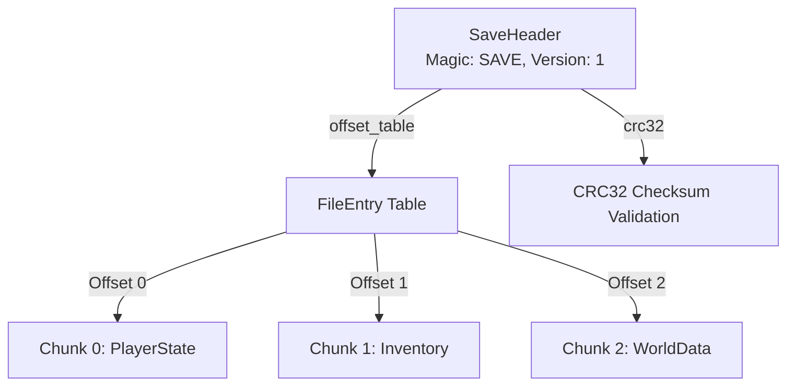

# Binary Master 実践チュートリアル (Step-by-Step Tutorial)

[](https://www.python.org/)
[](LICENSE)

**Binary Master (`binary-master`)** は、Python 3.14+ 向けの高機能な構造化バイナリ生成・解析＆仕様書自動生成ライブラリです。

Python標準の `struct` モジュールによるフォーマット文字列（`"<I2sH"` など）や手動オフセット計算の煩雑さを解消し、**型安全・宣言的・直感的**にバイナリデータをシリアライズ／デシリアライズできます。さらに、定義した構造から **Mermaid 図付きの仕様書（Markdown）** や **多言語コード（C / C++ / Rust / C# / Go）** を自動出力できます。

本チュートリアルでは、基本から応用までを **5つのステップ** で実際にコードを動かしながら学びます。

---

## 📚 目次

- [前提条件・環境セットアップ](#前提条件環境セットアップ)
- [Step 1: はじめてのバイナリ構造体（基礎編）](#step-1-はじめてのバイナリ構造体基礎編)
  - 1.1 構造体の宣言 (`@binary_struct`)
  - 1.2 シリアライズとデシリアライズ
  - 1.3 サイズ確認とエンディアンの指定
  - 1.4 メンバのバイトオフセット取得 (`offsetof`)
  - 1.5 文字列・生バイト列型 (`Bytes`, `FixedString`, `CString`, `PrefixedString`)
- [Step 2: ビットフィールドとアライメント（応用編）](#step-2-ビットフィールドとアライメント応用編)
  - 2.1 1ビット単位のフラグ定義 (`Bits[N]`)
  - 2.2 パケット境界アライメント (`align=4`, `auto_align=True`)
- [Step 3: 相対オフセットとポインタテーブル（高度なデータ構造）](#step-3-相対オフセットとポインタテーブル高度なデータ構造)
  - 3.1 自動オフセット計算 (`Offset[T, Base.SELF]`)
  - 3.2 オフセット演算とポインタテーブル (`OffsetTable`)
- [Step 4: 手続き的ライター & リーダーとデバッグ機能（低レベル制御）](#step-4-手続き的ライター--リーダーとデバッグ機能低レベル制御)
  - 4.1 `BinaryWriter` によるストリーム書き込み、位置管理 (`at_offset`, `preserve_position`)、セクションキャプション (`set_caption`)
  - 4.2 文字列戦略（Null終端 / 長さプレフィックス / 固定長）
  - 4.3 `BinaryReader` によるストリーム読み込み、先読み (`peek`)、位置保護 (`preserve_position`)
  - 4.4 充実したデバッグダンプ（注釈付き Hexdump / テーブル出力）
  - 4.5 バイナリ差分比較 (`writer.diff()`, `diff_dump()`)
  - 4.6 `BinaryWriter` による仕様書・多言語ヘッダーの直接出力 (`write_markdown`, `write_c_header`)
  - 4.7 多態バリアント (`write_variant`) とチャンク・オフセットテーブルの繰り返し集約 (`set_caption`)
- [Step 5: スキーマ駆動設計・仕様書自動生成・多言語出力（統合編）](#step-5-スキーマ駆動設計仕様書自動生成多言語出力統合編)
  - 5.1 `Builder` によるプロトコルスキーマ定義
  - 5.2 多態パケットの分岐 (`add_choice`)
  - 5.3 仕様書（Markdown & Mermaid 図）のワンライナー出力 (`write_markdown`)
  - 5.4 多言語ヘッダー出力 (C, Rust, Modern C++, C#, Go)
  - 5.5 スキーマ駆動の双方向シリアライズ (`to_bytes`) と自動デシリアライズ (`read`)
  - 5.6 スキーマ駆動のデバッグ検査 (`builder.hexdump` / `builder.dump`)
- [Step 6: v2.0 高度機能（型安全制約・可変長・ストリーミング・直接エクスポート）](#step-6-v20-高度機能型安全制約可変長ストリーミング直接エクスポート)
  - 6.1 `Magic` & `Constant`（シグネチャ・定数値の自動補完と検証）
  - 6.2 `BinaryEnum`（整数サイズ固定列挙型）
  - 6.3 統合チェックサム計算 & 検証 (`CRC32`, `CRC16`, `Adler32`, `Fletcher16`, etc.)
  - 6.4 JSON / 辞書相互変換 (`to_dict`, `from_dict`, `to_json`, `from_json`)
  - 6.5 巨大ファイル & ストリーミング処理 (`iter_struct`, `from_mmap`)
  - 6.6 可変長整数（LEB128 VarInt / VarUInt）
  - 6.7 任意ビットストリーム操作 (`BitWriter`, `BitReader`)
  - 6.8 CLI バイナリインスペクター (`binary-master`)
  - 6.9 構造体・インスタンスからの直接仕様書 & コード出力 (`to_markdown`, `to_code`)
  - 6.10 `LengthOf` & `CountOf`（自動長さ/要素数計算と連動デシリアライズ）
  - 6.11 `total_size` & `pad_to`（固定総サイズ保証とパディング）
  - 6.12 `Range`（型安全な値の範囲バリデーション）
  - 6.13 インタラクティブ HTML 仕様書 (`to_html()`, `write_html()`)
- [Step 7: 実践業界別レシピ集 (Real-World Industry Recipes)](#step-7-実践業界別レシピ集-real-world-industry-recipes)
  - 7.1 レシピ 1: ゲームセーブデータ・アーカイブ形式（Header + File Table + VarInt + CRC32）
  - 7.2 レシピ 2: IoT / 車載センサーテレメトリストリーム（Magic + BinaryEnum + LEB128タイムスタンプ）
  - 7.3 レシピ 3: 高頻度取引 (HFT) / 金融ティックロガー（ゼロコピー `from_mmap` + `iter_struct`）
  - 7.4 レシピ 4: 多態RPCメッセージキュー（`Variant` 動的ディスパッチ + 型安全ヘッダー）
- [Step 8: アーキテクチャ設計選定ガイド & トラブルシューティングFAQ](#step-8-アーキテクチャ設計選定ガイド--トラブルシューティングfaq)
  - 8.1 `@binary_struct` vs `BinaryWriter` vs `Builder` 使い分け早見表
  - 8.2 ゼロコピー & パフォーマンス最適化
  - 8.3 よくある落とし穴 & トラブルシューティング
- [まとめ & サンプルコードとの対応](#まとめ--サンプルコードとの対応)

---

## 前提条件・環境セットアップ

- **Python**: 3.14 以上

### インストール方法

```bash
# uv を使用する場合
uv add binary-master

# pip を使用する場合（ローカルリポジトリから）
pip install .
```

リポジトリ内のサンプルコードは `sample/` ディレクトリに格納されており、いつでも動作を確認できます：

```bash
python sample/main.py
```

---

## Step 1: はじめてのバイナリ構造体（基礎編）

> 対応サンプルコード: [`sample/01_basic_struct.py`](sample/01_basic_struct.py)

バイナリデータの読み書きで最も基本となるのが、`@binary_struct` デコレータを用いた宣言的構造体の定義です。

### 1.1 構造体の宣言 (`@binary_struct`)

Pythonの標準型アノテーションと同じ感覚でフィールドを定義します。

```python
from binary_master import (
    Bool,
    Bytes,
    Endian,
    FixedArray,
    FixedString,
    Float32,
    UInt8,
    UInt16,
    UInt32,
    binary_struct,
    offsetof,
    read_struct,
    sizeof,
)

@binary_struct(endian="little")
class PlayerProfile:
    """プレイヤーのプロファイルセーブデータ"""
    magic: UInt32              # シグネチャ: 0x504C4159 ('PLAY')
    player_id: UInt16          # プレイヤーID
    level: UInt8               # レベル (0-255)
    lives: UInt8               # 残機
    score: UInt32              # スコア
    health_ratio: Float32      # 体力比率 (0.0 - 1.0)
    is_vip: Bool               # VIP会員フラグ (1バイト: 0x01=True, 0x00=False)
    tag: FixedString[4]        # 4バイトのクランタグ文字列 ("PROG")
```

#### ポイント
- **プリミティブ型**: `UInt8`, `UInt16`, `UInt32`, `UInt64`, `Int8`, `Int16`, `Int32`, `Int64`, `Float16`, `Float32`, `Float64`, `Bool` などを直接指定できます。
- **固定長文字列 & バイト列**: `FixedString[N]` や `Bytes[N]` により、固定長テキストや生バイト列を Python の `str` / `bytes` として直感的に扱えます。
- **固定長配列**: `FixedArray[Type, Length]` で任意型の固定長配列を定義できます。
- **初期値（デフォルト値）の自由配置**: Python 標準の `@dataclass` の制限（「初期値ありフィールドの後に初期値なしフィールドを置けない」）を排除しており、**先頭や途中のフィールドにも自由に初期値（`magic: UInt32 = 0x504B5401`）を設定可能** です。
- **Docstring とインラインコメント**: クラス docstring や `# コメント` は、後述する仕様書生成時に自動抽出され、マニュアルの「説明」に反映されます。

```python
# 初期値付き構造体の定義例（先頭の magic や version に初期値を指定可能）
@binary_struct
class PacketHeader:
    magic: UInt32 = 0x504B5401    # 先頭フィールドに初期値
    version: UInt16 = 1           # 初期値
    payload_len: UInt16           # 必須フィールド（初期値なし）
    flags: UInt8 = 0              # 末尾フィールドに初期値

# 初期値を持つフィールドは省略してインスタンス化可能
pkt = PacketHeader(payload_len=256)
assert pkt.magic == 0x504B5401
assert pkt.version == 1
assert pkt.payload_len == 256
```

### 1.2 シリアライズとデシリアライズ

定義した構造体は通常のクラスのようにインスタンス化でき、`.to_bytes()` で直ちに `bytes` 列へシリアライズできます。

```python
# 1. インスタンス生成
player = PlayerProfile(
    magic=0x59414C50,   # 'PLAY' (リトルエンディアン)
    player_id=1042,
    level=50,
    lives=3,
    score=999999,
    health_ratio=0.85,
    is_vip=True,
    tag="PROG",
)

# 2. バイナリ列へシリアライズ
binary_data = player.to_bytes()
print(f"バイト長: {len(binary_data)} bytes")
print(f"Hex: {binary_data.hex(' ')}")

# 3. バイナリ列から構造体を復元 (デシリアライズ)
restored = PlayerProfile.from_bytes(binary_data)
# または: restored = read_struct(PlayerProfile, binary_data)

print(f"復元されたプレイヤーID: {restored.player_id}")
print(f"復元されたスコア: {restored.score}")
print(f"復元されたVIP状態: {restored.is_vip}")
print(f"復元されたクランタグ: {restored.tag}")  # 直接 str ("PROG") として復元される
```

### 1.3 サイズ確認とエンディアンの指定

クラスの静的バイトサイズは `sizeof()` または `.binary_size` で取得可能です。

```python
print(sizeof(PlayerProfile))         # => 21
print(PlayerProfile.binary_size)     # => 21
```

エンディアンは `@binary_struct(endian="little")` または `@binary_struct(endian="big")` で指定します。シリアライズ時に一時的にオーバーライドすることも可能です：

```python
# ビッグエンディアンで書き出し
big_data = player.to_bytes(endian="big")
```

### 1.4 メンバのバイトオフセット取得 (`offsetof`)

C言語の `offsetof(Struct, member)` と同様に、各フィールドの構造体先頭からのバイトオフセット（開始位置）を `offsetof()` 関数または `.offsetof("フィールド名")` メソッドで直接取得できます。

```python
from binary_master import offsetof

# クラスから直接取得
print(PlayerProfile.offsetof("magic"))        # => 0
print(PlayerProfile.offsetof("player_id"))    # => 4
print(PlayerProfile.offsetof("score"))        # => 8
print(PlayerProfile.offsetof("is_vip"))       # => 16
print(PlayerProfile.offsetof("tag"))          # => 17

# 関数形式でも呼び出し可能
print(offsetof(PlayerProfile, "score"))       # => 8

# インスタンスからも呼び出し可能
print(player.offsetof("score"))              # => 8
```

- **アライメント考慮**: `auto_align=True` やパディングフィールドによってオフセットがずれる場合も、パディング後の正確なバイトオフセットを返します。
- **ネスト対応**: 入れ子構造体の内部フィールドも `"header.version"` のようにドット記法で階層を辿ってオフセットを取得できます。
- **レイアウト一覧の取得**: 全メンバのオフセット・サイズ一覧を確認したい場合は `inspect_struct_layout(PlayerProfile)` も利用できます。

### 1.5 文字列・生バイト列型 (`Bytes`, `FixedString`, `CString`, `PrefixedString`)

バイナリ通信やファイルフォーマットで頻出する各種テキスト・バイト表現を、`@binary_struct` の型アノテーションとしてネイティブに記述できます：

| 型 | 説明 | Python 型 | 特徴 |
|---|---|---|---|
| `Bytes[N]` | N バイト固定長生データ | `bytes` | `FixedArray[UInt8, N]` の直感的な短縮形 |
| `FixedString[N]` | N バイト固定長文字列 | `str` | 余白は Null パディング、読み込み時は自動デコード |
| `CString` | Null 終端文字列 (`\0`) | `str` | 可変長。末尾 Null バイトまで自動読み書き |
| `PrefixedString[N]` | 長さプレフィックス付き | `str` | 先頭 N バイト (1, 2, 4) の数値で長さを示す |

```python
from binary_master import Bytes, FixedString, CString, PrefixedString, binary_struct

@binary_struct
class PacketMeta:
    guid: Bytes[16]              # 16バイト生バイナリ (UUID等)
    client_id: FixedString[8]    # 8バイト固定長文字列
    room_name: CString           # Null終端文字列
    description: PrefixedString[2] # 2バイト長プレフィックス付き文字列
```

---

## Step 2: ビットフィールドとアライメント（応用編）

> 対応サンプルコード: [`sample/02_bitfields_and_alignment.py`](sample/02_bitfields_and_alignment.py)

通信パケットやハードウェア制御では、1バイト未満のフラグビットを詰め込む「ビットフィールド」や、CPUアクセス効率のための「メモリアライメント」が不可欠です。

### 2.1 1ビット単位のフラグ定義 (`Bits[N]`)

`@binary_struct(bits=16)` のようにコンテナ全体の合計ビット数を指定し、各フィールドに `Bits[N]` を割り当てます。

```python
from binary_master import Bits, binary_struct

@binary_struct(bits=16)
class DeviceStatus:
    """16ビットにパックされたデバイスステータスフラグ"""
    powered_on:  Bits[1]  # Bit 0: 電源 (1=ON, 0=OFF)
    busy:        Bits[1]  # Bit 1: 処理中フラグ
    mode:        Bits[3]  # Bits 2..4: 動作モード (0〜7)
    error_code:  Bits[3]  # Bits 5..7: エラーコード (0〜7)
    battery_pct: Bits[7]  # Bits 8..14: バッテリー残量 (0〜100%)
    reserved:    Bits[1]  # Bit 15: 予約領域
```

インスタンス化時に各ビット値を個別に指定でき、自動的に1つの整数値（この例では 16-bit / 2バイト）にビットパッキングされます。

```python
status = DeviceStatus(
    powered_on=1,
    busy=0,
    mode=5,
    error_code=2,
    battery_pct=95,
    reserved=0,
)
data = status.to_bytes()
print(f"サイズ: {len(data)} bytes, Hex: 0x{int.from_bytes(data, 'little'):04X}")

# 復元
loaded = DeviceStatus.from_bytes(data)
print(f"Battery: {loaded.battery_pct}%, Mode: {loaded.mode}")
```

### 2.2 パケット境界アライメント (`align=4`, `auto_align=True`)

C言語の構造体パディング規則に準拠したい場合、2つのアライメント指定が利用できます。

#### 明示的アライメント境界 (`align=4`)
構造体の末尾やフィールド間に指定境界（例: 4バイト境界）のパディングを自動挿入します。

```python
from binary_master import UInt8, UInt32, binary_struct

@binary_struct(align=4)
class AlignedPacket:
    type_id: UInt8        # 1 byte
    # -> 3バイトのパディングが自動挿入され、counter は offset 4 から配置
    counter: UInt32       # 4 bytes
    flags: DeviceStatus   # 2 bytes
    # -> 全体サイズを4の倍数にするため、末尾に2バイトのパディングが自動挿入（計12B）

print(sizeof(AlignedPacket))  # => 12
```

#### 自然アライメント (`auto_align=True`)
各型が自身のサイズ境界（例: `UInt16` は2の倍数、`UInt32` は4の倍数）に自動配置されるようパディングが挿入されます。

```python
@binary_struct(auto_align=True)
class NaturalAlignedStruct:
    a: UInt8   # offset 0 (1B)
    # 1B パディング
    b: UInt16  # offset 2 (2B)
    c: UInt32  # offset 4 (4B)

print(sizeof(NaturalAlignedStruct))  # => 8
```

---

## Step 3: 相対オフセットとポインタテーブル（高度なデータ構造）

> 対応サンプルコード: [`sample/03_offsets_and_tables.py`](sample/03_offsets_and_tables.py)

バイナリファイルフォーマット（フォント、画像、3Dモデル、ゲームアーカイブなど）では、ヘッダー内に「データ本体が存在するオフセット位置」を記録する構造が頻出します。

Binary Master は **オフセットの自動バックパッチ（遅延解決）**、**ポインタテーブルの自動生成**、および **読み込み時の自動インスタンス化** を標準サポートしています。

---

### 3.1 「Offset で渡した構造体はどこに書かれるのか？」

初心者が最も疑問に持ちやすいポイントが **「`Offset[T]` に渡したオブジェクトの実体はバイナリのどこに書き出されるのか？」** です。

答えは **「親構造体の全通常フィールドが書き終わった直後（末尾）に順番に追加書き込みされる」** です。

#### 3段階のシリアライズ・ライフサイクル

```text
【メモリレイアウト / バイト列の配置順序】

0x0000 ┌───────────────────────────────────────────────┐
       │ AssetContainer (親構造体 / ヘッダー)          │
       │   magic: UInt32 (4B)                          │
       │   version: UInt16 (2B)                        │
0x0006 │   primary_offset: Offset[TextureData] (4B) ──┐│ ← 1. まず仮値 0x00000000 を書き込み位置を記憶
0x000A │   aux_offset: Offset[TextureData] (4B) ────┐ ││
0x000E ├─────────────────────────────────────────────┼─┼┤ ← 親構造体の末尾
       │ TextureData (primary_offset の実体データ)   │ ││
       │   width: 256, height: 256 ... (13B)         │ ││ ← 2. 親構造体の直後に自動追記！
0x001B ├─────────────────────────────────────────────┼─┼┤
       │ TextureData (aux_offset の実体データ)       │ ││
       │   width: 128, height: 128 ... (13B)         │ ││ ← 2. 続いて末尾に自動追記！
       └─────────────────────────────────────────────┴─┴┘
                                                     │ │
                                                     │ └─── 3. 実際の配置位置 (0x000E) との相対差分を
                                                     │         primary_offset の位置に自動バックパッチ！
                                                     └───── 3. 実際の配置位置 (0x001B) との相対差分を
                                                               aux_offset の位置に自動バックパッチ！
```

1. **フェーズ 1 (親構造体の通常フィールドの書き込み)**:
   ヘッダーの各フィールドを先頭から順にストリームへ書き出します。`Offset` フィールドの位置には **仮値 `0x00000000`（4バイト）** が書き込まれ、その書き込み位置（プレースホルダー）が内部で記録されます。
2. **フェーズ 2 (実体データの末尾追記)**:
   親構造体の通常フィールドがすべて書き終わった直後、引数で渡された各実体オブジェクト（`primary_offset=tex_main` 等）が **ストリームの末尾に順番に追加（追記）書き込み** されます。
3. **フェーズ 3 (オフセットの自動バックパッチ)**:
   実体データが配置された実アドレス（`writer.tell()`）を取得し、基準点（`Base.SELF` や `Base.STRUCT` 等）との相対差分を計算して、フェーズ 1 で残したプレースホルダーへシークして正しいオフセット値を上書きします。

したがって、**実体データを手動で別途 `write_struct` する必要はなく、`container.to_bytes()` を呼ぶだけで全体が完璧にシリアライズされます。**

```python
from binary_master import (
    Base,
    FixedArray,
    Offset,
    UInt8,
    UInt16,
    UInt32,
    binary_struct,
    BinaryStruct,
)

# 参照先ペイロード
@binary_struct
class TextureData(BinaryStruct):
    width: UInt16
    height: UInt16
    format: UInt8
    raw_pixels: FixedArray[UInt8, 8]

# コンテナヘッダー
@binary_struct
class AssetContainer(BinaryStruct):
    magic: UInt32
    version: UInt16
    # 自身の先頭 (Base.SELF) からの相対オフセットを 4バイト整数で格納
    primary_offset: Offset[TextureData, Base.SELF, UInt32]
    # オフセット基準位置にバイアスを付与 (Base.SELF + 0x20)
    aux_offset: Offset[TextureData, Base.SELF + 0x20, UInt32]

# --- データのセット方法 ---

# パターン 1: ヘッダーを先に宣言して後からセット（直感的でおすすめ）
# Offset フィールドは初期化時に省略できるため、ヘッダーを先に作成できます
container = AssetContainer(
    magic=0x54535341,  # 'ASST'
    version=1,
)
container.primary_offset = TextureData(width=256, height=256, format=1, raw_pixels=b"MAIN_TEX")
container.aux_offset     = TextureData(width=128, height=128, format=1, raw_pixels=b"AUX__TEX")

# パターン 2: コンストラクタ引数で一括指定
# container = AssetContainer(
#     magic=0x54535341,
#     version=1,
#     primary_offset=TextureData(width=256, height=256, format=1, raw_pixels=b"MAIN_TEX"),
#     aux_offset=TextureData(width=128, height=128, format=1, raw_pixels=b"AUX__TEX"),
# )

# to_bytes() だけでヘッダーと各実体データが順番に書き出され、オフセットが自動計算されます
binary_package = container.to_bytes()
```

---

### 3.2 中間構造体不要！`Offset[OffsetTable[...]]` によるポインタテーブル直接配置

「ヘッダー内にポインタテーブルへのオフセットを持ち、そのテーブルが複数の要素を指す」という構造も、ラッパー用の構造体を作ることなく直接宣言できます。

```text
【Offset[OffsetTable] の配置順序】

┌──────────────────────────────────────┐
│ DirectTableContainer (ヘッダー)      │
│   magic: UInt32                      │
│   num_items: UInt16 (=2 自動反映)     │
│   table_offset: Offset ──────────┐   │
├──────────────────────────────────┼───┤
│ OffsetTable (ポインタ配列テーブル)  │<──┘
│   table[0] ──────────────────┐   │
│   table[1] ──────────────┐   │   │
├──────────────────────────┼───┼───┤
│ LeafItem #0 (id=1, val=100)│<──┘   │
├──────────────────────────┼───────┤
│ LeafItem #1 (id=2, val=200)│<──────┘
└──────────────────────────┴───────┘
```

```python
from binary_master import binary_struct, BinaryStruct, UInt16, UInt32, Offset, OffsetTable, Base

@binary_struct
class LeafItem(BinaryStruct):
    item_id: UInt16
    val: UInt32

@binary_struct
class DirectTableContainer(BinaryStruct):
    magic: UInt32
    num_items: UInt16
    # 中間構造体なしで OffsetTable へのオフセットを直接指定！
    table_offset: Offset[OffsetTable["num_items", UInt32, Base.SELF], Base.SELF]

# 1. ヘッダーを先に宣言（num_items や table_offset は省略可能）
container = DirectTableContainer(magic=0x524F4F54)

# 2. 後からペイロードのリストを代入
# （num_items は渡されたリストの長さから自動計算・補完されます）
container.table_offset = [
    LeafItem(item_id=1, val=100),
    LeafItem(item_id=2, val=200),
]

# 3. シリアライズ
raw = container.to_bytes()
restored = DirectTableContainer.from_bytes(raw)
print(restored.num_items)     # => 2 (自動設定)
print(restored.table_offset)  # => [8, 14] (各 LeafItem への相対オフセット)
```

---

### 3.3 自由配置・ヘッダー先行書き込み (`NamedOffset["key"]`)

`Offset[...]` は親構造体の直後に自動追記されますが、**「ヘッダーを先に書いて、その後に任意の文字列や可変長データを挟み、後からオフセットの指す先を確定させたい」** 場合には、`NamedOffset["key"]` を使用します。

```python
from binary_master import binary_struct, BinaryStruct, UInt16, BinaryWriter, NamedOffset, read_struct

@binary_struct
class Header(BinaryStruct):
    magic: UInt16
    offset: NamedOffset["payload_pos"]  # "payload_pos" というキー名でオフセット枠を宣言

writer = BinaryWriter()
h = Header(magic=0x1234)

writer.write_struct(h)                    # 1. まずヘッダーを出力（オフセット位置は未確定）
writer.write_string("任意の可変長データ...") # 2. 途中に自由なデータを書き込む
writer.write_named_offset("payload_pos")  # 3. ここで "payload_pos" のオフセットを現在位置に確定・自動バックパッチ！

raw = writer.to_bytes()
restored = read_struct(Header, raw)
print(restored.offset)  # => 2 + 4 + len("任意の可変長データ...")
```

#### 同一キーの多重登録と例外安全性
- 同じキー名の `NamedOffset` を複数のフィールドや構造体で宣言した場合、同一キーの多重登録が許可されます。`writer.write_named_offset("key")` を呼び出すと、そのキーに紐づくすべてのオフセットスロットが同じターゲット位置へと一括で自動バックパッチされます（複数のポインタが同一ペイロードを指す構造に対応）。
- すでに解決済みのキーに対して誤って再度 `write_named_offset("key")` を呼び出した場合は、意図しない二重確定を防ぐため [`DuplicateNamedOffsetError`](file:///home/ishii/PycharmProjects/binary_master/src/binary_master/exceptions.py#L101-L103) が発生します（明示的に上書き・再更新する場合は [`rewrite_named_offset("key")`](file:///home/ishii/PycharmProjects/binary_master/src/binary_master/writer.py) を使用します）。
- `write_named_offset("key")` や `rewrite_named_offset("key")` で存在しないキーを指定した場合は、安全のため [`NamedOffsetNotFoundError`](file:///home/ishii/PycharmProjects/binary_master/src/binary_master/exceptions.py#L106-L108) が発生します。

#### 名前空間スコープ (`with writer.namespace(...)`)

同じ構造体クラス（例: `ChunkHeader`）を複数のチャンクで繰り返し書き出す際、同一のキー名（例: `"payload"`）がグローバル空間でバッティングするのを防ぐため、`with writer.namespace(...)` コンテキストマネージャでスコープを分割できます。

```python
from binary_master import (
    BinaryWriter,
    NamedOffset,
    UInt16,
    UInt32,
    binary_struct,
    read_struct,
)

@binary_struct
class ChunkPayload:
    width: UInt16
    height: UInt16

@binary_struct
class ChunkHeader:
    chunk_id: UInt16
    payload_offset: NamedOffset["payload"]  # 汎用的なキー名で定義

writer = BinaryWriter()

# auto_id=True を使うと、"chunk_0", "chunk_1"... と自動連番でスコープ化されます
for i in range(2):
    with writer.namespace("chunk", auto_id=True):
        # 1. ヘッダーを書き込み（payload_offset は仮値が書き込まれる）
        writer.write_struct(ChunkHeader(chunk_id=i + 1))
        # 2. 任意の可変長メタデータを挟む
        writer.write_string(f"metadata_{i}...")
        # 3. ペイロード実体を書き込みつつ、"chunk_i/payload" を自動バックパッチ！
        writer.write_named_offset("payload", ChunkPayload(width=(i + 1) * 100, height=(i + 1) * 200))

data = writer.to_bytes()

# 読み込み検証: ヘッダーのオフセットから直接ペイロードをデシリアライズ可能
h0 = read_struct(ChunkHeader, data[:6])
p0 = read_struct(ChunkPayload, data[h0.payload_offset:h0.payload_offset + 4])
print(f"Chunk 1 payload: {p0.width}x{p0.height}")  # => 100x200
```

- **自動採番 (`auto_id=True`)**: ループ内で `with writer.namespace("chunk", auto_id=True):` とすると、`chunk_0`, `chunk_1`... と自動で連番が付与されます。
- **明示的な名前空間**: `with writer.namespace("chunk_a"):` のように任意の文字列でスコープを指定することも可能です。
- **ネスト（階層化）**: `with writer.namespace("sec"): with writer.namespace("sub"):` のようにネストすると `"sec/sub/key"` と連結されます。
- **ルート脱出 (`/`)**: スコープ内から `NamedOffset["/global_footer"]` のように先頭にスラッシュを付けると、名前空間を脱出してルート直下のキーを参照します。

---

### 3.4 手続き的ライターでのオフセットテーブル予約 (`write_offset_table`)

構造体を使わず手続き的にバイナリを構築する場合も、`write_offset_table` でオフセット配列枠を予約し、後からオフセットをセットできます。
`spec_count="num_chunks"` を渡すと、仕様書（Markdown / Mermaid）上では個別のスロット行が 1 つのテンプレート行（`offsets[i]`）と繰り返しバッジ（`🔁 xnum_chunks`）に自動集約されます。

```python
writer = BinaryWriter()
writer.write_uint16(10, name="num_chunks", desc="Number of chunks")

# 10個のオフセットスロットを予約（仕様書上は num_chunks 回繰り返しとして集約）
table = writer.write_offset_table(
    count=10,
    offset_size=4,
    name="chunk_offsets",
    desc="Table of chunk offsets",
    spec_count="num_chunks",
)

# 各チャンクの書き込みとオフセットの登録
for i in range(10):
    table[i] = writer.tell()
    writer.write_cstring(f"Payload #{i}", name=f"chunk_{i}")
```

---

## Step 4: 手続き的ライター & リーダーとデバッグ機能（低レベル制御）

> 対応サンプルコード: [`sample/04_procedural_writer.py`](sample/04_procedural_writer.py)

> [!TIP]
> **Writer から直接仕様書や C/Rust ヘッダーを出力可能になりました！**  
> `BinaryWriter` で実際にバイナリを書き進めながら、ワンライナーで `writer.write_markdown("spec.md")` や `writer.write_c_header("spec.h")` を出力できます。  
> 実際の書き込みコードが存在する場合は `BinaryWriter` をそのまま使うのが最も手軽で直感的です。一方、事前にダミーデータなしでプロトコル仕様を設計したい場合や、受信パケットを自動デシリアライズ（`builder.read()`）したい場合は、[Step 5 (`Builder`)](#step-5-スキーマ駆動設計仕様書自動生成多言語出力統合編) を活用します。

構造体を定義するまでもない小さなスクラッチ処理や、ストリームを逐次読み書きしたい場合は `BinaryWriter` と `BinaryReader` を直接使用します。

### 4.1 仕様書メタデータとセクションキャプション (`set_caption`)

バイナリ出力コードを実装する際、コード上に `# --- ヘッダー部 ---` といったコメントを書いても、出力されるバイナリデータはもちろん、自動生成される仕様書（Markdown）や Mermaid ダイアグラムには何も反映されません。

一方、プロトコル仕様書やフォーマット定義書には、以下の **仕様書専用のメタデータ** が必要不可欠です：
- **セクション見出し名**: どのバイト範囲が何のブロック（ヘッダー、オフセット配列、ペイロード等）か
- **詳細説明文 (`desc`)**: そのセクションの仕様・フォーマット・役割の解説
- **仕様書上の繰り返し回数・変数名 (`spec_count`)**: 何件繰り返される領域なのか（例: `num_chunk 回`, `不定回数`）
- **多態バリアント候補 (`variants`)**: 条件に応じて格納され得る構造体の一覧

**`writer.set_caption(...)` は、これら仕様書生成に必要なすべての説明メタデータを 1 つの窓口に集約・一元管理** する機能です（バイナリの書き出しバイト列そのものには影響を与えません）。

#### 2つの書き方（コンテキストマネージャ vs 直接呼び出し）

##### ① `with` 構文によるスコープ管理（★推奨）
`with writer.set_caption(...):` を使うと、ブロック内の書き込みにのみメタデータが適用され、**ブロックを抜けると直前の状態に自動復元** されます。後続の書き込みへ設定が漏れ出さないため最も安全で可読性に優れます。

```python
from binary_master import BinaryWriter

writer = BinaryWriter(default_endian="little")

# ヘッダ情報
writer.set_caption("File Header", desc="ファイル種別とバージョン情報")
writer.write_uint32(0x46494C45, name="magic", desc="Magic 'FILE'")
writer.write_uint16(2, name="ver_maj", desc="Major version")
writer.write_uint16(0, name="ver_min", desc="Minor version")
writer.write_uint16(3, name="num_chunk", desc="格納チャンク数")

# オフセット配列を with set_caption でスコープ化
with writer.set_caption("offsets", desc="各チャンクへのオフセット配列", spec_count="num_chunk"):
    # write_offset_table はアクティブな set_caption の設定を自動継承！
    table = writer.write_offset_table(count=3, offset_size=4)

# ブロックを抜けると caption は自動解除されるので、チャンク本体に影響しない
for i in range(3):
    table[i] = writer.tell()
    writer.write_cstring(f"CHUNK_{i}", name=f"chunk_{i}")
```

##### ② 直接メソッド呼び出し
手続き的にセクションを順次切り替えたい場合も自然に呼び出せます（メソッドチェーン対応）。
```python
writer.set_caption("Header", desc="メインコンテナヘッダ")
writer.write_uint32(0x12345678, name="magic")

# 新しいキャプションに切り替え
writer.set_caption("Metadata", desc="テキストメタデータ")
writer.write_cstring("Hello", name="message")
```

##### ③ 位置管理とオフセット指定書き込み (`at_offset`, `preserve_position`)
ヘッダー内のデータサイズやチェックサムなど、「後続のデータを書き終わった後に先頭へ戻って書き戻したい（バックパッチ）」処理を、コンテキストマネージャで安全に行えます。

```python
# 方法A: 指定オフセットへ一時ジャンプして書き込み、終了時に元位置へ自動復帰 (at_offset)
size_offset = 4
with writer.at_offset(size_offset):
    writer.write_uint32(1024, name="payload_length")

# 方法B: 現在の書き込み位置を保護したまま任意シーク (preserve_position)
with writer.preserve_position():
    writer.seek(0)
    writer.write_uint32(0x12345678, name="magic")
# ブロックを抜けると元の位置へ自動復帰
```

### 4.2 文字列戦略（Null終端 / 長さプレフィックス / 固定長）

実世界のプロトコルで登場する3大文字列フォーマットをネイティブサポートしています：

```python
# ① C言語スタイル: Null終端文字列 ('\0')
writer.write_cstring("SampleApp v2.0", name="app_name")

# ② Pascalスタイル: 長さプレフィックス（先頭2バイトに文字列長を記録）
writer.write_prefixed_string("Confidential Document", prefix_bytes=2, name="doc_title")

# ③ 固定長パディング文字列（8バイト固定、空白で埋める）
writer.write_fixed_string("AUTH", length=8, pad_byte=b" ", name="author_tag")
```

### 4.3 `BinaryReader` によるストリーム読み込み

`BinaryReader` はカーソル位置を追跡しながら、型安全にデータを順次デコードします。

```python
from binary_master import BinaryReader

data = writer.to_bytes()
reader = BinaryReader(data, default_endian="little")

magic = reader.read_uint32()
ver_maj = reader.read_uint16()
ver_min = reader.read_uint16()

app_name = reader.read_cstring(encoding="utf-8")
doc_title = reader.read_prefixed_string(prefix_bytes=2, encoding="utf-8")
author_tag = reader.read_fixed_string(length=8, encoding="utf-8").strip()

print(f"App: {app_name}, Title: {doc_title}, Tag: {author_tag}")
```

#### 先読み (`peek`) と位置保護 (`preserve_position`), EOF判定 (`is_eof`)
ストリームのカーソルを進めずに次に来るデータを検証したり、一時的に位置を移動して元の位置に戻すことができます：

```python
# 先読み（カーソル位置はそのまま）
if reader.peek_uint16() == 0x01:
    print("タイプ1パケットを検出")

next_magic = reader.peek_uint32()
next_4bytes = reader.peek_bytes(4)
next_byte = reader.peek()

# データ終端の確認
if reader.is_eof:
    print("すべてのデータを読み込み完了")

# 一時的な位置移動と自動復帰
with reader.preserve_position():
    reader.seek(0x20)
    aux = reader.read_uint32()
# ブロック終了時に元の位置へ自動復帰
```

### 4.4 充実したデバッグダンプ

Binary Master には、開発効率を飛躍的に高める強力なデバッグツールが備わっています。

#### ① 注釈付き Hexdump (`writer.hexdump()`)
バイト列とASCII表示だけでなく、**どのバイトがどのフィールド名・型に対応しているか** の注釈が横に表示されます。

```python
print(writer.hexdump(color=True))
```

```text
Offset    00 01 02 03 04 05 06 07  08 09 0A 0B 0C 0D 0E 0F  |     ASCII      |  Field Annotations
-------------------------------------------------------------------------------------------------
00000000  45 4c 49 46 02 00 00 00  53 61 6d 70 6c 65 41 70  |ELIF....SampleAp|  magic=0x46494C45 (UInt32); ver_maj=2 (UInt16); ver_min=0 (UInt16); app_name=SampleApp .. (CString)
00000010  70 20 76 32 2e 30 00 15  00 43 6f 6e 66 69 64 65  |p v2.0...Confide|  app_name=SampleApp .. (CString); doc_title=Confidenti.. (PrefixedString[2])
```

#### ② 表形式トレース (`writer.dump("table")`)
全フィールドの Offset, Size, Type, Hex Bytes, Value に加え、**先ほど設定した `Caption`（セクション名）** が右端の列に表示されます。  
デバッグ時に「どのセクションの、どのフィールドを書き込んだか」を一目で突き合わせることができます。

```python
print(writer.dump("table"))
```

```text
+--------+------+---------------+-------------------+--------+----------------------------+-------------------------------------+--------------+
| Offset | Size | Field Name    | Type              | Endian | Hex Bytes                  | Value / Preview                     | Caption      |
+========+======+===============+===================+========+============================+=====================================+==============+
| 0x0000 |   4B | magic         | UInt32            | Little | 45 4c 49 46                | 0x46494C45                          | File Header  |
| 0x0004 |   2B | ver_maj       | UInt16            | Little | 02 00                      | 2                                   | File Header  |
| 0x0006 |   2B | ver_min       | UInt16            | Little | 00 00                      | 0                                   | File Header  |
| 0x0008 |  15B | app_name      | CString           | -      | 53 61 6d 70 6c 65 .. (15B) | SampleApp ..                        | Metadata     |
| 0x0017 |  23B | doc_title     | PrefixedString[2] | Little | 15 00 43 6f 6e 66 .. (23B) | Confidenti..                        | Metadata     |
| 0x002E |   8B | author_tag    | FixedString[8]    | -      | 41 55 54 48 20 20 20 20    | AUTH                                | Metadata     |
+--------+------+---------------+-------------------+--------+----------------------------+-------------------------------------+--------------+
Total: 46 bytes (0x002E) across 6 fields
```

#### ③ リーダーのカーソル位置・残りバイト検査 (`reader.hexdump()`)
現在どこまでパースしたか、残りが何バイトあるかを一目で確認できます。

```python
reader.read_uint32()
print(reader.hexdump())  # --> CURSOR @ 0x0004 と表示される
```

### 4.5 バイナリ差分比較 (`writer.diff()`, `diff_dump()`)

2つのバイナリバッファや `BinaryWriter` インスタンスの内容に相違がある場合、どのバイト位置でどのような差分が生じているかをフィールド注釈付きでビジュアルに比較・確認できます。

```python
from binary_master import BinaryWriter, diff_dump

writer1 = BinaryWriter()
writer1.write_uint32(0x12345678, name="magic")
writer1.write_uint16(42, name="packet_id")

writer2 = BinaryWriter()
writer2.write_uint32(0x12345678, name="magic")
writer2.write_uint16(99, name="packet_id")

# 差分レポート文字列（または ANSI カラー付きテキスト）を取得
diff_report = writer1.diff(writer2, color=True)
print(diff_report)
```

差分出力例（どのフィールドで値が食い違っているかが一目でわかります）：
```text
--- Binary Diff: Self vs Other ---
  Size Self:   6 bytes (`0x0006`)
  Size Other:  6 bytes (`0x0006`)
  Differing byte count: 1 bytes in 1 range(s)

Offset      Self Hex                Other Hex               Field / Context
---------------------------------------------------------------------------
0x0004..0005   2a                      63                      packet_id (UInt16)
```

### 4.6 `BinaryWriter` による仕様書・多言語ヘッダーの直接出力 (`write_markdown`, `write_c_header`)

`BinaryWriter` でバイナリを書き進めた後、その書き込み履歴（エントリ）をもとに仕様書や多言語コードを直接生成できます。

```python
# 仕様書（Markdown）の出力
writer.write_markdown("packet_spec.md")

# 各種言語のコード・ヘッダー出力
writer.write_c_header("packet_spec.h")
writer.write_rust("packet_spec.rs")
writer.write_cpp("packet_spec.hpp")
writer.write_csharp("packet_spec.cs", namespace="MyProtocol")
writer.write_go("packet_spec.go", package_name="protocol")

# 拡張子からの自動判別出力
writer.write_code("packet_spec.rs")
```

### 4.7 多態バリアント (`write_variant`) とチャンクの繰り返し集約 (`spec_count` / `set_caption`)

#### ① 多態バリアント (`write_variant`)
「同じ領域に条件によって異なる構造体が書き込まれる」ケースでは、`candidates`（候補型辞書またはリスト）を指定して書き込みます。

```python
# 候補辞書: {ID: 構造体クラス}
candidates = {1: HeaderChunk, 2: TextChunk}

# タグフィールドと一致しているか検証しながら安全に書き込み
writer.write_uint16(1, name="chunk_type")
writer.write_variant(
    HeaderChunk(version=1, flags=0),
    candidates=candidates,
    tag_field="chunk_type",
    name="payload",
)
```
許可されていない型のインスタンスを渡した場合や、直前に書かれたタグ値と型が不一致の場合は即座にエラーとなります。また、仕様書や C ヘッダーにも候補構造体が自動的に登録されます。

#### ② チャンク・オフセットテーブルの繰り返し集約 (`set_caption` / `spec_count`)
ループで何十個も同じチャンク構造体やオフセットテーブルを書き込む場合、仕様書テーブルに全行を展開するとドキュメントが肥大化してしまいます。  
`with writer.set_caption(...)` で `spec_count`（または `write_struct` の `spec_count` 引数）を指定すると、仕様書上では **「1要素のテンプレート（相対オフセット `+0x00`, `+0x04`...）」** として美しく自動集約されます。

```python
# パターンA: with writer.set_caption(...) によるスコープ化（推奨）
# タイトル、説明文、繰り返し回数・変数名を1箇所でスッキリ定義！
with writer.set_caption("DataChunks", desc="可変個のデータチャンク", spec_count="chunk_count"):
    for chunk in chunks:
        writer.write_struct(chunk)

# パターンB: オフセットテーブルでの活用
# テーブル定義が 'offsets[i]' として仕様書に自動集約されます
with writer.set_caption("offsets", desc="各チャンクへのオフセット配列", spec_count="num_chunk"):
    table = writer.write_offset_table(count=len(chunks))

# パターンC: write_struct で直接指定
for chunk in chunks:
    writer.write_struct(chunk, spec_count="chunk_count")  # 不定回数の場合は spec_count=-1

# パターンD: リストを一括書き込み
writer.write_repeated(chunks, spec_count="num_chunks")
```
- `spec_count=-1` や負の数を指定すると、仕様書上には `不定回数 (0回以上 / 可変)`、Mermaid 図には `🔁 (不定回数)` と表記されます。
- `section=""`（デフォルト）のときは、構造体クラス名（例: `Chunk`）が自動的にセクション見出しとして使用されるため、セクション名を手動で書く必要もありません。

---

## Step 5: スキーマ駆動設計・仕様書自動生成・多言語出力（統合編）

> 対応サンプルコード: [`sample/05_builder_and_reader.py`](sample/05_builder_and_reader.py)

### 💡 Writer と Builder の使い分け：Builder の役割と存在理由

Step 4 で見たように、`BinaryWriter` でも仕様書（Markdown）や C/Rust ヘッダーの直接出力、多態バリアント、繰り返しチャンクの集約ができるようになりました。では、`Builder`（`BinaryBuilder`）はどのような場面で必要なのでしょうか？

1. **実データ不要の「スキーマ事前設計」**:
   バイナリデータを実際に書き出すコードやダミーデータを用意しなくても、構造体クラスの登録とプロトコルの章立て（`add_document`）だけで **仕様書や C/Rust ヘッダーを作成** できます。仕様策定フェーズに最適です。
2. **スキーマ駆動の「自動デシリアライズ」(`builder.read`)**:
   受信した生のバイナリ列を渡すだけで、ヘッダーのタグ値や条件分岐をスキーマに従って自動評価し、対応する構造体インスタンスとして一括復元できます（`Reader` で手動で `if/elif` を書く必要がありません）。
3. **コードジェネレータの「内部中間表現 (IR)」**:
   実は `writer.to_c_header()` や各種コード生成機能も、内部では `writer.to_builder()` を介して Builder 構造に変換されて動作しています。Builder はシステム全体の核となるスキーマ表現です。

| 観点 | `BinaryWriter` (コード駆動 / データ駆動) | `Builder` (スキーマ駆動 / 仕様・パーサー駆動) |
|---|---|---|
| **主な用途** | バイナリの生成・出力、書き込み実行ログからの仕様書/ヘッダー自動生成 | プロトコル仕様の先行策定、受信バイナリの自動デシリアライズ |
| **動的な条件分岐** | Python の自然な `if/elif` や `for` ループで柔軟に処理可能 | メタ定義（`add_choice`, `condition`）による静的スキーマ宣言 |
| **実データの要否** | 必要（実際に書き込まれたバイト列から仕様を抽出） | **不要**（クラス定義と章立てドキュメントのみで仕様書/コード出力可） |
| **読み込み (パース)** | 読み込み不可（別途 `BinaryReader` で手動実装） | **自動パース可能** (`builder.read(data)` で一括復元) |

**結論・使い分けの指針**:
- **「バイナリを出力する処理」がある場合（日常使いの 8〜9 割）**: `BinaryWriter` を使うのが最も直感的でコード量も少なくなります。
- **「仕様策定先行」または「受信バイナリの自動パース」を行う場合**: `Builder` が威力を発揮します。

`Builder`（`BinaryBuilder`）を使用することで、事前スキーマ定義から **「仕様書生成」「多言語ヘッダー出力」「自動パーサー」** を1本の定義で完結できます。

### 5.1 `Builder` によるプロトコルスキーマ定義

ネットワークパケットなどの通信仕様を設計します。

```python
from binary_master import (
    Builder,
    UInt8,
    UInt16,
    UInt32,
    Float32,
    FixedArray,
    binary_struct,
)

# 1. パケットの構成要素を定義
@binary_struct(endian="little")
class PacketHeader:
    """共通パケットヘッダー"""
    magic: UInt32         # 'MSGP' (0x4D534750)
    version: UInt16       # プロトコルバージョン
    msg_type: UInt16      # メッセージ種別: 1=Text, 2=Sensor
    payload_size: UInt32  # ペイロード長
    flags: UInt16         # Bit 0: チェックサムフッター有無

@binary_struct
class TextMessage:
    """テキストメッセージペイロード"""
    encoding: UInt16
    text_len: UInt16
    content: FixedArray[UInt8, 16]

@binary_struct
class SensorReport:
    """テレメトリセンサーデータペイロード"""
    sensor_id: UInt32
    temperature: Float32
    pressure: Float32
    humidity: Float32

@binary_struct
class ChecksumFooter:
    """末尾の CRC32 チェックサム"""
    crc32: UInt32
```

### 5.2 多態パケットの分岐 (`add_choice`) と条件分岐 (`condition`)

メッセージ種別（`msg_type`）によって直後のペイロード構造が変化する仕様を定義します。

```python
# Builder インスタンスの作成
builder = Builder(
    title="Network Telemetry Protocol Specification",
    version="1.0.0",
    default_endian="little",
    description="テキスト通信とセンサーテレメトリを統合したバイナリプロトコル仕様書。",
)

# 概要ドキュメント章を追加
builder.add_document("概要とスコープ", "本ドキュメントは NTP-v1 プロトコルの詳細仕様を定めます。")

# セクション（キャプション）で論理グループ化しながら構造体を登録
# （Mermaid フローチャートで自動的に subgraph 枠線としてグループ化されます）
with builder.section("Header Section", "固定長パケットヘッダー"):
    builder.add_struct(PacketHeader, name="header", desc="固定長パケットヘッダー")

with builder.caption("Payload Section", "メッセージ種別に応じたペイロード"):
    builder.add_choice(
        name="payload",
        tag_field="msg_type",
        variants={
            1: (TextMessage, "テキストメッセージペイロード"),
            2: (SensorReport, "環境センサー計測値ペイロード"),
        },
        desc="PacketHeader.msg_type に応じてディスパッチされるペイロード",
    )

with builder.caption("Footer Section", "整合性チェック"):
    builder.add_struct(
        ChecksumFooter,
        name="footer",
        desc="末尾 CRC32 チェックサム",
        condition="flags & 0x01 != 0",
    )
```

### 5.3 仕様書（Markdown & Mermaid 図）のワンライナー出力 (`write_markdown`)

`builder.write_markdown()`（または `builder.write()`）を呼び出すだけで、仕様書 Markdown ファイル（Mermaid フローチャートおよびパケットレイアウト図付き）が瞬時に生成されます。また `builder.to_markdown()` で文字列として取得することも可能です。

```python
builder.write_markdown("telemetry_protocol_spec.md", diagram_direction="TD")
# または: spec_md = builder.to_markdown(diagram_direction="TD")
```

生成される Markdown には以下が含まれます：
- 目次・ドキュメント章
- プロトコルの **Mermaid Flowchart**（条件分岐や多態バリアントのひし形ノード付き）
- 各構造体の **Mermaid packet-beta** 配置図
- 詳細なオフセット・サイズ・型・説明テーブル

### 5.4 多言語ヘッダー出力 (C, Rust, Modern C++, C#, Go)

同じスキーマ定義から、各プログラミング言語の構造体定義コードを生成できます。

```python
# C言語ヘッダー (.h)
builder.write_c_header("telemetry_protocol.h")

# Rust 構造体定義 (.rs)
builder.write_rust("telemetry_protocol.rs")

# Modern C++ ヘッダー (.hpp)
builder.write_cpp("telemetry_protocol.hpp")

# C# クラス/構造体 (.cs)
builder.write_csharp("telemetry_protocol.cs", namespace="TelemetryProtocol")

# Go パッケージ (.go)
builder.write_go("telemetry_protocol.go", package_name="telemetry")
```

各出力には、ビットフィールドのアライメント属性（例: C言語の `#pragma pack(push, 1)`、Rustの `#[repr(C, packed)]` など）が適切に付与されます。

### 5.5 スキーマ駆動の双方向シリアライズ (`to_bytes`) と自動デシリアライズ (`read`)

`Builder` は、事前定義したスキーマを用いた **双方向（シリアライズ・デシリアライズ両対応）** のプロトコルエンジンとして機能します。

#### ① スキーマ駆動シリアライズ (`builder.to_bytes` / `builder.serialize`)
スキーマの各ノード名（`header`, `payload`, `footer`）をキーとする辞書、または構造体インスタンスを渡すだけで、条件フラグや多態バリアントを自動解決してバイナリ列を生成します。

```python
# 辞書からスキーマに従って一括バイナリ化
packet_bytes = builder.to_bytes({
    "header": PacketHeader(magic=0x5047534D, version=1, msg_type=2, payload_size=16, flags=1),
    "payload": SensorReport(sensor_id=101, temperature=23.5, pressure=1013.25, humidity=48.0),
    "footer": ChecksumFooter(crc32=0xDEADBEEF),
})
```

#### ② スキーマ駆動自動デシリアライズ (`builder.read`)
受信した生のバイナリバイト列を `builder.read(data)` に渡すだけで、ヘッダーの `msg_type` や `flags` を自動判別し、適切なクラスのインスタンスとしてパースしてくれます。

```python
# スキーマ情報から自動パース！
result = builder.read(packet_bytes)

print(result.header.magic)            # => 0x5047534D
print(type(result.payload).__name__)   # => 'SensorReport'
print(result.payload.temperature)      # => 23.5
print(result.footer.crc32)            # => 0xDEADBEEF
```

手動での `if msg_type == 1: ... elif msg_type == 2: ...` といった分岐処理を書く必要は一切ありません。

### 5.6 スキーマ駆動のデバッグ検査 (`builder.hexdump` / `builder.dump`)

受信したバイナリパケットがスキーマのどのフィールドにどう割り振られているかをデバッグ確認したい場合、`builder.hexdump(data)` や `builder.dump(data, "table")` を使用します。

スキーマ情報（構造体、Choice、条件分岐、セクション）に基づいて、**生のバイト列をフィールド名・値・セクション名付きで自動可視化** できます。

```python
# ① 注釈付き Hexdump（バイト列とフィールドの対応を表示）
print(builder.hexdump(packet_bytes))

# ② セクション（Caption）付きのレイアウト表
print(builder.dump(packet_bytes, format="table"))
```

```text
+--------+------+--------------+---------+--------+-------------+-----------------+-----------------+
| Offset | Size | Field Name   | Type    | Endian | Hex Bytes   | Value / Preview | Caption         |
+========+======+==============+=========+========+=============+=================+=================+
| 0x0000 |   4B | magic        | UInt32  | Little | 4d 53 47 50 | 0x5047534D      | Header Section  |
| 0x0004 |   2B | version      | UInt16  | Little | 01 00       | 1               | Header Section  |
| 0x0006 |   2B | msg_type     | UInt16  | Little | 02 00       | 2               | Header Section  |
| 0x0008 |   4B | payload_size | UInt32  | Little | 10 00 00 00 | 0x10            | Header Section  |
| 0x000C |   2B | flags        | UInt16  | Little | 01 00       | 1               | Header Section  |
| 0x000E |   4B | sensor_id    | UInt32  | Little | 65 00 00 00 | 0x65            | Payload Section |
| 0x0012 |   4B | temperature  | Float32 | Little | 00 00 bc 41 | 23.5            | Payload Section |
| 0x0016 |   4B | pressure     | Float32 | Little | 00 50 7d 44 | 1013            | Payload Section |
| 0x001A |   4B | humidity     | Float32 | Little | 00 00 40 42 | 48              | Payload Section |
| 0x001E |   4B | crc32        | UInt32  | Little | ef be ad de | 0xDEADBEEF      | Footer Section  |
+--------+------+--------------+---------+--------+-------------+-----------------+-----------------+
```

また、`res = builder.read(packet_bytes, trace=True)` で読み込むと、パース結果オブジェクトから直接 `res.hexdump()` や `res.dump("table")` を呼び出すことも可能です。

---

## Step 6: v2.0 高度機能（プロトコル & 実践ツール）

### 6.1 CRC / チェックサム自動計算 & 検証

通信プロトコルやバイナリファイルフォーマットでは、データ破損を検知するためのチェックサムや CRC が不可欠です。
Binary Master では、フィールドに `CRC32` や `CRC16` などのチェックサム型を指定するだけで、手動計算を一切行うことなく自動計算・検証が行われます。

```python
from binary_master import binary_struct, UInt16, Bytes, CRC32, ChecksumMismatchError

@binary_struct(endian="big")
class PacketWithCRC:
    msg_id: UInt16
    payload: Bytes[16]
    checksum: CRC32     # 先頭からこのフィールド直前までのバイト列から自動計算

# 1. 書き込み: checksum は自動計算されて埋め込まれる
pkt = PacketWithCRC(msg_id=1, payload=b"Hello CRC World!")
raw = pkt.to_bytes()

# 2. 読み込み: 自動的に整合性を検証
restored = PacketWithCRC.from_bytes(raw)
assert restored.msg_id == 1

# 3. データ改ざん時のエラー検知
corrupted = bytearray(raw)
corrupted[2] ^= 0xFF
try:
    PacketWithCRC.from_bytes(corrupted)
except ChecksumMismatchError as e:
    print(f"破損検知: {e}")
```

また、手続き的ライターでもコンテキストマネージャを用いてブロック単位の CRC バックパッチが可能です：

```python
with writer.checksum("crc32"):
    writer.write_bytes(payload)
    # ブロックを抜けると CRC32 が自動的に計算され書き込まれます
```

### 6.2 型安全な列挙型 (`BinaryEnum`)

Python の `enum.Enum` / `enum.IntEnum` を直接フィールド型として利用できます。  
`BinaryEnum` を継承することで、バイナリ上の物理サイズ（1, 2, 4, 8 バイト）を型パラメータ `Status[UInt8]` のように明示的に指定可能です。

```python
from binary_master import binary_struct, BinaryEnum, UInt8, UInt16

class StatusCode(BinaryEnum):
    SUCCESS = 0x00
    NOT_FOUND = 0x01
    SERVER_ERROR = 0xFF

@binary_struct
class ApiResponse:
    status: StatusCode[UInt8]   # 1 バイト整数として格納
    code: UInt16

resp = ApiResponse(status=StatusCode.SUCCESS, code=200)
raw = resp.to_bytes()
parsed = ApiResponse.from_bytes(raw)
assert parsed.status is StatusCode.SUCCESS
```

### 6.3 マジックナンバー & 定数制約 (`Magic`, `Constant`)

ファイルの識別シグネチャ（マジックナンバー）や固定バージョン番号を宣言的に定義できます。
これらはインスタンス生成時の引数を省略しても自動的にデフォルト値が設定され、デシリアライズ時には期待値と異なる場合に即座に例外を送出します。

```python
from binary_master import binary_struct, Magic, Constant, UInt16, UInt32

@binary_struct(endian="big")
class FileHeader:
    magic: Magic[b"FILE"]            # 自動補完 & デシリアライズ時検証
    version: Constant[UInt16, 1]     # 固定値 1
    file_size: UInt32

# magic と version を渡さずに生成可能！
header = FileHeader(file_size=2048)
raw = header.to_bytes()
assert raw[:4] == b"FILE"
```

### 6.4 JSON / 辞書相互変換 (`to_dict`, `from_dict`, `to_json`, `from_json`)

バイナリデータを Web API（REST/JSON）や設定ファイルと連携するための相互変換メソッドが標準搭載されています。
バイナリバイト列は `bytes_format="hex"`（例: `"0x0102"`）、`"base64"`、`"list"`（数値配列）のいずれでもシリアライズ・復元できます。

```python
# 辞書化 / JSON 化
d = header.to_dict(bytes_format="hex")
json_str = header.to_json(indent=2)

# JSON / 辞書からの完全復元
restored = FileHeader.from_json(json_str)
assert restored.file_size == header.file_size
```

### 6.5 巨大ファイル & ストリーミング処理 (`iter_struct`, `from_mmap`)

数 GB 超の巨大ログファイルやセンサー連続ストリームを扱う場合、全ファイルを一度にメモリへ読み込むとメモリが枯渇します。
`BinaryReader` はイテレータによる順次読み出しと OS メモリマップ（mmap）によるゼロコピー読み込みに対応しています。

```python
from binary_master import BinaryReader

# メモリマップファイルによる省メモリ・超高速ストリーミング
with BinaryReader.from_mmap("huge_telemetry.bin") as reader:
    for packet in reader.iter_struct(TelemetryRecord):
        process_record(packet)
```

### 6.6 可変長整数（LEB128 VarInt / VarUInt）

Protocol Buffers や WebAssembly 形式で採用されている **LEB128** 可変長整数をサポート。
1 バイトから任意の巨大な整数まで、値の大きさに応じた最小バイト数で効率よく格納します。

- **`VarUInt`**: 符号なし可変長整数
- **`VarInt`**: 負数対応の符号付き可変長整数

```python
from binary_master import binary_struct, VarUInt, VarInt

@binary_struct
class CompactMessage:
    user_id: VarUInt      # 100 -> 1バイト, 10000 -> 2バイト
    temperature: VarInt   # -15 -> 1バイト
```

### 6.7 任意ビットストリーム操作 (`BitWriter`, `BitReader`)

8ビット未満のビット単位パッキングや、バイト境界をまたぐビットストリームの読み書きに対応します。

```python
from binary_master import BitWriter, BitReader

bw = BitWriter()
bw.write_bits(0b101, 3)     # 3 ビット
bw.write_bits(0b11, 2)      # 2 ビット
bw.write_bits(0b001, 3)     # 3 ビット -> 計 8 ビット (1 バイト完成)
data = bw.to_bytes()

br = BitReader(data)
assert br.read_bits(3) == 0b101
assert br.read_bits(2) == 0b11
assert br.read_bits(3) == 0b001
```

### 6.8 CLI バイナリインスペクター (`binary-master`)

ターミナルから直接バイナリファイルの検査やコード出力を行えます：

```bash
# バイナリファイルの Hexdump & 注釈表示
binary-master inspect data.bin

# 2つのバイナリファイルの差分比較（ビジュアル diff）
binary-master diff expected.bin actual.bin

# 構造体クラスから仕様書 Markdown を生成
binary-master spec my_module:MyPacket -o spec.md

# 構造体クラスから各言語（Rust/C/C++/C#/Go）コードを出力
binary-master export my_module:MyPacket --lang rust -o -
```

### 6.9 構造体・インスタンスからの直接仕様書 & コード出力 (`to_markdown`, `to_code`)

`Builder` や `BinaryWriter` を介さずとも、`@binary_struct` クラスまたはそのインスタンスから直接 `.to_markdown()` や `.to_code("rust")` を呼び出せます。

```python
from binary_master import binary_struct, Magic, UInt32, Float32

@binary_struct
class SensorPacket:
    """環境センサーパケット"""
    magic: Magic[b"SENS"]
    sequence: UInt32
    temperature: Float32

# 1. クラス定義から直接仕様書・コード文字列を取得
md_spec = SensorPacket.to_markdown(title="Sensor Protocol Specification")
rust_code = SensorPacket.to_code("rust")
cpp_code = SensorPacket.to_code("cpp")
go_code = SensorPacket.to_code("go")

# 2. ファイルへの直接書き出し
SensorPacket.write_markdown("docs/sensor_spec.md")
SensorPacket.write_code("src/sensor.rs", "rust")

# 3. 実データが入ったインスタンスからもワンライナーで出力可能
pkt = SensorPacket(sequence=1001, temperature=24.5)
md_live = pkt.to_markdown(include_values=True)  # 実測値付きの仕様書
```

### 6.10 `LengthOf` & `CountOf`（自動長さ/要素数計算と連動デシリアライズ）

バイナリ通信では「ペイロードのバイト長」や「後続配列の要素数」をヘッダーに格納する設計が極めて一般的です。`LengthOf` と `CountOf` を使うと、シリアライズ時の自動計算とデシリアライズ時の連動読み込みを完全に自動化できます。

```python
from binary_master import binary_struct, UInt16, UInt32, UInt8, Bytes, Array, LengthOf, CountOf

@binary_struct
class FileChunk:
    # payload フィールドのバイト長を自動計算
    payload_len: LengthOf[UInt16, "payload"]
    payload: Bytes
    footer: UInt8

# 書き込み: payload_len を指定しなくても、実データ（5バイト）から自動計算！
chunk = FileChunk(payload=b"HELLO", footer=0xFF)
data = chunk.to_bytes()  # b"\x05\x00HELLO\xFF"
assert chunk.payload_len == 5

# 読み込み: payload_len (5) の値に従って正確に 5 バイトだけ payload に読み込まれ、後続の footer も正常に復元
recovered = FileChunk.from_bytes(data)
assert recovered.payload == b"HELLO"
assert recovered.footer == 0xFF
```

### 6.11 `total_size` & `pad_to`（固定総サイズ保証とパディング）

固定長ブロック（ディスクセクター512バイト、固定長パケット64バイト等）を作成する際、`total_size` を指定すると不足分が自動パディングされます。

```python
from binary_master import binary_struct, UInt16, UInt8, BinaryWriter, sizeof

# 構造体全体のサイズを厳格に 16 バイトに固定
@binary_struct(total_size=16, pad_byte=b"\x00")
class FixedBlock:
    magic: UInt16
    version: UInt8

block = FixedBlock(magic=0x1234, version=1)
raw = block.to_bytes()
assert len(raw) == 16  # 3バイトのデータ + 13バイトのパディング
assert sizeof(FixedBlock) == 16

# 手続き型ライターでも pad_to で任意オフセットまで簡単パディング
writer = BinaryWriter()
writer.write_uint16(0xCAFE)
writer.pad_to(16, pad_byte=b"\xFF")
assert len(writer.to_bytes()) == 16
```

### 6.12 `Range`（型安全な値の範囲バリデーション）

`Range[Type, min, max]` を指定すると、シリアライズ（`to_bytes`）およびデシリアライズ（`from_bytes`）の双方で値の上下限チェックが自動実行されます。

```python
from binary_master import binary_struct, Range, Int16, UInt8, RangeValidationError

@binary_struct
class Telemetry:
    temperature: Range[Int16, -40, 125]
    humidity: Range[UInt8, 0, 100]

# 正常値: 通常通りシリアライズ
valid = Telemetry(temperature=25, humidity=50)
data = valid.to_bytes()

# 異常値: RangeValidationError が発生
try:
    invalid = Telemetry(temperature=200, humidity=50)
    invalid.to_bytes()
except RangeValidationError as e:
    print(f"検知: {e}")  # Field 'temperature' value 200 is out of valid range [-40, 125]
```

### 6.13 インタラクティブ HTML 仕様書 (`to_html()`, `write_html()`)

単一ファイルで完結する美しい HTML 仕様書を出力できます。
ブラウザで開くだけで、Mermaid による構造図や、**仕様表の行をホバーすると該当バイトが光る「インタラクティブ Hex Inspector」** が利用できます。

```python
from binary_master import binary_struct, UInt32, Float32, CString

@binary_struct
class DeviceReport:
    """デバイス稼働状態レポート"""
    device_id: UInt32
    voltage: Float32
    status_msg: CString

report = DeviceReport(device_id=98765, voltage=3.3, status_msg="ONLINE")

# HTML 文字列を取得、またはファイルに直接保存
html_text = report.to_html(title="Device Report Specification")
report.write_html("report_manual.html")
```

---

## Step 7: 実践業界別レシピ集 (Real-World Industry Recipes)

現場で頻出する4大ドメインの実践的バイナリ設計パターンを解説します。

### 7.1 レシピ 1: ゲームセーブデータ・アーカイブ形式

ヘッダー検証（`Magic`）、暗号化/圧縮フラグ（`Bits`）、可変個ファイルテーブル（`OffsetTable`）、そしてデータ整合性検証（`CRC32`）を組み合わせた完全なセーブファイル実装です。



```python
from binary_master import (
    binary_struct, Magic, Constant, Bits, UInt8, UInt16, UInt32,
    OffsetTable, FixedString, CString, CRC32, compute_checksum,
    BinaryWriter, BinaryReader
)

# 1. ヘッダービットフラグ
@binary_struct(bits=16)
class SaveFlags:
    compressed: Bits[1]
    encrypted: Bits[1]
    hardcore_mode: Bits[1]
    reserved: Bits[13]

# 2. メインセーブヘッダー
@binary_struct
class SaveHeader:
    magic: Magic[b"SAVE"]
    version: Constant[UInt16, 1]
    flags: SaveFlags
    chunk_count: UInt16
    chunks_offset: OffsetTable["chunk_count", UInt32]
    crc32: UInt32  # ヘッダー以降の全データのCRC32チェックサム

# 3. チャンクエントリ
@binary_struct
class PlayerStateChunk:
    player_name: FixedString[16]
    level: UInt16
    hp: UInt32
    gold: UInt32

# 書き込み
writer = BinaryWriter(endian="little")
header = SaveHeader(
    flags=SaveFlags(compressed=0, encrypted=0, hardcore_mode=1),
    chunk_count=1,
    crc32=0  # 一旦ダミー
)
handle = writer.write_struct(header)

with writer.section("Chunks"):
    payload_start = writer.tell()
    player_chunk = PlayerStateChunk(player_name="Hero", level=50, hp=1200, gold=9999)
    chunk_off = writer.tell()
    writer.write_struct(player_chunk)
    handle.resolve_entry(0, chunk_off)

# CRC32のバックパッチ
payload_data = writer.to_bytes()[payload_start:]
computed_crc = compute_checksum(payload_data, CRC32)
with writer.at_offset(header.offsetof("crc32")):
    writer.write_uint32(computed_crc)

save_data = writer.to_bytes()

# 読み込み & CRC32自動検証
reader = BinaryReader(save_data, endian="little")
read_hdr = reader.read_struct(SaveHeader)
assert read_hdr.magic == b"SAVE"
assert read_hdr.flags.hardcore_mode == 1

calc_crc = compute_checksum(save_data[payload_start:], CRC32)
assert read_hdr.crc32 == calc_crc  # 完全検証
```

### 7.2 レシピ 2: IoT / 車載センサーテレメトリストリーム

エッジデバイスからの省帯域・高信頼テレメトリプロトコル。`Magic`、`BinaryEnum`、LEB128（`VarUInt`, `VarInt`）、および `Adler32` / `CRC16` による軽量チェックサムを融合します。

```python
from enum import auto
from binary_master import (
    binary_struct, BinaryEnum, Magic, VarUInt, VarInt, Float32,
    Adler32, compute_checksum, read_struct
)

class SensorType(BinaryEnum, size=1):
    TEMPERATURE_HUMIDITY = 1
    ACCELEROMETER = 2
    GPS_LOCATION = 3

@binary_struct
class TelemetryFrame:
    magic: Magic[b"\xAA\x55"]          # 2バイトフレーム同期シグネチャ
    sensor_type: SensorType            # 1バイト列挙型
    device_id: VarUInt                 # LEB128可変長 (ID 120なら1B, 100000なら3B)
    timestamp_delta_ms: VarUInt        # 前フレームからの差分ミリ秒 (可変長)
    reading_delta: VarInt              # 負数対応差分温度 (可変長)
    checksum: Adler32[lambda self: self.device_id]  # 自動チェックサム

frame = TelemetryFrame(
    sensor_type=SensorType.TEMPERATURE_HUMIDITY,
    device_id=98765,
    timestamp_delta_ms=16,
    reading_delta=-3
)
raw_frame = frame.to_bytes()
# デシリアライズ
decoded = TelemetryFrame.from_bytes(raw_frame)
assert decoded.sensor_type == SensorType.TEMPERATURE_HUMIDITY
assert decoded.reading_delta == -3
```

### 7.3 レシピ 3: 高頻度取引 (HFT) / 金融ティックロガー

マイクロ秒精度の市場約定データログ。GBクラスのファイルでもメモリ使用量 0 で超高速に走査する **ゼロコピー `from_mmap`** と **`iter_struct`** パターンです。

```python
from binary_master import binary_struct, Magic, UInt64, UInt32, Float64, BinaryReader

@binary_struct(endian="little")
class MarketTick:
    magic: Magic[b"TICK"]
    timestamp_ns: UInt64   # エポックナノ秒
    symbol_id: UInt32      # 銘柄ID
    bid_price: Float64     # 最良買気配
    ask_price: Float64     # 最良売気配
    volume: UInt32         # 約定株数

# 巨大なマーケットログファイルをメモリマップでゼロコピー走査
def scan_ticks_for_arbitrage(log_path: str, target_symbol: int):
    with BinaryReader.from_mmap(log_path) as reader:
        # iter_struct は終端までジェネレータで1件ずつゼロコピー復元
        for tick in reader.iter_struct(MarketTick):
            if tick.symbol_id == target_symbol:
                spread = tick.ask_price - tick.bid_price
                if spread < 0.01:
                    print(f"Tight spread detected at {tick.timestamp_ns}: {spread}")
```

### 7.4 レシピ 4: 多態RPCメッセージキュー

メッセージ種別（`msg_type`）によってペイロード構造が動的に変化するネットワークRPCプロトコル。`Variant` デコレータと `Builder` の完全統合です。

```python
from binary_master import (
    binary_struct, BinaryEnum, Magic, UInt16, UInt32, CString,
    Variant, Builder
)

class MsgType(BinaryEnum, size=2):
    LOGIN_REQ = 1
    CHAT_MSG = 2
    PING = 3

@binary_struct
class LoginPayload:
    user_id: UInt32
    auth_token: CString

@binary_struct
class ChatPayload:
    channel_id: UInt32
    message: CString

@binary_struct
class PingPayload:
    sequence: UInt32

@binary_struct
class RpcMessage:
    magic: Magic[b"RPC\x01"]
    msg_type: MsgType
    body: Variant["msg_type", {
        MsgType.LOGIN_REQ: LoginPayload,
        MsgType.CHAT_MSG: ChatPayload,
        MsgType.PING: PingPayload,
    }]

# 送信パケットの作成
msg = RpcMessage(
    msg_type=MsgType.CHAT_MSG,
    body=ChatPayload(channel_id=101, message="Hello Binary Master!")
)
wire_bytes = msg.to_bytes()

# 受信側での自動判別・復元
received = RpcMessage.from_bytes(wire_bytes)
assert isinstance(received.body, ChatPayload)
assert received.body.message == "Hello Binary Master!"
```

---

## Step 8: アーキテクチャ設計選定ガイド & トラブルシューティングFAQ

### 8.1 `@binary_struct` vs `BinaryWriter` vs `Builder` 使い分け早見表

| 目的・アプローチ | 推奨ツール | 代表的なシチュエーション |
|---|---|---|
| **ヘッダー・パケットの型安全モデリング** | `@binary_struct` | Python のクラスとして綺麗に構造体を定義し、`to_bytes()` / `from_bytes()` で直感的に読み書きしたい時。 |
| **動的ストリーム・手動オフセット制御** | `BinaryWriter` / `BinaryReader` | 途中で長さをバックパッチしたい時、可変長の生データを順次流し込みたい時、位置保護（`preserve_position`）や先読み（`peek`）が必要な時。 |
| **スキーマ先行プロトコル設計・仕様書生成** | `Builder` (`BinaryBuilder`) | バイナリを書く前にまず仕様書（Markdown / Mermaid図）を確定させたい時、多言語コード（C/C++/Rust/C#/Go）を一斉生成したい時、辞書データから自動ビルドしたい時。 |

### 8.2 ゼロコピー & パフォーマンス最適化

1. **`from_mmap` の活用**:
   - 100MB 以上のファイルや複数GBのログファイルを処理する際は、`BinaryReader.from_mmap("file.bin")` を使用してください。OS のページキャッシュを直接参照し、Python のヒープメモリ消費をほぼゼロに抑えます。
2. **`iter_struct` によるストリーミング**:
   - リスト内包表記で全件を一度にリスト化せず、`for item in reader.iter_struct(Cls):` でイテレータ処理することで、メモリフットプリントを一定に保ちます。
3. **`bytearray` / `memoryview` の直接渡し**:
   - `BinaryReader(buf)` に渡すバッファは `bytes` だけでなく `bytearray` や `memoryview` もそのまま受け付けます。コピーを発生させずにスライス可能です。

### 8.3 よくある落とし穴 & トラブルシューティング

> [!WARNING]
> **Q. C言語と構造体のサイズが一致しない（パディングのズレ）**
> - **原因**: Cコンパイラはデフォルトでメンバのアライメント境界（4バイト境界、8バイト境界）にパディングバイトを挿入します。
> - **解決策**: `@binary_struct(auto_align=True)` を指定するか、C側で `#pragma pack(push, 1)` を指定してアライメント規則を一致させてください。

> [!TIP]
> **Q. エンディアンの指定が複数ある場合、どれが優先されるか？**
> - **優先順位**:
>   1. フィールド定義時の個別指定（例: `UInt32` の `endian`）
>   2. 構造体デコレータの指定（`@binary_struct(endian="big")`）
>   3. `BinaryWriter` / `BinaryReader` のコンストラクタ指定（`BinaryWriter(endian="big")`）
>   4. デフォルト（`Endian.LITTLE`）

> [!NOTE]
> **Q. `OffsetTable` のオフセット基準点（BaseOffset）が構造体の先頭からずれる**
> - **解決策**: デフォルトのオフセットはファイル先頭（`0x0000`）基準です。構造体先頭からの相対オフセットにしたい場合は、`OffsetTable[Count, Type, Base.SELF]` または `Base.SELF + 0x10` などの相対指定を活用してください。

---

## まとめ & サンプルコードとの対応

| ステップ | トピック | 主な機能・API | 対応サンプルコード |
|---|---|---|---|
| **Step 1** | 基本的な構造体 | `@binary_struct`, プリミティブ型, `FixedArray`, `to_bytes()`, `from_bytes()` | [`sample/01_basic_struct.py`](sample/01_basic_struct.py) |
| **Step 2** | ビットフィールド & アライメント | `Bits[N]`, `bits=16`, `align=4`, `auto_align=True` | [`sample/02_bitfields_and_alignment.py`](sample/02_bitfields_and_alignment.py) |
| **Step 3** | 相対オフセット & テーブル | `Offset`, `Base.SELF`, `OffsetTable`, 自動バックパッチ | [`sample/03_offsets_and_tables.py`](sample/03_offsets_and_tables.py) |
| **Step 4** | 手続き的ライター & リーダー | `BinaryWriter`, `BinaryReader`, 文字列戦略, `hexdump()`, `dump("table")` | [`sample/04_procedural_writer.py`](sample/04_procedural_writer.py) |
| **Step 5** | スキーマ駆動設計 & 多言語出力 | `Builder`, `section()`, `caption()`, `write()`, `builder.read()`, `builder.hexdump()`, `builder.dump()` | [`sample/05_builder_and_reader.py`](sample/05_builder_and_reader.py) |
| **Step 6** | v2.0 高度機能総合 | CRC32, `BinaryEnum`, `Magic`, `Constant`, JSON連携, `iter_struct`, `VarInt`, `BitWriter` | [`sample/06_advanced_v2_features.py`](sample/06_advanced_v2_features.py) |

すべてのサンプルは以下のコマンドでまとめて実行・検証できます：

```bash
python sample/main.py
```

Binary Master を活用して、保守性が高く堅牢なバイナリプロトコル・ファイルフォーマット開発を体験してください！
