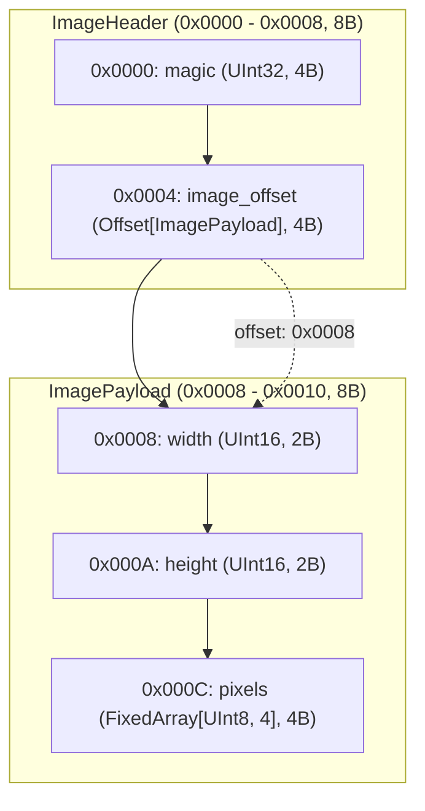
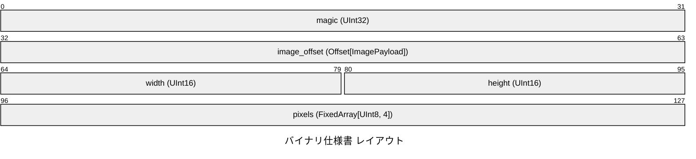
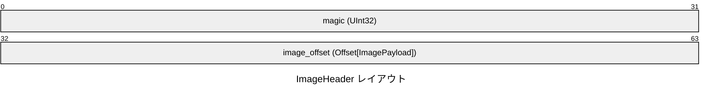
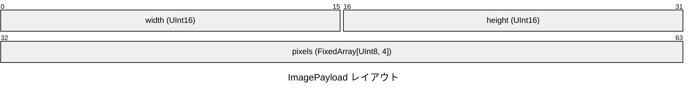

# バイナリ仕様書

## 概要

イメージヘッダー構造体

- **合計サイズ**: 16 バイト (`0x0010`)
- **デフォルトエンディアン**: リトルエンディアン (Little)
- **合計フィールド数**: 5

## 構造図 (フローチャート)

## 構造図 (パケット図)

## メモリレイアウト表

### ImageHeader (0x0000 - 0x0008, 8B)

イメージヘッダー構造体

| オフセット (16進) | オフセット (10進) | サイズ (B) | フィールド名 | 型 | エンディアン | 説明 |
|---|---|---|---|---|---|---|
| `0x0000` | 0 | 4 | `magic` | `UInt32` | Little | - |
| `0x0004` | 4 | 4 | `image_offset` | `Offset[ImagePayload]` | Little | `-> 0x0008` |

### ImagePayload (0x0008 - 0x0010, 8B)

イメージペイロード構造体

| オフセット (16進) | オフセット (10進) | サイズ (B) | フィールド名 | 型 | エンディアン | 説明 |
|---|---|---|---|---|---|---|
| `0x0008` | 8 | 2 | `width` | `UInt16` | Little | - |
| `0x000A` | 10 | 2 | `height` | `UInt16` | Little | - |
| `0x000C` | 12 | 4 | `pixels` | `FixedArray[UInt8, 4]` | Little | - |
