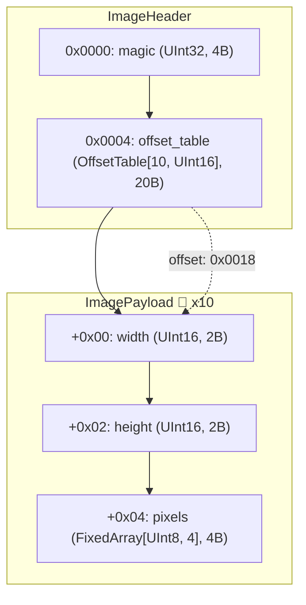
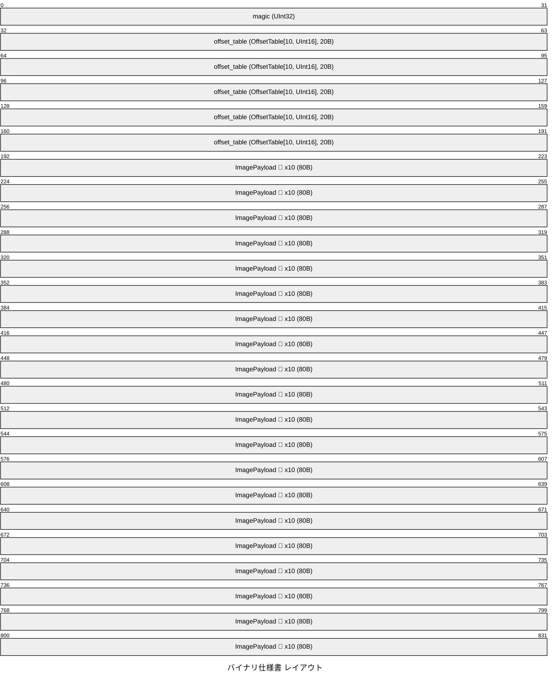
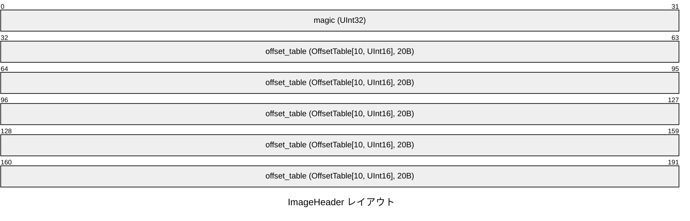
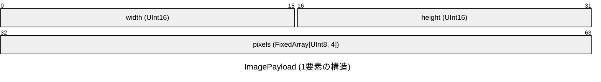

# バイナリ仕様書

## 概要

イメージヘッダー構造体

- **合計サイズ**: 104 バイト (`0x0068`)
- **デフォルトエンディアン**: リトルエンディアン (Little)
- **合計フィールド数**: 41

## 構造図 (フローチャート)

## 構造図 (パケット図)

## メモリレイアウト表

### ImageHeader

イメージヘッダー構造体

| オフセット (16進) | オフセット (10進) | サイズ (B) | フィールド名 | 型 | エンディアン | 説明 |
|---|---|---|---|---|---|---|
| `0x0000` | 0 | 4 | `magic` | `UInt32` | Little | - |
| `0x0004` | 4 | 2 | `offset_table[0]` | `Offset[UInt16]` | Little | Offset entry 0 (`-> 0x0018`) |
| ... | ... | ... | ... | ... | ... | ... |
| `0x0016` | 22 | 2 | `offset_table[9]` | `Offset[UInt16]` | Little | Offset entry 9 (`-> 0x0060`) |

### ImagePayload

イメージペイロード構造体

- 🔁 **繰り返し**: 10 回
- **1要素サイズ**: `8` バイト (0x8)
- **サンプルデータ**: 10 件 (合計 `80` バイト)

| 相対オフセット | サイズ (B) | フィールド名 | 型 | エンディアン | 説明 |
|---|---|---|---|---|---|
| `+0x00` | 2 | `width` | `UInt16` | Little | - |
| `+0x02` | 2 | `height` | `UInt16` | Little | - |
| `+0x04` | 4 | `pixels` | `FixedArray[UInt8, 4]` | Little | - |
