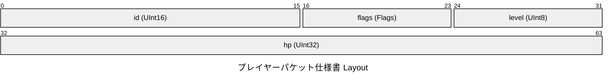
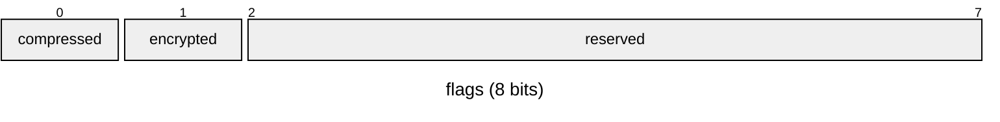

# プレイヤーパケット仕様書

## Overview

- **Total Size**: 8 bytes (`0x0008`)
- **Default Endianness**: Little
- **Total Fields**: 4

## Structure Diagram (Packet)

## Memory Layout Table

| Offset (Hex) | Offset (Dec) | Size (B) | Field Name | Type | Endian | Description |
|---|---|---|---|---|---|---|
| `0x0000` | 0 | 2 | `id` | `UInt16` | Little | プレイヤー識別ID |
| `0x0002` | 2 | 1 | `flags` | `Flags` | Little | 各種ステータスフラグ |
| `0x0003` | 3 | 1 | `level` | `UInt8` | Little | 現在のレベル (1〜99) |
| `0x0004` | 4 | 4 | `hp` | `UInt32` | Little | 体力パラメータ (最大HP) |

## Bitfield Details

### `flags` (Offset: `0x0002`, Size: 1B)

| Bit Range | Field Name | Width | Description |
|---|---|---|---|
| `[0:1]` | `compressed` | 1 bit(s) | 圧縮フラグ (1: 圧縮あり, 0: なし) |
| `[1:2]` | `encrypted` | 1 bit(s) | 暗号化フラグ (1: 暗号化あり, 0: なし) |
| `[2:8]` | `reserved` | 6 bit(s) | 予約領域 (将来の拡張用) |
