# 次世代マルチメディアアーカイブ (.nma) 完全仕様書

## Overview

次世代マルチメディアアーカイブ (.nma) のメインヘッダー仕様。

ファイル全体の識別情報、制御フラグ、各主要セクションへの相対オフセットを保持します。

- **Total Size**: 246 bytes (`0x00F6`)
- **Default Endianness**: Little
- **Total Fields**: 54

## Structure Diagram (Flowchart)

```mermaid
flowchart TD
    subgraph SG_Archive_Header ["Archive Header (0x0000 - 0x006E, 110B)"]
        N0["0x0000: magic (UInt32, 4B)"]
        N1["0x0004: version (UInt16, 2B)"]
        N2["0x0006: flags (ArchiveFlags, 2B)"]
        N3["0x0008: author_offset (Offset[AuthorProfile, UInt16], 2B)"]
        N4["0x000A: padding (Padding[2], 2B)"]
        N5["0x000C: toc_offset (Offset[TableOfContents], 4B)"]
        N6["0x0010: primary_media_offset (Offset[PolymorphicMediaChunk], 4B)"]
        N7["0x0014: alignment_pad (Padding[4], 4B)"]
        N8["0x0018: author_id (UInt32, 4B)"]
        N9["0x001C: reputation (Float32, 4B)"]
        N10["0x0020: rating (Int16, 2B)"]
        N11["0x0022: entry_count (UInt16, 2B)"]
        N12["0x0024: chunk_offsets[0] (Offset[UInt32], 4B)"]
        N13["0x0028: chunk_offsets[1] (Offset[UInt32], 4B)"]
        N14["0x002C: chunk_offsets[2] (Offset[UInt32], 4B)"]
        N15["0x0030: chunk_type (UInt16, 2B)"]
        N16["0x0032: priority (UInt8, 1B)"]
        N17["0x0033: encoding_id (UInt8, 1B)"]
        N18["0x0034: char_count (UInt16, 2B)"]
        N19["0x0036: raw_preview (FixedArray[UInt8, 8], 8B)"]
        N20["0x003E: chunk_type (UInt16, 2B)"]
        N21["0x0040: priority (UInt8, 1B)"]
        N22["0x0041: width (UInt16, 2B)"]
        N23["0x0043: height (UInt16, 2B)"]
        N24["0x0045: channels (UInt8, 1B)"]
        N25["0x0046: pixels_preview (FixedArray[UInt8, 8], 8B)"]
        N26["0x004E: chunk_type (UInt16, 2B)"]
        N27["0x0050: priority (UInt8, 1B)"]
        N28["0x0051: sample_rate (UInt32, 4B)"]
        N29["0x0055: channels (UInt8, 1B)"]
        N30["0x0056: duration_sec (Float64, 8B)"]
        N31["0x005E: chunk_type (UInt16, 2B)"]
        N32["0x0060: priority (UInt8, 1B)"]
        N33["0x0061: width (UInt16, 2B)"]
        N34["0x0063: height (UInt16, 2B)"]
        N35["0x0065: channels (UInt8, 1B)"]
        N36["0x0066: pixels_preview (FixedArray[UInt8, 8], 8B)"]
    end
    subgraph SG_Metadata_String_Pool ["Metadata String Pool (0x006E - 0x00BD, 79B)"]
        N37["0x006E: archive_title (CString, 28B)"]
        N38["0x008A: archive_desc (PrefixedString[2], 35B)"]
        N39["0x00AD: archive_tag (FixedString[16], 16B)"]
    end
    subgraph SG_Boundary_Alignment ["Boundary Alignment (0x00BD - 0x00D0, 19B)"]
        N40["0x00BD: security_pad (Padding[4], 4B)"]
        N41["0x00C1: sector_align (Padding[15], 15B)"]
    end
    subgraph SG_Polymorphic_Payload_Section ["Polymorphic Payload Section (0x00D0 - 0x00F6, 38B)"]
        N42["0x00D0: extra_offsets[0] (Offset[UInt32], 4B)"]
        N43["0x00D4: extra_offsets[1] (Offset[UInt32], 4B)"]
        N44["0x00D8: chunk_type (UInt16, 2B)"]
        N45["0x00DA: priority (UInt8, 1B)"]
        N46["0x00DB: encoding_id (UInt8, 1B)"]
        N47["0x00DC: char_count (UInt16, 2B)"]
        N48["0x00DE: raw_preview (FixedArray[UInt8, 8], 8B)"]
        N49["0x00E6: chunk_type (UInt16, 2B)"]
        N50["0x00E8: priority (UInt8, 1B)"]
        N51["0x00E9: sample_rate (UInt32, 4B)"]
        N52["0x00ED: channels (UInt8, 1B)"]
        N53["0x00EE: duration_sec (Float64, 8B)"]
    end
    N0 --> N1
    N1 --> N2
    N2 --> N3
    N3 --> N4
    N4 --> N5
    N5 --> N6
    N6 --> N7
    N7 --> N8
    N8 --> N9
    N9 --> N10
    N10 --> N11
    N11 --> N12
    N12 --> N13
    N13 --> N14
    N14 --> N15
    N15 --> N16
    N16 --> N17
    N17 --> N18
    N18 --> N19
    N19 --> N20
    N20 --> N21
    N21 --> N22
    N22 --> N23
    N23 --> N24
    N24 --> N25
    N25 --> N26
    N26 --> N27
    N27 --> N28
    N28 --> N29
    N29 --> N30
    N30 --> N31
    N31 --> N32
    N32 --> N33
    N33 --> N34
    N34 --> N35
    N35 --> N36
    N36 --> N37
    N37 --> N38
    N38 --> N39
    N39 --> N40
    N40 --> N41
    N41 --> N42
    N42 --> N43
    N43 --> N44
    N44 --> N45
    N45 --> N46
    N46 --> N47
    N47 --> N48
    N48 --> N49
    N49 --> N50
    N50 --> N51
    N51 --> N52
    N52 --> N53
    N3 -.->|"offset: 0x0018"| N8
    N5 -.->|"offset: 0x0022"| N11
    N6 -.->|"offset: 0x005E"| N31
    N12 -.->|"offset: 0x0030"| N15
    N13 -.->|"offset: 0x003E"| N20
    N14 -.->|"offset: 0x004E"| N26
    N42 -.->|"offset: 0x00D8"| N44
    N43 -.->|"offset: 0x00E6"| N49
```

## Structure Diagram (Packet)

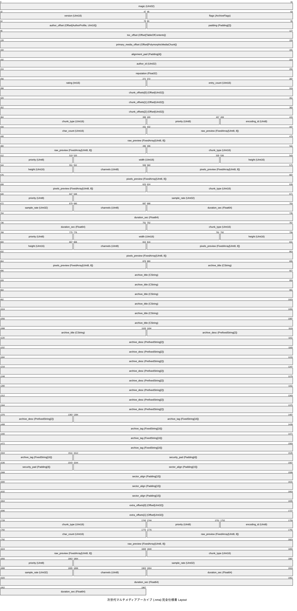

## Memory Layout Table

### Archive Header (0x0000 - 0x006E, 110B)

アーカイブ全体の識別情報、制御フラグ、相対オフセット群を格納するメインヘッダー。

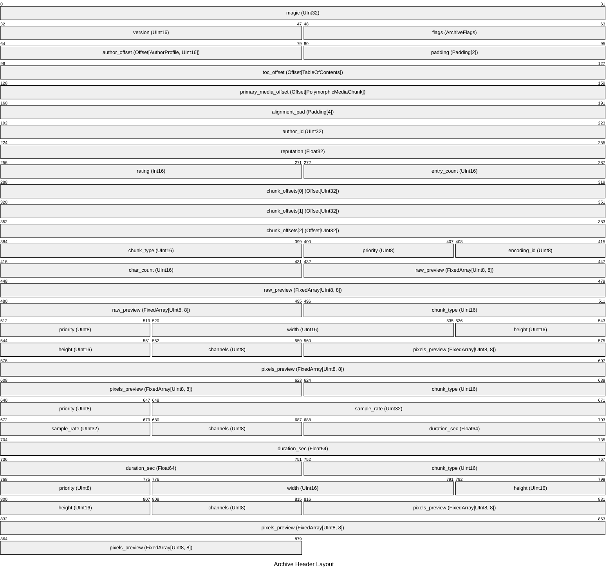

| Offset (Hex) | Offset (Dec) | Size (B) | Field Name | Type | Endian | Description |
|---|---|---|---|---|---|---|
| `0x0000` | 0 | 4 | `magic` | `UInt32` | Little | ファイル識別子 ('NMA\x01' = 0x01414D4E) |
| `0x0004` | 4 | 2 | `version` | `UInt16` | Little | フォーマットバージョン (0x0200 = v2.0) |
| `0x0006` | 6 | 2 | `flags` | `ArchiveFlags` | Little | 16ビット制御ビットフィールド |
| `0x0008` | 8 | 2 | `author_offset` | `Offset[AuthorProfile, UInt16]` | Little | (A) 構造体先頭相対 (Base.SELF) かつ 2バイトオフセット (UInt16) (`-> 0x0018`) |
| `0x000A` | 10 | 2 | `padding` | `Padding[2]` | - | Alignment padding |
| `0x000C` | 12 | 4 | `toc_offset` | `Offset[TableOfContents]` | Little | (B) 構造体先頭 + 0x20 相対 (ヘッダー境界を基準) (`-> 0x0022`) |
| `0x0010` | 16 | 4 | `primary_media_offset` | `Offset[PolymorphicMediaChunk]` | Little | (C) 短縮記法 (型を省略して4バイト UInt32 デフォルト、構造体先頭相対) (`-> 0x005E`) |
| `0x0014` | 20 | 4 | `alignment_pad` | `Padding[4]` | - | Struct size alignment |
| `0x0018` | 24 | 4 | `author_id` | `UInt32` | Little | 作成者識別ID (32bit) |
| `0x001C` | 28 | 4 | `reputation` | `Float32` | Little | 信頼度スコア (単精度浮動小数点数) |
| `0x0020` | 32 | 2 | `rating` | `Int16` | Little | レーティング補正値 (符号付き16bit) |
| `0x0022` | 34 | 2 | `entry_count` | `UInt16` | Little | 登録チャンク数 |
| `0x0024` | 36 | 4 | `chunk_offsets[0]` | `Offset[UInt32]` | Little | 構造体先頭 (Base.SELF) を起点とする 3エントリのオフセットテーブル [#0] (`-> 0x0030`) |
| `0x0028` | 40 | 4 | `chunk_offsets[1]` | `Offset[UInt32]` | Little | 構造体先頭 (Base.SELF) を起点とする 3エントリのオフセットテーブル [#1] (`-> 0x003E`) |
| `0x002C` | 44 | 4 | `chunk_offsets[2]` | `Offset[UInt32]` | Little | 構造体先頭 (Base.SELF) を起点とする 3エントリのオフセットテーブル [#2] (`-> 0x004E`) |
| `0x0030` | 48 | 2 | `chunk_type` | `UInt16` | Little | チャンク種別ID (1: Text, 2: Image, 3: Audio) |
| `0x0032` | 50 | 1 | `priority` | `UInt8` | Little | 配信優先度 |
| `0x0033` | 51 | 1 | `encoding_id` | `UInt8` | Little | 文字エンコーディング (1: UTF-8, 2: UTF-16LE) |
| `0x0034` | 52 | 2 | `char_count` | `UInt16` | Little | 文字数 |
| `0x0036` | 54 | 8 | `raw_preview` | `FixedArray[UInt8, 8]` | Little | 先頭プレビューバイト列 (8バイト固定) |
| `0x003E` | 62 | 2 | `chunk_type` | `UInt16` | Little | チャンク種別ID (1: Text, 2: Image, 3: Audio) |
| `0x0040` | 64 | 1 | `priority` | `UInt8` | Little | 配信優先度 |
| `0x0041` | 65 | 2 | `width` | `UInt16` | Little | 画像横幅 (px) |
| `0x0043` | 67 | 2 | `height` | `UInt16` | Little | 画像縦幅 (px) |
| `0x0045` | 69 | 1 | `channels` | `UInt8` | Little | 色チャンネル数 (3: RGB, 4: RGBA) |
| `0x0046` | 70 | 8 | `pixels_preview` | `FixedArray[UInt8, 8]` | Little | ピクセルプレビュー (8バイト固定) |
| `0x004E` | 78 | 2 | `chunk_type` | `UInt16` | Little | チャンク種別ID (1: Text, 2: Image, 3: Audio) |
| `0x0050` | 80 | 1 | `priority` | `UInt8` | Little | 配信優先度 |
| `0x0051` | 81 | 4 | `sample_rate` | `UInt32` | Little | サンプリングレート (Hz: 例 44100, 48000) |
| `0x0055` | 85 | 1 | `channels` | `UInt8` | Little | 音声チャンネル数 (1: Mono, 2: Stereo) |
| `0x0056` | 86 | 8 | `duration_sec` | `Float64` | Little | 再生時間 (秒: 倍精度浮動小数点数) |
| `0x005E` | 94 | 2 | `chunk_type` | `UInt16` | Little | チャンク種別ID (1: Text, 2: Image, 3: Audio) |
| `0x0060` | 96 | 1 | `priority` | `UInt8` | Little | 配信優先度 |
| `0x0061` | 97 | 2 | `width` | `UInt16` | Little | 画像横幅 (px) |
| `0x0063` | 99 | 2 | `height` | `UInt16` | Little | 画像縦幅 (px) |
| `0x0065` | 101 | 1 | `channels` | `UInt8` | Little | 色チャンネル数 (3: RGB, 4: RGBA) |
| `0x0066` | 102 | 8 | `pixels_preview` | `FixedArray[UInt8, 8]` | Little | ピクセルプレビュー (8バイト固定) |

この領域には、条件（種別タグ等）に応じて以下のいずれかの構造体が格納されます。

#### [Variant] Tag `0x0001`: `TextChunk`

テキストデータチャンク (多態バリアント種別 1)

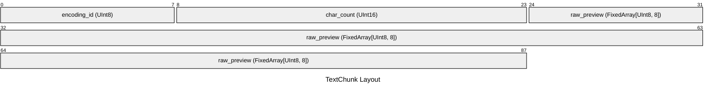

| Relative Offset | Size (B) | Field Name | Type | Endian | Description |
|---|---|---|---|---|---|
| `+0x00` | 1 | `encoding_id` | `UInt8` | Little | 文字エンコーディング (1: UTF-8, 2: UTF-16LE) |
| `+0x01` | 2 | `char_count` | `UInt16` | Little | 文字数 |
| `+0x03` | 8 | `raw_preview` | `FixedArray[UInt8, 8]` | Little | 先頭プレビューバイト列 (8バイト固定) |

#### [Variant] Tag `0x0002`: `ImageChunk`

画像データチャンク (多態バリアント種別 2)

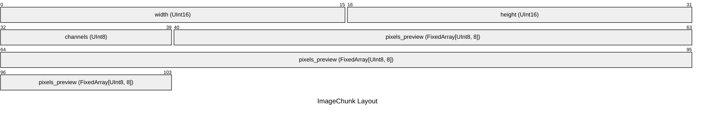

| Relative Offset | Size (B) | Field Name | Type | Endian | Description |
|---|---|---|---|---|---|
| `+0x00` | 2 | `width` | `UInt16` | Little | 画像横幅 (px) |
| `+0x02` | 2 | `height` | `UInt16` | Little | 画像縦幅 (px) |
| `+0x04` | 1 | `channels` | `UInt8` | Little | 色チャンネル数 (3: RGB, 4: RGBA) |
| `+0x05` | 8 | `pixels_preview` | `FixedArray[UInt8, 8]` | Little | ピクセルプレビュー (8バイト固定) |

#### [Variant] Tag `0x0003`: `AudioChunk`

音声データチャンク (多態バリアント種別 3)

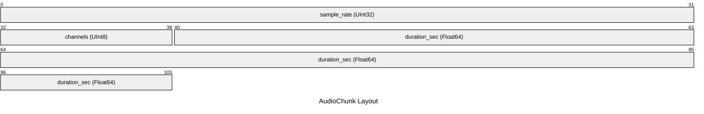

| Relative Offset | Size (B) | Field Name | Type | Endian | Description |
|---|---|---|---|---|---|
| `+0x00` | 4 | `sample_rate` | `UInt32` | Little | サンプリングレート (Hz: 例 44100, 48000) |
| `+0x04` | 1 | `channels` | `UInt8` | Little | 音声チャンネル数 (1: Mono, 2: Stereo) |
| `+0x05` | 8 | `duration_sec` | `Float64` | Little | 再生時間 (秒: 倍精度浮動小数点数) |

### Metadata String Pool (0x006E - 0x00BD, 79B)

アーカイブのタイトルや説明文などの可変長文字列プール領域。

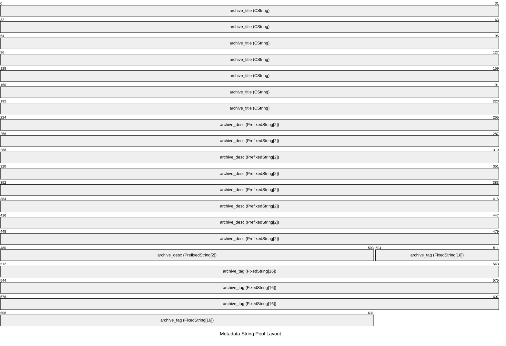

#### Title & Description (0x006E - 0x00BD, 79B)

C言語形式およびPascal形式の文字列

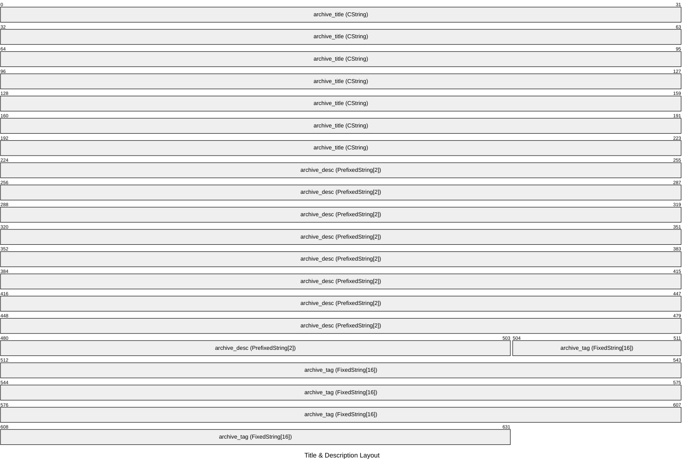

| Offset (Hex) | Offset (Dec) | Size (B) | Field Name | Type | Endian | Description |
|---|---|---|---|---|---|---|
| `0x006E` | 110 | 28 | `archive_title` | `CString` | - | アーカイブタイトル (Null終端) |
| `0x008A` | 138 | 35 | `archive_desc` | `PrefixedString[2]` | Little | アーカイブ説明 (2B長さプレフィックス) |
| `0x00AD` | 173 | 16 | `archive_tag` | `FixedString[16]` | - | 固定長タグ (16B Nullパディング) |

### Boundary Alignment (0x00BD - 0x00D0, 19B)

セクター境界へ向けたアライメント調整

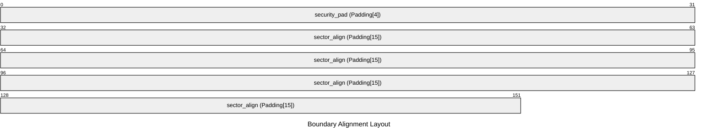

| Offset (Hex) | Offset (Dec) | Size (B) | Field Name | Type | Endian | Description |
|---|---|---|---|---|---|---|
| `0x00BD` | 189 | 4 | `security_pad` | `Padding[4]` | - | 4バイトの固定パディング |
| `0x00C1` | 193 | 15 | `sector_align` | `Padding[15]` | - | 16バイト境界へのアライメント |

### Polymorphic Payload Section (0x00D0 - 0x00F6, 38B)

種別タグに応じて異なるデータ構造が格納される多態チャンク領域。

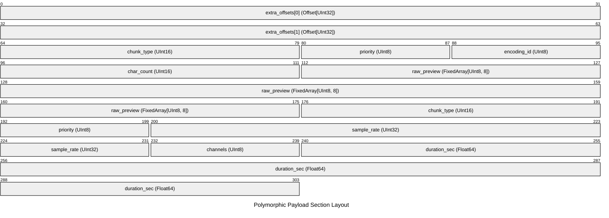

| Offset (Hex) | Offset (Dec) | Size (B) | Field Name | Type | Endian | Description |
|---|---|---|---|---|---|---|
| `0x00D0` | 208 | 4 | `extra_offsets[0]` | `Offset[UInt32]` | Little | 追加データブロックへの相対オフセットテーブル [#0] (`-> 0x00D8`) |
| `0x00D4` | 212 | 4 | `extra_offsets[1]` | `Offset[UInt32]` | Little | 追加データブロックへの相対オフセットテーブル [#1] (`-> 0x00E6`) |
| `0x00D8` | 216 | 2 | `chunk_type` | `UInt16` | Little | チャンク種別ID (1: Text, 2: Image, 3: Audio) |
| `0x00DA` | 218 | 1 | `priority` | `UInt8` | Little | 配信優先度 |
| `0x00DB` | 219 | 1 | `encoding_id` | `UInt8` | Little | 文字エンコーディング (1: UTF-8, 2: UTF-16LE) |
| `0x00DC` | 220 | 2 | `char_count` | `UInt16` | Little | 文字数 |
| `0x00DE` | 222 | 8 | `raw_preview` | `FixedArray[UInt8, 8]` | Little | 先頭プレビューバイト列 (8バイト固定) |
| `0x00E6` | 230 | 2 | `chunk_type` | `UInt16` | Little | チャンク種別ID (1: Text, 2: Image, 3: Audio) |
| `0x00E8` | 232 | 1 | `priority` | `UInt8` | Little | 配信優先度 |
| `0x00E9` | 233 | 4 | `sample_rate` | `UInt32` | Little | サンプリングレート (Hz: 例 44100, 48000) |
| `0x00ED` | 237 | 1 | `channels` | `UInt8` | Little | 音声チャンネル数 (1: Mono, 2: Stereo) |
| `0x00EE` | 238 | 8 | `duration_sec` | `Float64` | Little | 再生時間 (秒: 倍精度浮動小数点数) |

この領域には、条件（種別タグ等）に応じて以下のいずれかの構造体が格納されます。

#### [Variant] Tag `0x0001`: `TextChunk`

種別1: テキストプレビューデータ

| Relative Offset | Size (B) | Field Name | Type | Endian | Description |
|---|---|---|---|---|---|
| `+0x00` | 1 | `encoding_id` | `UInt8` | Little | 文字エンコーディング (1: UTF-8, 2: UTF-16LE) |
| `+0x01` | 2 | `char_count` | `UInt16` | Little | 文字数 |
| `+0x03` | 8 | `raw_preview` | `FixedArray[UInt8, 8]` | Little | 先頭プレビューバイト列 (8バイト固定) |

#### [Variant] Tag `0x0002`: `ImageChunk`

種別2: RGBA画像データ

| Relative Offset | Size (B) | Field Name | Type | Endian | Description |
|---|---|---|---|---|---|
| `+0x00` | 2 | `width` | `UInt16` | Little | 画像横幅 (px) |
| `+0x02` | 2 | `height` | `UInt16` | Little | 画像縦幅 (px) |
| `+0x04` | 1 | `channels` | `UInt8` | Little | 色チャンネル数 (3: RGB, 4: RGBA) |
| `+0x05` | 8 | `pixels_preview` | `FixedArray[UInt8, 8]` | Little | ピクセルプレビュー (8バイト固定) |

#### [Variant] Tag `0x0003`: `AudioChunk`

種別3: PCM音声データ

| Relative Offset | Size (B) | Field Name | Type | Endian | Description |
|---|---|---|---|---|---|
| `+0x00` | 4 | `sample_rate` | `UInt32` | Little | サンプリングレート (Hz: 例 44100, 48000) |
| `+0x04` | 1 | `channels` | `UInt8` | Little | 音声チャンネル数 (1: Mono, 2: Stereo) |
| `+0x05` | 8 | `duration_sec` | `Float64` | Little | 再生時間 (秒: 倍精度浮動小数点数) |

## Bitfield Details

### `flags` (Offset: `0x0006`, Size: 2B)

アーカイブ制御フラグ (16ビットビットフィールド)

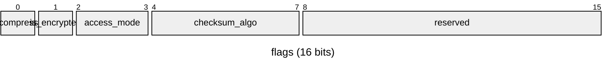

| Bit Range | Field Name | Width | Description |
|---|---|---|---|
| `[0:1]` | `is_compressed` | 1 bit(s) | 圧縮有効フラグ (0: 非圧縮, 1: 圧縮あり) |
| `[1:2]` | `is_encrypted` | 1 bit(s) | 暗号化有効フラグ (0: 平文, 1: 暗号化) |
| `[2:4]` | `access_mode` | 2 bit(s) | アクセス権限 (0: ReadOnly, 1: Write, 2: Admin) |
| `[4:8]` | `checksum_algo` | 4 bit(s) | チェックサム種別 (0: None, 1: CRC32, 2: SHA256) |
| `[8:16]` | `reserved` | 8 bit(s) | 将来の拡張用予約領域 (常に0) |
