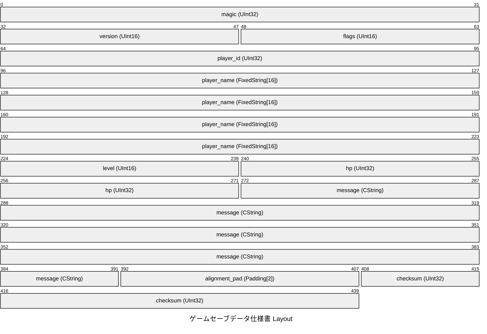
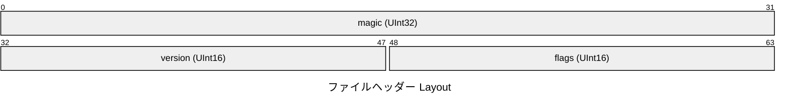
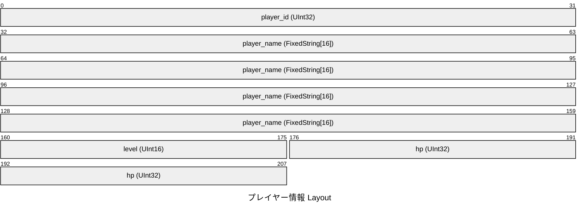
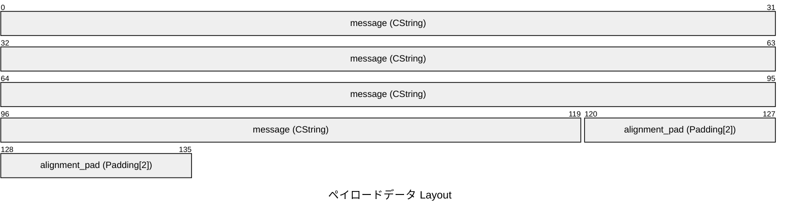
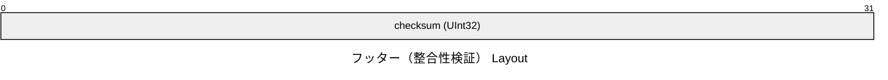

# ゲームセーブデータ仕様書

## Overview

- **Total Size**: 55 bytes (`0x0037`)
- **Default Endianness**: Little
- **Total Fields**: 10

## Structure Diagram (Packet)

## Memory Layout Table

### ファイルヘッダー (0x0000 - 0x0008, 8B)

| Offset (Hex) | Offset (Dec) | Size (B) | Field Name | Type | Endian | Description |
|---|---|---|---|---|---|---|
| `0x0000` | 0 | 4 | `magic` | `UInt32` | Little | ファイル識別子 ('MYFT') |
| `0x0004` | 4 | 2 | `version` | `UInt16` | Little | フォーマットバージョン |
| `0x0006` | 6 | 2 | `flags` | `UInt16` | Little | 制御フラグ |

### プレイヤー情報 (0x0008 - 0x0022, 26B)

| Offset (Hex) | Offset (Dec) | Size (B) | Field Name | Type | Endian | Description |
|---|---|---|---|---|---|---|
| `0x0008` | 8 | 4 | `player_id` | `UInt32` | Little | プレイヤー識別番号 |
| `0x000C` | 12 | 16 | `player_name` | `FixedString[16]` | - | プレイヤー名 (16バイト固定長) |
| `0x001C` | 28 | 2 | `level` | `UInt16` | Little | 現在のレベル |
| `0x001E` | 30 | 4 | `hp` | `UInt32` | Little | 体力 (HP) |

### ペイロードデータ (0x0022 - 0x0033, 17B)

| Offset (Hex) | Offset (Dec) | Size (B) | Field Name | Type | Endian | Description |
|---|---|---|---|---|---|---|
| `0x0022` | 34 | 15 | `message` | `CString` | - | ステータスメッセージ |
| `0x0031` | 49 | 2 | `alignment_pad` | `Padding[2]` | - | アライメントパディング |

### フッター（整合性検証） (0x0033 - 0x0037, 4B)

| Offset (Hex) | Offset (Dec) | Size (B) | Field Name | Type | Endian | Description |
|---|---|---|---|---|---|---|
| `0x0033` | 51 | 4 | `checksum` | `UInt32` | Little | CRC-32 チェックサム |
