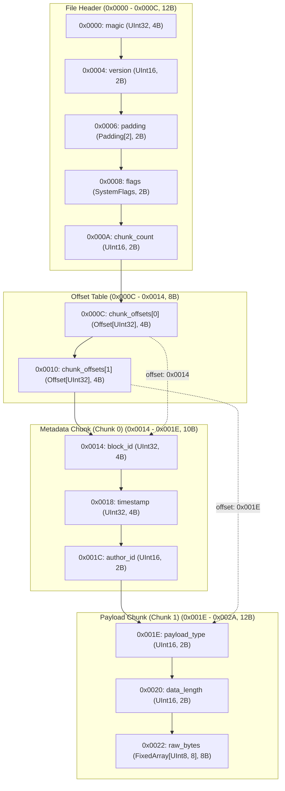
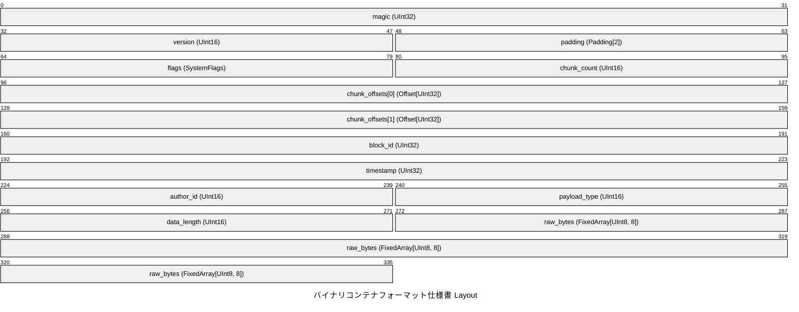
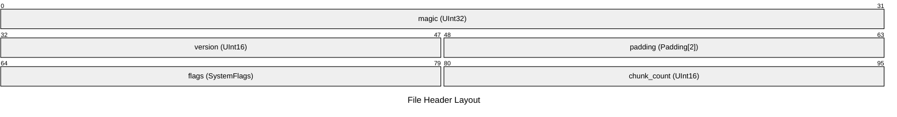
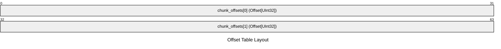
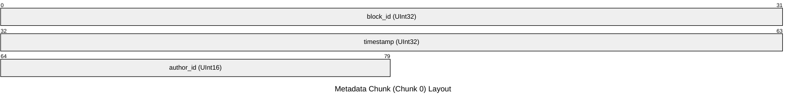
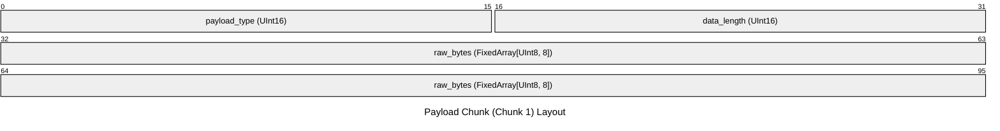
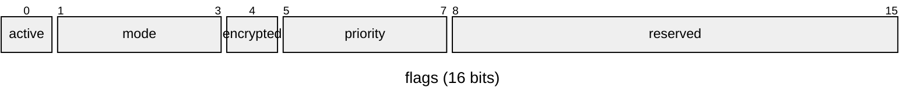

# バイナリコンテナフォーマット仕様書

## Overview

総合バイナリコンテナフォーマット仕様。
ヘッダー、オフセットテーブル、各データブロックから構成されます。

- **Total Size**: 42 bytes (`0x002A`)
- **Default Endianness**: Little
- **Total Fields**: 13

## Structure Diagram (Flowchart)

## Structure Diagram (Packet)

## Memory Layout Table

### File Header (0x0000 - 0x000C, 12B)

コンテナ全体の基本情報とフラグを保持する領域です。

| Offset (Hex) | Offset (Dec) | Size (B) | Field Name | Type | Endian | Description |
|---|---|---|---|---|---|---|
| `0x0000` | 0 | 4 | `magic` | `UInt32` | Little | マジックナンバー ('PKT\x01' = 0x01544B50) |
| `0x0004` | 4 | 2 | `version` | `UInt16` | Little | プロトコルバージョン (0x0100 = v1.0) |
| `0x0006` | 6 | 2 | `padding` | `Padding[2]` | - | Alignment padding |
| `0x0008` | 8 | 2 | `flags` | `SystemFlags` | Little | システム制御フラグ (16ビット) |
| `0x000A` | 10 | 2 | `chunk_count` | `UInt16` | Little | 後続データチャンクの総数 |

### Offset Table (0x000C - 0x0014, 8B)

各データチャンクの開始位置を指す32ビットオフセット配列です。

| Offset (Hex) | Offset (Dec) | Size (B) | Field Name | Type | Endian | Description |
|---|---|---|---|---|---|---|
| `0x000C` | 12 | 4 | `chunk_offsets[0]` | `Offset[UInt32]` | Little | データチャンク開始オフセット [#0] (`-> 0x0014`) |
| `0x0010` | 16 | 4 | `chunk_offsets[1]` | `Offset[UInt32]` | Little | データチャンク開始オフセット [#1] (`-> 0x001E`) |

### Metadata Chunk (Chunk 0) (0x0014 - 0x001E, 10B)

管理用メタデータが格納されるブロックです。

| Offset (Hex) | Offset (Dec) | Size (B) | Field Name | Type | Endian | Description |
|---|---|---|---|---|---|---|
| `0x0014` | 20 | 4 | `block_id` | `UInt32` | Little | ブロック固有ID |
| `0x0018` | 24 | 4 | `timestamp` | `UInt32` | Little | 作成エポック秒 (UTC) |
| `0x001C` | 28 | 2 | `author_id` | `UInt16` | Little | 作成者識別ID |

### Payload Chunk (Chunk 1) (0x001E - 0x002A, 12B)

暗号化された実データが格納されるブロックです。

| Offset (Hex) | Offset (Dec) | Size (B) | Field Name | Type | Endian | Description |
|---|---|---|---|---|---|---|
| `0x001E` | 30 | 2 | `payload_type` | `UInt16` | Little | ペイロード種別コード (0x0001: センサー, 0x0002: ログ) |
| `0x0020` | 32 | 2 | `data_length` | `UInt16` | Little | 実データ長 (バイト数) |
| `0x0022` | 34 | 8 | `raw_bytes` | `FixedArray[UInt8, 8]` | Little | ペイロードバイナリデータ |

## Bitfield Details

### `flags` (Offset: `0x0008`, Size: 2B)

システム制御フラグ定義。動作モードおよび暗号化設定を制御します。

| Bit Range | Field Name | Width | Description |
|---|---|---|---|
| `[0:1]` | `active` | 1 bit(s) | 有効フラグ (1: アクティブ, 0: スタンバイ) |
| `[1:4]` | `mode` | 3 bit(s) | 動作モード (0: 通常, 1: 省電力, 2: 高負荷) |
| `[4:5]` | `encrypted` | 1 bit(s) | 暗号化フラグ (1: AES-256暗号化あり, 0: 平文) |
| `[5:8]` | `priority` | 3 bit(s) | 優先度レベル (0: 低 〜 7: 最高) |
| `[8:16]` | `reserved` | 8 bit(s) | 拡張用予約領域 (常に0) |
