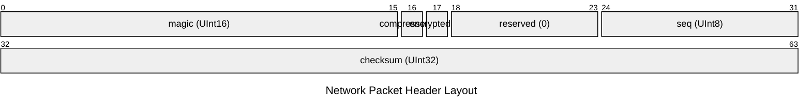
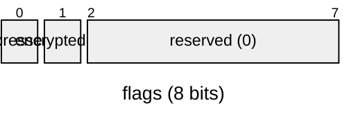

# Network Packet Header

## Overview

- **Total Size**: 8 bytes (`0x0008`)
- **Default Endianness**: Little
- **Total Fields**: 4

## Structure Diagram (Packet)

## Memory Layout Table

| Offset (Hex) | Offset (Dec) | Size (B) | Field Name | Type | Endian | Value / Preview | Description |
|---|---|---|---|---|---|---|---|
| `0x0000` | 0 | 2 | `magic` | `UInt16` | Little | `23130 (0x5A5A)` | - |
| `0x0002` | 2 | 1 | `flags` | `HeaderFlags` | Little | `1 (0x1)` | - |
| `0x0003` | 3 | 1 | `seq` | `UInt8` | Little | `42 (0x2A)` | - |
| `0x0004` | 4 | 4 | `checksum` | `UInt32` | Little | `3735928559 (0xDEADBEEF)` | - |

## Bitfield Details

### `flags` (Offset: `0x0002`, Size: 1B)

| Bit Range | Field Name | Width | Value | Description |
|---|---|---|---|---|
| `[0:1]` | `compressed` | 1 bit(s) | `1 (0x1)` | - |
| `[1:2]` | `encrypted` | 1 bit(s) | `0 (0x0)` | - |
| `[2:8]` | `reserved` | 6 bit(s) | `0 (0x0)` | - |
