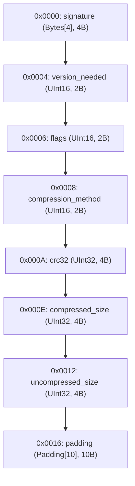

# ZIP Local File Header Specification

## Overview

- **Total Size**: 32 bytes (`0x0020`)
- **Default Endianness**: Little
- **Total Fields**: 8

## Structure Diagram

## Memory Layout Table

| Offset (Hex) | Offset (Dec) | Size (B) | Field Name | Type | Endian | Value / Preview | Description |
|---|---|---|---|---|---|---|---|
| `0x0000` | 0 | 4 | `signature` | `Bytes[4]` | - | `b'PK\x03\x04'` | ZIP local file header signature |
| `0x0004` | 4 | 2 | `version_needed` | `UInt16` | Little | `20 (0x14)` | Version needed to extract (2.0) |
| `0x0006` | 6 | 2 | `flags` | `UInt16` | Little | `0 (0x0)` | General purpose bit flag |
| `0x0008` | 8 | 2 | `compression_method` | `UInt16` | Little | `8 (0x8)` | Deflate compression |
| `0x000A` | 10 | 4 | `crc32` | `UInt32` | Little | `305419896 (0x12345678)` | CRC-32 checksum |
| `0x000E` | 14 | 4 | `compressed_size` | `UInt32` | Little | `1024 (0x400)` | Compressed size in bytes |
| `0x0012` | 18 | 4 | `uncompressed_size` | `UInt32` | Little | `2048 (0x800)` | Uncompressed size in bytes |
| `0x0016` | 22 | 10 | `padding` | `Padding[10]` | - | `b'\x00\x00\x00\x00\x00\x00\x00\x00\x00\x00'` | Alignment to 32-byte boundary |
