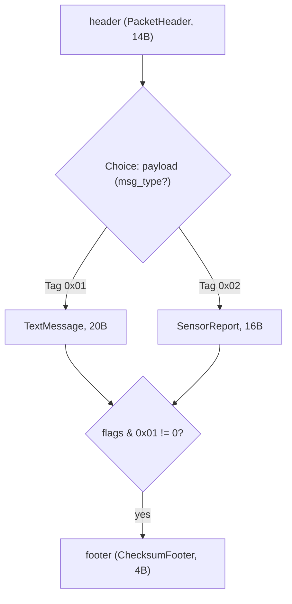

# Network Telemetry Protocol Specification

## Overview

Unified binary messaging format supporting text messages and sensor telemetry packets.

- **Version**: `1.0.0`
- **Default Endianness**: Little
- **Defined Structures**: 2
- **Choice / Branch Points**: 1

## Protocol Overview & Scope

This document specifies the Network Telemetry Protocol (NTP-v1).
All multi-byte numeric fields are encoded in Little-Endian byte order.

Packets begin with a fixed 14-byte `PacketHeader`. The `msg_type` field dictates
which payload structure immediately follows:
- `0x0001`: `TextMessage`
- `0x0002`: `SensorReport`

If bit 0 of `flags` is set (`flags & 0x01 != 0`), a 4-byte `ChecksumFooter` is appended.

## Structure Diagram (Flowchart)

## Data Structures & Layout

### Struct `header` (PacketHeader)

Fixed 14-byte packet header

- **Total Size**: 14 bytes (`0x000E`)

| Relative Offset | Size (B) | Field Name | Type | Endian | Description |
|---|---|---|---|---|---|
| `+0x00` | 4 | `magic` | `UInt32` | Little | Signature: 0x4D534750 ('MSGP') |
| `+0x04` | 2 | `version` | `UInt16` | Little | Protocol version |
| `+0x06` | 2 | `msg_type` | `UInt16` | Little | 1 = Text, 2 = Sensor Data |
| `+0x08` | 4 | `payload_size` | `UInt32` | Little | Length of following payload |
| `+0x0C` | 2 | `flags` | `UInt16` | Little | Bit 0: Has Checksum Footer |

### Choice Branch: `payload`

Dispatched by field: `msg_type`

Dynamic payload dispatched by PacketHeader.msg_type

Depending on the tag value, one of the following variant structures is used:

#### [Variant] Tag `0x01`: `TextMessage`

Human-readable plaintext message payload

- **Variant Size**: 20 bytes (`0x0014`)

| Relative Offset | Size (B) | Field Name | Type | Endian | Description |
|---|---|---|---|---|---|
| `+0x00` | 2 | `encoding` | `UInt16` | Little | 1 = UTF-8, 2 = ASCII |
| `+0x02` | 2 | `text_len` | `UInt16` | Little | Length of text in bytes |
| `+0x04` | 16 | `content` | `FixedArray[UInt8, 16]` | Little | Fixed buffer for text |

#### [Variant] Tag `0x02`: `SensorReport`

Multi-channel environmental sensor readings

- **Variant Size**: 16 bytes (`0x0010`)

| Relative Offset | Size (B) | Field Name | Type | Endian | Description |
|---|---|---|---|---|---|
| `+0x00` | 4 | `sensor_id` | `UInt32` | Little | Unique sensor ID |
| `+0x04` | 4 | `temperature` | `Float32` | Little | Temperature in Celsius |
| `+0x08` | 4 | `pressure` | `Float32` | Little | Pressure in hPa |
| `+0x0C` | 4 | `humidity` | `Float32` | Little | Relative humidity (0.0 - 100.0) |

### Struct `footer` (ChecksumFooter)

> [!NOTE]
> **Condition**: `flags & 0x01 != 0`

Trailing CRC32 checksum verification

- **Total Size**: 4 bytes (`0x0004`)

| Relative Offset | Size (B) | Field Name | Type | Endian | Description |
|---|---|---|---|---|---|
| `+0x00` | 4 | `crc32` | `UInt32` | Little | IEEE 802.3 CRC32 checksum |
