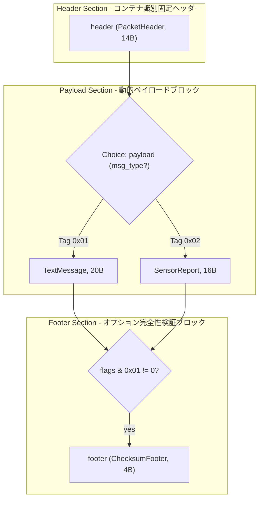
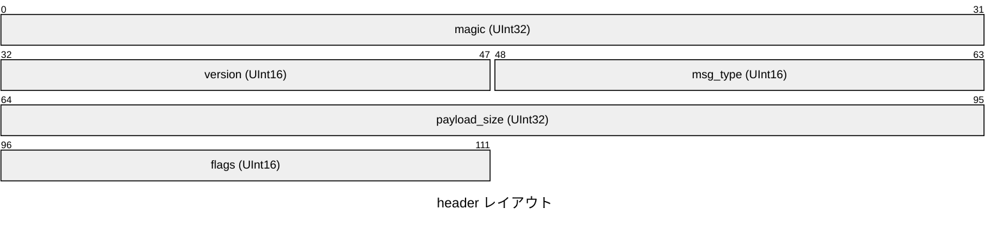
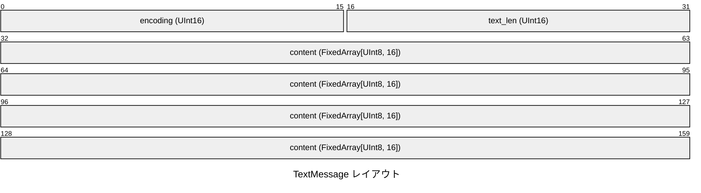
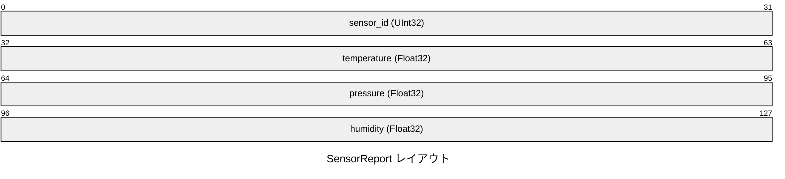
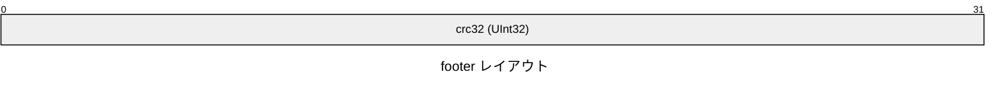

# Network Telemetry Protocol Specification

## 概要

テキスト通信と環境テレメトリ計測パケットを統合したバイナリプロトコル仕様。

- **バージョン**: `1.0.0`
- **デフォルトエンディアン**: リトルエンディアン (Little)
- **定義された構造体数**: 2
- **条件分岐数**: 1

## プロトコル概要とスコープ

本仕様書はネットワークテレメトリプロトコル (NTP-v1) を規定します。
すべての数値フィールドはリトルエンディアンでエンコードされます。

パケットは固定14バイトの `PacketHeader` から開始し、`msg_type` に応じてペイロードが分岐します：
- `0x0001`: `TextMessage`
- `0x0002`: `SensorReport`

また、`flags` の Bit 0 が立っている場合、末尾に 4 バイトの `ChecksumFooter` が付与されます。

## 構造図 (フローチャート)

## データ構造とレイアウト

### セクション: Header Section

コンテナ識別固定ヘッダー

### 構造体 `header` (PacketHeader)

固定14バイトパケットヘッダー

- **合計サイズ**: 14 バイト (`0x000E`)

| 相対オフセット | サイズ (B) | フィールド名 | 型 | エンディアン | 説明 |
|---|---|---|---|---|---|
| `+0x00` | 4 | `magic` | `UInt32` | Little | - |
| `+0x04` | 2 | `version` | `UInt16` | Little | - |
| `+0x06` | 2 | `msg_type` | `UInt16` | Little | - |
| `+0x08` | 4 | `payload_size` | `UInt32` | Little | - |
| `+0x0C` | 2 | `flags` | `UInt16` | Little | - |

### セクション: Payload Section

動的ペイロードブロック

### 条件分岐: `payload`

判定フィールド: `msg_type`

PacketHeader.msg_type による動的分岐

タグ値に応じて、以下のいずれかの構造体が使用されます:

#### [バリアント] Tag `0x01`: `TextMessage`

プレーンテキストメッセージ

- **バリアントサイズ**: 20 バイト (`0x0014`)

| 相対オフセット | サイズ (B) | フィールド名 | 型 | エンディアン | 説明 |
|---|---|---|---|---|---|
| `+0x00` | 2 | `encoding` | `UInt16` | Little | - |
| `+0x02` | 2 | `text_len` | `UInt16` | Little | - |
| `+0x04` | 16 | `content` | `FixedArray[UInt8, 16]` | Little | - |

#### [バリアント] Tag `0x02`: `SensorReport`

マルチチャネル環境センサー計測値

- **バリアントサイズ**: 16 バイト (`0x0010`)

| 相対オフセット | サイズ (B) | フィールド名 | 型 | エンディアン | 説明 |
|---|---|---|---|---|---|
| `+0x00` | 4 | `sensor_id` | `UInt32` | Little | - |
| `+0x04` | 4 | `temperature` | `Float32` | Little | - |
| `+0x08` | 4 | `pressure` | `Float32` | Little | - |
| `+0x0C` | 4 | `humidity` | `Float32` | Little | - |

### セクション: Footer Section

オプション完全性検証ブロック

### 構造体 `footer` (ChecksumFooter)

> [!NOTE]
> **適用条件**: `flags & 0x01 != 0`

CRC32 チェックサム

- **合計サイズ**: 4 バイト (`0x0004`)

| 相対オフセット | サイズ (B) | フィールド名 | 型 | エンディアン | 説明 |
|---|---|---|---|---|---|
| `+0x00` | 4 | `crc32` | `UInt32` | Little | - |
