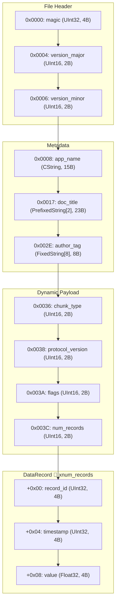
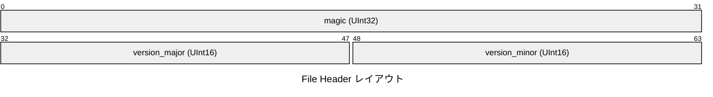
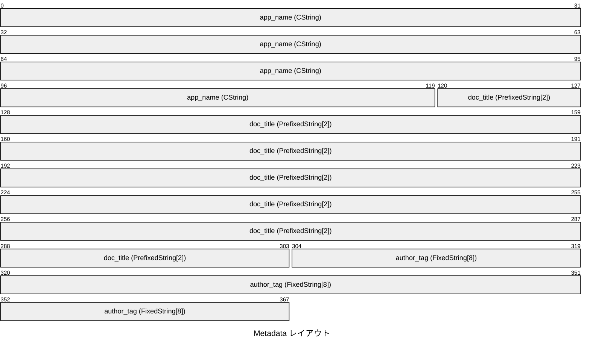
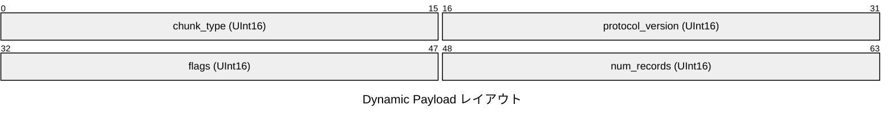
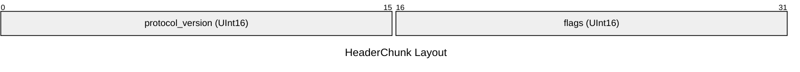
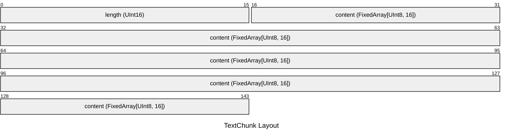
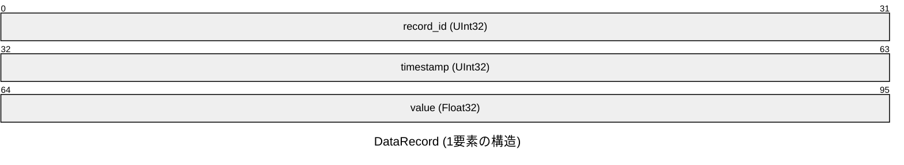

# Procedural Binary Protocol Specification

## 概要

HeaderChunk(protocol_version: binary_master.binary_types.UInt16, flags: binary_master.binary_types.UInt16)

- **合計サイズ**: 98 バイト (`0x0062`)
- **デフォルトエンディアン**: リトルエンディアン (Little)
- **合計フィールド数**: 19 (定義数: 13)
- **構造体数**: 2

## 構造図

## メモリレイアウト表

### File Header

ファイル識別子とバージョン

| オフセット (16進) | オフセット (10進) | サイズ (B) | フィールド名 | 型 | エンディアン | 説明 |
|---|---|---|---|---|---|---|
| `0x0000` | 0 | 4 | `magic` | `UInt32` | Little | Magic 'FILE' |
| `0x0004` | 4 | 2 | `version_major` | `UInt16` | Little | Major version |
| `0x0006` | 6 | 2 | `version_minor` | `UInt16` | Little | Minor version |

### Metadata

アプリケーション属性テキスト

| オフセット (16進) | オフセット (10進) | サイズ (B) | フィールド名 | 型 | エンディアン | 説明 |
|---|---|---|---|---|---|---|
| `0x0008` | 8 | 15 | `app_name` | `CString` | - | Null終端文字列 |
| `0x0017` | 23 | 23 | `doc_title` | `PrefixedString[2]` | Little | 2B長さプレフィックス文字列 |
| `0x002E` | 46 | 8 | `author_tag` | `FixedString[8]` | - | 8B固定長文字列 |

### Dynamic Payload

動的ペイロードブロック

| オフセット (16進) | オフセット (10進) | サイズ (B) | フィールド名 | 型 | エンディアン | 説明 |
|---|---|---|---|---|---|---|
| `0x0036` | 54 | 2 | `chunk_type` | `UInt16` | Little | 1=HeaderChunk, 2=TextChunk |
| `0x0038` | 56 | 2 | `protocol_version` | `UInt16` | Little | - |
| `0x003A` | 58 | 2 | `flags` | `UInt16` | Little | - |
| `0x003C` | 60 | 2 | `num_records` | `UInt16` | Little | レコード件数 |

この領域には、条件（種別タグ等）に応じて以下のいずれかの構造体が格納されます。

#### [バリアント] Tag `0x0001`: `HeaderChunk`

HeaderChunk(protocol_version: binary_master.binary_types.UInt16, flags: binary_master.binary_types.UInt16)

| 相対オフセット | サイズ (B) | フィールド名 | 型 | エンディアン | 説明 |
|---|---|---|---|---|---|
| `+0x00` | 2 | `protocol_version` | `UInt16` | Little | - |
| `+0x02` | 2 | `flags` | `UInt16` | Little | - |

#### [バリアント] Tag `0x0002`: `TextChunk`

TextChunk(length: binary_master.binary_types.UInt16, content: (<class 'binary_master.binary_types.FixedArray'>, <class 'binary_master.binary_types.UInt8'>, 16))

| 相対オフセット | サイズ (B) | フィールド名 | 型 | エンディアン | 説明 |
|---|---|---|---|---|---|
| `+0x00` | 2 | `length` | `UInt16` | Little | - |
| `+0x02` | 16 | `content` | `FixedArray[UInt8, 16]` | Little | - |

### DataRecord

連続計測データレコード

- 🔁 **繰り返し**: `num_records` 回
- **1要素サイズ**: `12` バイト (0xC)
- **配置範囲**: `0x003E` 〜 `0x0062` (`36` バイト)
- **サンプルデータ**: 3 件 (合計 `36` バイト)

| 相対オフセット | サイズ (B) | フィールド名 | 型 | エンディアン | 説明 |
|---|---|---|---|---|---|
| `+0x00` | 4 | `record_id` | `UInt32` | Little | - |
| `+0x04` | 4 | `timestamp` | `UInt32` | Little | - |
| `+0x08` | 4 | `value` | `Float32` | Little | - |
