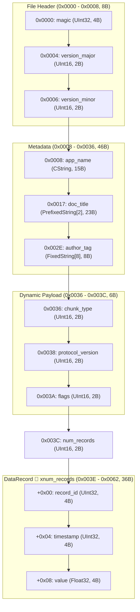

# Procedural Binary Protocol Specification

## Overview

Configuration header parameters.

- **Total Size**: 98 bytes (`0x0062`)
- **Default Endianness**: Little
- **Total Fields**: 19

## Structure Diagram

## Memory Layout Table

### File Header (0x0000 - 0x0008, 8B)

Container header identifying format and version

| Offset (Hex) | Offset (Dec) | Size (B) | Field Name | Type | Endian | Description |
|---|---|---|---|---|---|---|
| `0x0000` | 0 | 4 | `magic` | `UInt32` | Little | Magic 'FILE' |
| `0x0004` | 4 | 2 | `version_major` | `UInt16` | Little | Major version |
| `0x0006` | 6 | 2 | `version_minor` | `UInt16` | Little | Minor version |

### Metadata (0x0008 - 0x0036, 46B)

Textual metadata and application properties

| Offset (Hex) | Offset (Dec) | Size (B) | Field Name | Type | Endian | Description |
|---|---|---|---|---|---|---|
| `0x0008` | 8 | 15 | `app_name` | `CString` | - | App Name |
| `0x0017` | 23 | 23 | `doc_title` | `PrefixedString[2]` | Little | Doc Title |
| `0x002E` | 46 | 8 | `author_tag` | `FixedString[8]` | - | Author Tag |

### Dynamic Payload (0x0036 - 0x003C, 6B)

Dynamic payload dispatched by chunk_type

| Offset (Hex) | Offset (Dec) | Size (B) | Field Name | Type | Endian | Description |
|---|---|---|---|---|---|---|
| `0x0036` | 54 | 2 | `chunk_type` | `UInt16` | Little | 1=HeaderChunk, 2=TextChunk |
| `0x0038` | 56 | 2 | `protocol_version` | `UInt16` | Little | - |
| `0x003A` | 58 | 2 | `flags` | `UInt16` | Little | - |

この領域には、条件（種別タグ等）に応じて以下のいずれかの構造体が格納されます。

#### [Variant] Tag `0x0001`: `HeaderChunk`

Configuration header parameters.

| Relative Offset | Size (B) | Field Name | Type | Endian | Description |
|---|---|---|---|---|---|
| `+0x00` | 2 | `protocol_version` | `UInt16` | Little | - |
| `+0x02` | 2 | `flags` | `UInt16` | Little | - |

#### [Variant] Tag `0x0002`: `TextChunk`

Text data chunk payload.

| Relative Offset | Size (B) | Field Name | Type | Endian | Description |
|---|---|---|---|---|---|
| `+0x00` | 2 | `length` | `UInt16` | Little | - |
| `+0x02` | 16 | `content` | `FixedArray[UInt8, 16]` | Little | - |

### (0x003C - 0x003E, 2B)

| Offset (Hex) | Offset (Dec) | Size (B) | Field Name | Type | Endian | Description |
|---|---|---|---|---|---|---|
| `0x003C` | 60 | 2 | `num_records` | `UInt16` | Little | Number of following data records |

### DataRecord (0x003E - 0x0062, 36B)

Repeating measurement data record.

- 🔁 **繰り返し**: `num_records` 回
- **1要素サイズ**: `12` bytes (0xC)
- **サンプルデータ**: 3 件 (合計 `36` bytes)

| Relative Offset | Size (B) | Field Name | Type | Endian | Description |
|---|---|---|---|---|---|
| `+0x00` | 4 | `record_id` | `UInt32` | Little | - |
| `+0x04` | 4 | `timestamp` | `UInt32` | Little | - |
| `+0x08` | 4 | `value` | `Float32` | Little | - |
