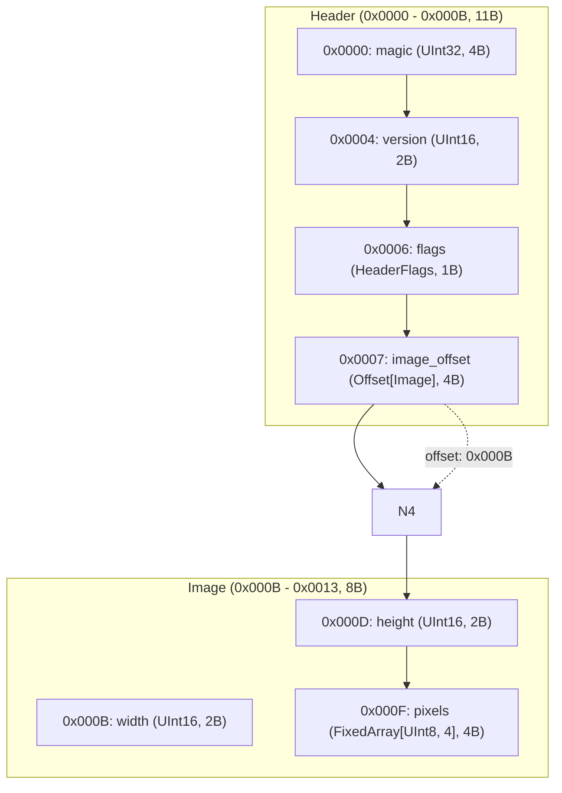
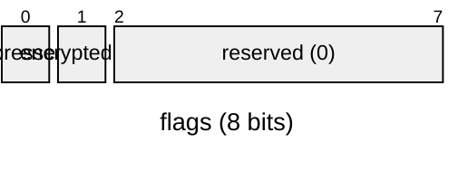

# Sample Image File Format Manual

## Overview

- **Total Size**: 19 bytes (`0x0013`)
- **Default Endianness**: Little
- **Total Fields**: 7

## Structure Diagram

## Memory Layout Table

| Offset (Hex) | Offset (Dec) | Size (B) | Field Name | Type | Endian | Value / Preview | Description |
|---|---|---|---|---|---|---|---|
| `0x0000` | 0 | 4 | `magic` | `UInt32` | Little | `1196314761 (0x474E5089)` | - |
| `0x0004` | 4 | 2 | `version` | `UInt16` | Little | `1 (0x1)` | - |
| `0x0006` | 6 | 1 | `flags` | `HeaderFlags` | Little | `1 (0x1)` | - |
| `0x0007` | 7 | 4 | `image_offset` | `Offset[Image]` | Little | `11 (0xB)` | - |
| `0x000B` | 11 | 2 | `width` | `UInt16` | Little | `1920 (0x780)` | - |
| `0x000D` | 13 | 2 | `height` | `UInt16` | Little | `1080 (0x438)` | - |
| `0x000F` | 15 | 4 | `pixels` | `FixedArray[UInt8, 4]` | Little | `[255, 0, 0, 255]` | - |

## Bitfield Details

### `flags` (Offset: `0x0006`, Size: 1B)

| Bit Range | Field Name | Width | Value | Description |
|---|---|---|---|---|
| `[0:1]` | `compressed` | 1 bit(s) | `1 (0x1)` | - |
| `[1:2]` | `encrypted` | 1 bit(s) | `0 (0x0)` | - |
| `[2:8]` | `reserved` | 6 bit(s) | `0 (0x0)` | - |
